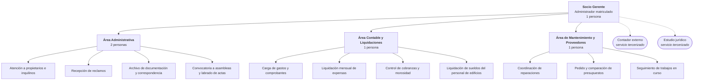
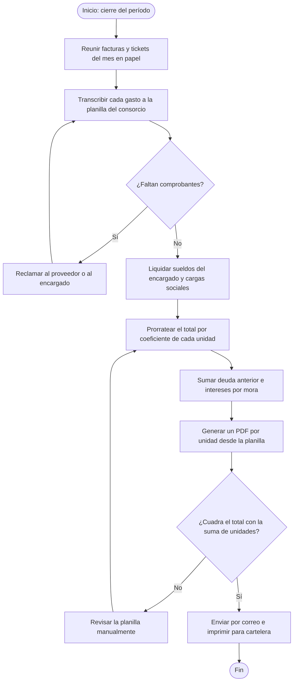
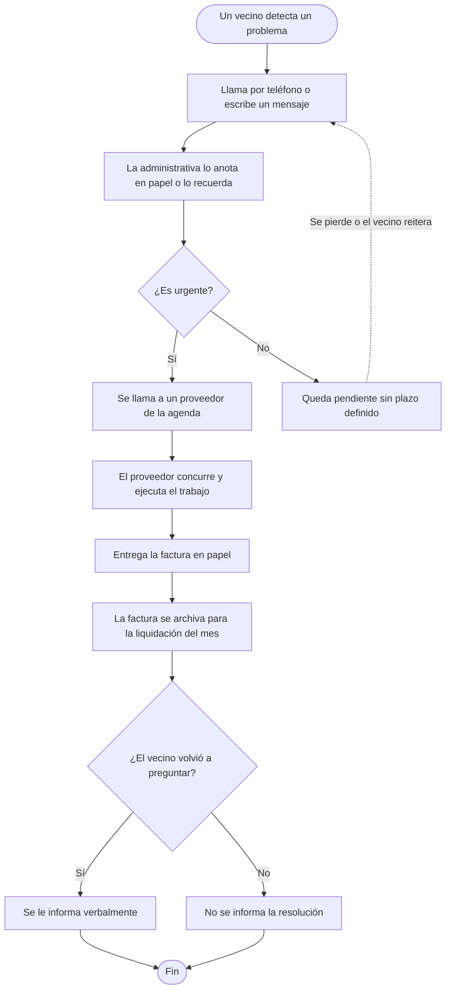
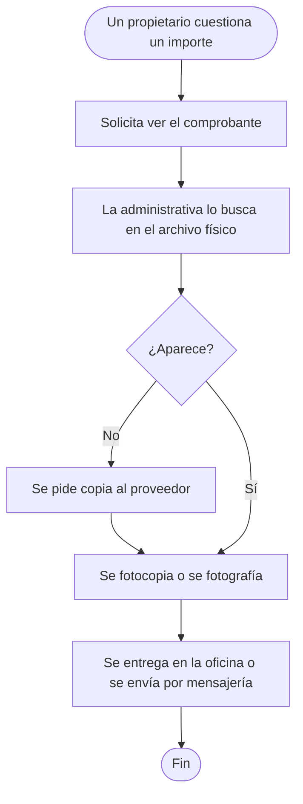

# 1. Análisis de la organización donde se implementará el sistema

> **Requisito de la cátedra (1° Entrega, punto 1):** *"Análisis de la organización donde se
> implementará el sistema: nombre de la organización, objetivos principales y secundarios,
> organigrama, matriz FODA, análisis de los principales procesos."*

---

## 1.1 Nombre y presentación de la organización

**Grupo Delta — Administración de Consorcios S.R.L.**
Domicilio: Córdoba 1750, piso 4, oficina B — Rosario, provincia de Santa Fe.
Forma jurídica: Sociedad de Responsabilidad Limitada.
Actividad: administración de consorcios de propiedad horizontal.
Antigüedad: 14 años en el mercado rosarino.

Grupo Delta es una administradora de tamaño pequeño-mediano, representativa del grueso del mercado de
la ciudad. Su cartera actual está compuesta por:

| Indicador | Valor |
|---|---|
| Consorcios administrados | 11 |
| Unidades funcionales bajo administración | 418 |
| Unidades por edificio (mínimo / promedio / máximo) | 12 / 38 / 96 |
| Empleados | 5, incluido el socio gerente |
| Masa mensual de expensas administrada | aproximadamente $ 138.000.000 |
| Modelo de ingreso | porcentaje sobre el total liquidado de cada consorcio |
| Antigüedad promedio de los edificios | 27 años |
| Proveedores habituales | 34, registrados informalmente en una agenda de contactos |

La administradora está inscripta en el **Registro Público de Administradores de Consorcios de la
Municipalidad de Rosario**, creado por la Ordenanza 9679, y su socio gerente cuenta con la matrícula
correspondiente. Esa inscripción le impone obligaciones de rendición e información a los
copropietarios que hoy cumple de manera manual y con esfuerzo.

### Contexto competitivo

El mercado rosarino de administración de consorcios está atomizado: conviven administradoras
unipersonales, estudios contables que administran como actividad secundaria y tres o cuatro firmas
grandes que ya ofrecen a sus consorcios una aplicación web o móvil propia. Grupo Delta compite por
cercanía y trato personal, pero pierde licitaciones frente a las firmas grandes cuando el consorcio
pide "una app para ver las expensas".

---

## 1.2 Objetivos de la organización

### Objetivo principal

Administrar consorcios de propiedad horizontal en la ciudad de Rosario cumpliendo la normativa
vigente, generando un resultado económico sostenible a partir de los honorarios percibidos por unidad
funcional administrada.

### Objetivos secundarios

| Código | Objetivo secundario | Cómo lo mide hoy la organización |
|---|---|---|
| OS-1 | Liquidar las expensas de todos los consorcios antes del día 5 de cada mes | Fecha efectiva de envío, por consorcio |
| OS-2 | Reducir el índice de morosidad de la cartera por debajo del 12 % | Deuda vencida sobre masa liquidada |
| OS-3 | Retener los consorcios existentes y renovar los contratos anuales de administración | Consorcios perdidos por año |
| OS-4 | Incorporar entre 2 y 3 consorcios nuevos por año sin ampliar la planta de personal | Altas netas anuales sobre cantidad de empleados |
| OS-5 | Cumplir en tiempo y forma las obligaciones de rendición e información de la Ordenanza 9679 | Reclamos formales e intimaciones recibidas |
| OS-6 | Resolver los reclamos de mantenimiento en un plazo acorde a su urgencia | **No se mide:** no existe registro sistemático |
| OS-7 | Sostener una red de proveedores confiables y con precios competitivos | **No se mide:** la evaluación es subjetiva |

Que OS-6 y OS-7 carezcan de indicador es en sí mismo un hallazgo del relevamiento: la organización
declara objetivos que no puede verificar porque el proceso no genera el dato. Este punto se retoma en
el análisis de problemas.

---

## 1.3 Organigrama

*Ilustración 1 — Organigrama de Grupo Delta S.R.L.*

Es una estructura funcional plana, propia de una organización de este tamaño. Dos consecuencias
relevantes para el proyecto:

- **No hay área de sistemas.** Cualquier solución debe operar sin administrador de infraestructura y
  sin soporte técnico interno. Esto condiciona la elección tecnológica del punto 4.
- **Las personas concentran el conocimiento.** La liquidación mensual depende de una sola persona: su
  ausencia detiene el proceso de los 11 consorcios. El sistema debe reducir esa dependencia.

---

## 1.4 Matriz FODA

### Análisis interno

| **Fortalezas** | **Debilidades** |
|---|---|
| **F1.** Catorce años de trayectoria y reputación en el mercado rosarino. | **D1.** Los procesos centrales se ejecutan sobre planillas de cálculo, sin control de versiones ni respaldo automático. |
| **F2.** Trato personal y cercano con los consorcistas, valorado en las renovaciones. | **D2.** No hay trazabilidad de los comprobantes de gasto: se archivan en papel y solo se muestran si un propietario los solicita expresamente. |
| **F3.** Administrador matriculado e inscripto en el Registro Público municipal. | **D3.** Los reclamos ingresan por teléfono y por mensajería: no quedan registrados ni tienen estado, plazo ni responsable asignado. |
| **F4.** Conocimiento profundo de la normativa de propiedad horizontal y de la operatoria bancaria. | **D4.** La morosidad se detecta al cierre del mes siguiente, cuando la deuda ya está consolidada. |
| **F5.** Red consolidada de proveedores de confianza. | **D5.** Alta dependencia de personas clave: la liquidación recae en una única persona. |
| **F6.** Estructura chica, con capacidad de decidir y ejecutar rápido. | **D6.** No se generan indicadores de gestión: las decisiones se toman por intuición y memoria. |
| | **D7.** El registro de proveedores es una agenda de contactos, sin histórico de trabajos, costos ni desempeño. |
| | **D8.** La comunicación con los vecinos se dispersa entre carteleras, grupos de mensajería y correos individuales. |

### Análisis externo

| **Oportunidades** | **Amenazas** |
|---|---|
| **O1.** La Ordenanza 9679 y sus modificatorias exigen rendición detallada e información a los copropietarios: la transparencia dejó de ser un diferencial y pasó a ser una obligación. | **A1.** Las administradoras grandes de Rosario ya ofrecen aplicación web o móvil, y los consorcios lo piden en las licitaciones. |
| **O2.** Alta penetración de teléfonos inteligentes en todos los grupos etarios de la cartera. | **A2.** La inflación acelera la desactualización de las expensas y aumenta la conflictividad con los propietarios. |
| **O3.** Costos de infraestructura en la nube accesibles, con capas gratuitas suficientes para este volumen de operación. | **A3.** El endurecimiento de las obligaciones de rendición aumenta el riesgo de sanciones ante incumplimientos formales. |
| **O4.** Demanda creciente de transparencia por parte de propietarios e inquilinos, agravada por el peso de las expensas en el presupuesto familiar. | **A4.** La normativa de protección de datos personales impone obligaciones sobre el tratamiento de la información de los consorcistas. |
| **O5.** Consorcios vecinos insatisfechos con sus administradoras actuales: hay mercado disponible sin necesidad de bajar honorarios. | **A5.** Escasez y rotación de proveedores de mantenimiento confiables. |

### Cruces de la matriz — estrategias derivadas

Estos cruces son los que dan origen al proyecto:

| Cruce | Tipo | Estrategia |
|---|---|---|
| F1–F2 × O5 | Ofensiva | Capitalizar la reputación para captar consorcios insatisfechos, ofreciendo un nivel de servicio digital que hoy no puede sostenerse con planillas. |
| **D1–D2–D3 × A1** | **Defensiva** | **Digitalizar los procesos centrales es condición para no perder la cartera** frente a competidores que ya ofrecen aplicación. Este cruce es el disparador directo del sistema. |
| D2 × O1–O4 | Reorientación | Convertir la obligación normativa de rendir en un diferencial competitivo, publicando cada comprobante de gasto de forma accesible al copropietario. |
| D4–D6 × A2 | Supervivencia | Sin indicadores de morosidad y de gasto, la administradora no puede reaccionar a tiempo en un contexto inflacionario. |
| D5 × F6 × O3 | Reorientación | Un sistema en la nube elimina la dependencia de la máquina y de la persona que hoy concentra la liquidación, sin requerir infraestructura propia. |
| D7 × A5 | Supervivencia | Registrar histórico de trabajos y costos por proveedor para sostener la red ante la rotación. |

---

## 1.5 Análisis de los principales procesos

Se relevaron los cinco procesos que concentran la operación de la administradora. Los diagramas
describen la **situación actual (AS-IS)**; los cuellos de botella señalados alimentan el árbol de
problemas del punto 2.

### 1.5.1 Liquidación mensual de expensas

Es el proceso central: define el ingreso de la organización y es el más visible para el cliente.

*Ilustración 2 — Proceso actual de liquidación de expensas.*

| Aspecto | Situación actual |
|---|---|
| Responsable | Área Contable y Liquidaciones, 1 persona |
| Frecuencia | Mensual, por cada uno de los 11 consorcios |
| Duración | 3 a 4 horas por consorcio, es decir **entre 33 y 44 horas mensuales** |
| Soporte | Una planilla de cálculo por consorcio y comprobantes en papel |
| Errores frecuentes | Transcripción de importes, coeficientes desactualizados tras subdivisiones, omisión de gastos, diferencias de redondeo |
| Cuello de botella | Los pasos de transcripción y prorrateo se rehacen íntegramente cuando aparece un gasto tardío |

### 1.5.2 Gestión de reclamos y reparaciones

*Ilustración 3 — Proceso actual de gestión de reclamos.*

| Aspecto | Situación actual |
|---|---|
| Responsable | El Área Administrativa recibe; el Área de Mantenimiento ejecuta |
| Volumen estimado | 60 a 80 reclamos mensuales en toda la cartera |
| Soporte | Llamadas telefónicas, mensajería y anotaciones en papel |
| Cuello de botella | **No hay estado, ni responsable, ni plazo.** Un reclamo no urgente puede quedar sin atender durante semanas sin que nadie lo advierta |
| Consecuencia | El vecino reitera el reclamo por varios canales, se duplica el trabajo administrativo y se erosiona la confianza |

### 1.5.3 Rendición de gastos a los copropietarios

*Ilustración 4 — Proceso actual de rendición de gastos.*

| Aspecto | Situación actual |
|---|---|
| Disparador | Reactivo: solo ocurre si un propietario pregunta |
| Duración | De 15 minutos a 2 días, según si el comprobante aparece en el archivo |
| Cuello de botella | El archivo es físico y está ordenado por mes, no por consorcio ni por rubro |
| Riesgo normativo | La Ordenanza 9679 exige poner la documentación respaldatoria a disposición de los copropietarios; el cumplimiento actual es reactivo y no deja constancia |

### 1.5.4 Reserva de espacios comunes

| Aspecto | Situación actual |
|---|---|
| Alcance | 6 de los 11 consorcios tienen salón de usos múltiples, quincho o terraza reservables |
| Soporte | Un cuaderno en la portería, o un mensaje al encargado |
| Cuello de botella | Reservas superpuestas por falta de una agenda única; las reglas del reglamento interno (anticipación, depósito de garantía, cupo de personas) se aplican de memoria y de manera desigual |
| Consecuencia | Conflictos entre vecinos que terminan escalando a la administración |

### 1.5.5 Alta de un consorcio nuevo

| Aspecto | Situación actual |
|---|---|
| Frecuencia | 2 a 3 veces por año |
| Duración | 2 a 3 semanas hasta la primera liquidación |
| Actividades | Copiar y adaptar la planilla de otro consorcio, cargar unidades y coeficientes desde el reglamento de copropiedad, relevar propietarios e inquilinos, abrir la cuenta bancaria del consorcio |
| Cuello de botella | La carga de coeficientes desde el reglamento en papel es manual, y un error en esta etapa se arrastra a todas las liquidaciones futuras |

---

## 1.6 Síntesis del relevamiento

El relevamiento deja tres conclusiones que ordenan el resto del proyecto:

1. **La capacidad de la organización está topeada por el trabajo manual.** Entre 33 y 44 horas
   mensuales dedicadas solo a liquidar, sobre una planta de 5 personas, explican por qué OS-4 —crecer
   sin sumar personal— no se cumple.
2. **La organización no produce el dato que necesita para decidir.** OS-6 y OS-7 no tienen indicador
   porque el proceso no genera registro, y la morosidad de OS-2 se conoce tarde.
3. **La brecha digital frente a la competencia es una amenaza concreta**, no hipotética: ya se
   pierden licitaciones por no ofrecer acceso digital a las expensas.

Estas conclusiones se formalizan en el árbol de problemas del punto 2.

---

## Referencias

- Congreso de la Nación Argentina. (2014). *Ley N.º 26.994. Código Civil y Comercial de la Nación*.
  Libro Cuarto, Título V: Propiedad Horizontal, artículos 2037 a 2072.
- Kendall, K. E., & Kendall, J. E. (2011). *Análisis y diseño de sistemas* (8.ª ed.). Pearson.
- Laudon, K. C., & Laudon, J. P. (2020). *Sistemas de información gerencial* (16.ª ed.). Pearson.
- Municipalidad de Rosario. (2017). *Ordenanza N.º 9679: Registro Público de Administradores de
  Consorcios de Propiedad Horizontal, y sus modificatorias*. Rosario, Argentina.
- Porter, M. E. (2008). The Five Competitive Forces That Shape Strategy. *Harvard Business Review*,
  86(1), 78–93.
