# 2. Análisis de problemas

> **Requisito de la cátedra (1° Entrega, punto 2):** *"Análisis de Problemas."*

---

## 2.1 Metodología aplicada

Se utiliza la técnica del **árbol de problemas**, propia del Enfoque del Marco Lógico, por tres
razones:

1. Obliga a distinguir entre lo que se observa (los síntomas) y lo que lo origina (las causas), y a
   no confundir "no tenemos un sistema" con un problema: la ausencia de una solución no es un
   problema, es la falta de un medio.
2. Produce una estructura causal que puede invertirse mecánicamente para construir el árbol de
   objetivos del punto 3, garantizando trazabilidad entre ambos.
3. Permite decidir **dónde interviene el sistema y dónde no**, evitando prometer que el software
   resuelve cuestiones que exceden su alcance.

Las fuentes de información son el relevamiento de procesos del punto 1, entrevistas con el socio
gerente y con la responsable de liquidaciones, y la revisión de las planillas de los tres consorcios
de mayor tamaño.

## 2.2 Identificación del problema central

Se evaluaron tres candidatos a problema central:

| Candidato | Evaluación |
|---|---|
| "La administradora no tiene un sistema informático" | Rechazado: es la ausencia de un medio, no un problema. |
| "Los propietarios desconfían de la administración" | Rechazado: es un **efecto**, no la causa. La desconfianza se origina en la falta de respaldo verificable. |
| "La gestión de los consorcios se realiza sobre procesos manuales, sin registro ni trazabilidad" | **Aceptado.** Explica simultáneamente la opacidad, la lentitud y la ausencia de datos para decidir. |

> ### Problema central
>
> **La gestión de los consorcios administrados por Grupo Delta se ejecuta sobre procesos manuales y
> canales informales, sin registro trazable de la información, lo que la vuelve lenta, opaca frente a
> los copropietarios y no medible para la toma de decisiones.**

## 2.3 Árbol de problemas

```mermaid
flowchart TD
    subgraph EFECTOS["EFECTOS"]
        direction TB
        EF["<b>EF. Pérdida de competitividad y<br/>riesgo de continuidad de la administradora</b>"]
        E1["E1. Pérdida de consorcios<br/>en las renovaciones anuales"]
        E2["E2. Conflictividad creciente<br/>con propietarios e inquilinos"]
        E3["E3. Capacidad de crecimiento topeada<br/>sin incorporar personal"]
        E4["E4. Exposición a sanciones por<br/>incumplimientos formales de rendición"]
        E5["E5. Deterioro del flujo de fondos<br/>de los consorcios por morosidad"]
        E1 --> EF
        E2 --> EF
        E3 --> EF
        E4 --> EF
        E5 --> EF
        E21["E2.1 Reclamos reiterados<br/>por varios canales"] --> E2
        E22["E2.2 Cuestionamientos a las<br/>expensas sin respuesta rápida"] --> E2
        E31["E3.1 Sobrecarga del área<br/>contable en el cierre mensual"] --> E3
    end

    P["<b>PROBLEMA CENTRAL</b><br/>La gestión de los consorcios se ejecuta sobre procesos<br/>manuales y canales informales, sin registro trazable:<br/>es lenta, opaca y no medible"]

    subgraph CAUSAS["CAUSAS"]
        direction TB
        C1["C1. La liquidación de expensas<br/>es íntegramente manual"]
        C2["C2. Los comprobantes de gasto<br/>no son accesibles al copropietario"]
        C3["C3. Los reclamos no se registran<br/>ni se les da seguimiento"]
        C4["C4. La organización no produce<br/>indicadores de gestión"]
        C5["C5. La comunicación con los vecinos<br/>está dispersa en canales informales"]

        C11["C1.1 Los gastos se transcriben a<br/>mano desde papel a una planilla"]
        C12["C1.2 Los coeficientes se cargan<br/>manualmente y se desactualizan"]
        C13["C1.3 El proceso depende de<br/>una única persona"]
        C11 --> C1
        C12 --> C1
        C13 --> C1

        C21["C2.1 Los comprobantes se archivan<br/>solo en papel"]
        C22["C2.2 El archivo se ordena por mes,<br/>no por consorcio ni por rubro"]
        C21 --> C2
        C22 --> C2

        C31["C3.1 El reclamo ingresa por teléfono<br/>o mensajería, sin quedar asentado"]
        C32["C3.2 No hay estado, responsable<br/>ni plazo asignado"]
        C33["C3.3 No se informa al vecino<br/>cuando se resuelve"]
        C31 --> C3
        C32 --> C3
        C33 --> C3

        C41["C4.1 El dato no se genera:<br/>el proceso no deja registro"]
        C42["C4.2 La morosidad se conoce recién<br/>al cierre del mes siguiente"]
        C43["C4.3 No hay histórico de costos<br/>ni de desempeño por proveedor"]
        C41 --> C4
        C42 --> C4
        C43 --> C4

        C51["C5.1 Cartelera, mensajería y correo<br/>conviven sin fuente única"]
        C52["C5.2 Las reservas de espacios comunes<br/>se anotan en un cuaderno"]
        C51 --> C5
        C52 --> C5
    end

    P --> E1
    P --> E2
    P --> E3
    P --> E4
    P --> E5
    C1 --> P
    C2 --> P
    C3 --> P
    C4 --> P
    C5 --> P
```

*Ilustración 5 — Árbol de problemas.*

## 2.4 Descripción de las causas

### C1 — La liquidación de expensas es íntegramente manual

Es la causa de mayor peso: consume entre 33 y 44 horas mensuales y concentra los errores más costosos
en términos de credibilidad.

| Subcausa | Descripción | Evidencia del relevamiento |
|---|---|---|
| C1.1 | Cada factura y ticket se transcribe a mano desde el papel a una planilla de cálculo | Se detectaron 4 diferencias de transcripción sobre 120 gastos revisados en 3 consorcios |
| C1.2 | Los coeficientes de cada unidad se cargan manualmente y no se actualizan tras subdivisiones o unificaciones | Dos consorcios liquidan con coeficientes que no suman exactamente 100 % |
| C1.3 | El proceso completo depende de una única persona, sin documentación ni respaldo | Durante una licencia de dos semanas, la liquidación de 11 consorcios se atrasó 9 días |

### C2 — Los comprobantes de gasto no son accesibles al copropietario

El acceso a la documentación respaldatoria es reactivo: solo ocurre si alguien la pide, y depende de
que el papel aparezca en el archivo. Esto tiene además implicancia normativa, porque la Ordenanza
9679 exige ponerla a disposición.

### C3 — Los reclamos no se registran ni se les da seguimiento

Con 60 a 80 reclamos mensuales sin ningún soporte de registro, no existe forma de saber cuántos están
abiertos, hace cuánto, ni quién debería resolverlos. La consecuencia inmediata es la reiteración: el
vecino insiste por varios canales porque no tiene modo de verificar el avance, y cada reiteración
consume tiempo administrativo sin agregar información.

### C4 — La organización no produce indicadores de gestión

Esta causa merece un párrafo aparte porque es la que sostiene el requisito de soporte a la decisión.
No se trata de que la administradora tenga los datos y no los analice: **el proceso no genera el
dato**. No hay una fecha de resolución de reclamo porque no hay reclamo registrado; no hay costo
histórico por proveedor porque no hay proveedor asociado al gasto. Por eso los objetivos secundarios
OS-6 y OS-7 del punto 1 figuran sin indicador. Decidir a qué proveedor contratar, qué consorcio
requiere gestión de cobranza o qué rubro se desvió del promedio son hoy decisiones basadas en la
memoria del socio gerente.

### C5 — La comunicación está dispersa en canales informales

Sin una fuente única, la misma información circula distinta según el canal, y la administradora no
puede acreditar haber comunicado algo. Las reservas de espacios comunes son el caso extremo: un
cuaderno en la portería produce superposiciones que terminan escalando a la oficina.

## 2.5 Descripción de los efectos

| Código | Efecto | Manifestación observada |
|---|---|---|
| E1 | Pérdida de consorcios en las renovaciones | Dos consorcios migraron en los últimos tres años a administradoras con aplicación propia |
| E2 | Conflictividad creciente con propietarios e inquilinos | Reclamos reiterados (E2.1) y cuestionamientos a las expensas sin respuesta rápida (E2.2) |
| E3 | Capacidad de crecimiento topeada | La incorporación de consorcios se frena por sobrecarga del área contable en el cierre mensual (E3.1); OS-4 no se cumple |
| E4 | Exposición a sanciones | Cumplimiento reactivo y sin constancia de las obligaciones de rendición e información |
| E5 | Deterioro del flujo de fondos de los consorcios | La morosidad se detecta tarde, cuando la gestión de cobranza es menos efectiva |
| **EF** | **Pérdida de competitividad y riesgo de continuidad** | Efecto final: la administradora compite con un servicio que el mercado ya considera insuficiente |

## 2.6 Alcance de la intervención

No todas las causas se resuelven con software. Delimitarlo desde el análisis evita comprometer
resultados que el sistema no puede producir.

| Causa | ¿La resuelve el sistema? | Observación |
|---|---|---|
| C1.1 Transcripción manual de gastos | **Sí, totalmente** | Carga digital con extracción asistida desde la imagen del comprobante |
| C1.2 Coeficientes desactualizados | **Sí, parcialmente** | El sistema los almacena y valida que sumen 100 %, pero la carga inicial correcta sigue siendo responsabilidad de la administradora |
| C1.3 Dependencia de una persona | **Sí, parcialmente** | El proceso queda documentado y ejecutable por cualquier usuario habilitado; no reemplaza el criterio contable |
| C2 Comprobantes inaccesibles | **Sí, totalmente** | Repositorio digital vinculado a cada gasto y visible por el copropietario |
| C3 Reclamos sin registro | **Sí, totalmente** | Reclamos con estado, responsable, historial y notificación automática |
| C4 Ausencia de indicadores | **Sí, totalmente** | Es consecuencia directa de digitalizar: al generarse el dato, el tablero se vuelve posible |
| C5 Comunicación dispersa | **Sí, parcialmente** | El sistema provee la fuente única; que los vecinos abandonen los canales informales depende de la gestión del cambio, no del software |
| Escasez de proveedores confiables (A5 del FODA) | **No** | Es una condición del mercado. El sistema aporta información para elegir mejor, no más oferta |
| Impacto de la inflación en las expensas (A2 del FODA) | **No** | Excede al sistema. Se mitiga parcialmente detectando desvíos de gasto a tiempo |

## 2.7 Cuantificación del problema

Base para la evaluación económica del punto 5 y para los indicadores de éxito del punto 3:

| Métrica | Valor actual medido | Método de obtención |
|---|---|---|
| Horas mensuales dedicadas a liquidar | 33 a 44 h | Relevamiento sobre 11 consorcios |
| Horas mensuales dedicadas a atender reclamos reiterados | aproximadamente 20 h | Estimación del Área Administrativa |
| Horas mensuales dedicadas a buscar comprobantes en el archivo | aproximadamente 8 h | Estimación del Área Administrativa |
| Índice de morosidad de la cartera | 16,4 % | Deuda vencida sobre masa liquidada, últimos 12 meses |
| Reclamos mensuales | 60 a 80 | Estimación, sin registro sistemático |
| Reclamos que el vecino reitera | aproximadamente 35 % | Estimación del Área Administrativa |
| Tiempo medio de resolución de reclamos | **Desconocido** | No medible con los datos actuales |
| Consorcios perdidos en los últimos 3 años | 2 sobre 13 | Registro comercial de la administradora |
| Días de atraso en la liquidación cuando falta la responsable | 9 | Caso registrado |

El renglón "desconocido" es deliberado: refleja el estado real de la organización y define la línea de
base contra la cual se medirá el sistema una vez implantado.

---

## Referencias

- Comisión Económica para América Latina y el Caribe. (2005). *Metodología del marco lógico para la
  planificación, el seguimiento y la evaluación de proyectos y programas* (Serie Manuales N.º 42).
  Naciones Unidas.
- Ortegón, E., Pacheco, J. F., & Prieto, A. (2015). *Metodología del marco lógico*. ILPES–CEPAL.
- Municipalidad de Rosario. (2017). *Ordenanza N.º 9679 y sus modificatorias*. Rosario, Argentina.
