# 3. Análisis de objetivos

> **Requisito de la cátedra (1° Entrega, punto 3):** *"Análisis de Objetivos."*

---

## 3.1 Metodología aplicada

El árbol de objetivos es la conversión del árbol de problemas del punto 2 a situaciones positivas
alcanzadas: cada causa se transforma en un **medio**, cada efecto en un **fin**, y el problema central
en el **objetivo general**. La relación causa–efecto se convierte en una relación medio–fin.

La conversión no es automática en un punto: hubo que verificar que cada objetivo resultante fuera
**alcanzable y verificable**. Los objetivos que dependen de factores externos al sistema quedan
identificados como supuestos, no como resultados comprometidos.

Cada objetivo recibe un código **OBJ-n** que se arrastra al resto de la documentación: los
requerimientos funcionales del punto 4 se justifican contra estos códigos, y la matriz de
trazabilidad del punto 12 verifica que ninguno quede sin implementación.

## 3.2 Objetivo general

> **Gestionar los consorcios administrados por Grupo Delta sobre procesos digitalizados y trazables,
> que permitan liquidar expensas de forma ágil y verificable, dar respuesta seguida a los reclamos y
> sostener las decisiones de administración en indicadores construidos con datos del propio sistema.**

## 3.3 Árbol de objetivos

```mermaid
flowchart TD
    subgraph FINES["FINES"]
        direction TB
        FF["<b>FF. La administradora sostiene y amplía su cartera<br/>con una propuesta de servicio competitiva</b>"]
        F1["F1. Se retienen los consorcios<br/>en las renovaciones anuales"]
        F2["F2. Disminuye la conflictividad con<br/>propietarios e inquilinos"]
        F3["F3. Se incorporan consorcios nuevos<br/>sin ampliar la planta de personal"]
        F4["F4. Se cumplen las obligaciones formales<br/>de rendición con constancia"]
        F5["F5. Mejora el flujo de fondos de los<br/>consorcios por reducción de la morosidad"]
        F1 --> FF
        F2 --> FF
        F3 --> FF
        F4 --> FF
        F5 --> FF
    end

    O["<b>OBJETIVO GENERAL</b><br/>Gestionar los consorcios sobre procesos digitalizados<br/>y trazables: liquidación ágil y verificable, reclamos<br/>con seguimiento y decisiones basadas en indicadores"]

    subgraph MEDIOS["MEDIOS"]
        direction TB
        M1["<b>OBJ-1.</b> Automatizar la liquidación<br/>mensual de expensas"]
        M2["<b>OBJ-2.</b> Dar acceso digital a los<br/>comprobantes de gasto"]
        M3["<b>OBJ-3.</b> Registrar y dar seguimiento<br/>a todos los reclamos"]
        M4["<b>OBJ-4.</b> Producir indicadores de gestión<br/>a partir de los datos del sistema"]
        M5["<b>OBJ-5.</b> Centralizar la comunicación<br/>con los consorcistas"]

        M11["OBJ-1.1 Cargar los gastos en forma digital,<br/>con asistencia para la lectura del comprobante"]
        M12["OBJ-1.2 Almacenar y validar los coeficientes<br/>de cada unidad funcional"]
        M13["OBJ-1.3 Permitir que cualquier usuario habilitado<br/>ejecute la liquidación"]
        M11 --> M1
        M12 --> M1
        M13 --> M1

        M21["OBJ-2.1 Digitalizar y vincular cada comprobante<br/>al gasto que respalda"]
        M22["OBJ-2.2 Permitir la consulta por consorcio,<br/>período y rubro"]
        M21 --> M2
        M22 --> M2

        M31["OBJ-3.1 Registrar el reclamo con estado,<br/>responsable y fecha"]
        M32["OBJ-3.2 Clasificar y priorizar el reclamo<br/>al momento de su ingreso"]
        M33["OBJ-3.3 Notificar automáticamente<br/>cada cambio de estado"]
        M31 --> M3
        M32 --> M3
        M33 --> M3

        M41["OBJ-4.1 Medir morosidad por consorcio<br/>y por unidad, en tiempo real"]
        M42["OBJ-4.2 Analizar la evolución del gasto<br/>por rubro y detectar desvíos"]
        M43["OBJ-4.3 Registrar histórico de costos<br/>y desempeño por proveedor"]
        M44["OBJ-4.4 Medir el tiempo de resolución<br/>de los reclamos"]
        M41 --> M4
        M42 --> M4
        M43 --> M4
        M44 --> M4

        M51["OBJ-5.1 Publicar novedades y documentación<br/>en una fuente única"]
        M52["OBJ-5.2 Gestionar las reservas de espacios<br/>comunes con reglas explícitas"]
        M53["OBJ-5.3 Permitir consultar la documentación<br/>del consorcio en lenguaje natural"]
        M51 --> M5
        M52 --> M5
        M53 --> M5
    end

    O --> F1
    O --> F2
    O --> F3
    O --> F4
    O --> F5
    M1 --> O
    M2 --> O
    M3 --> O
    M4 --> O
    M5 --> O
```

*Ilustración 6 — Árbol de objetivos.*

## 3.4 Objetivos, indicadores y metas

Cada objetivo se define con un indicador verificable y una meta a doce meses de la puesta en marcha.
La línea de base sale de la cuantificación del punto 2.6.

### OBJ-1 — Automatizar la liquidación mensual de expensas

| | |
|---|---|
| **Causa que revierte** | C1 — La liquidación es íntegramente manual |
| **Indicador** | Horas mensuales dedicadas a la liquidación de toda la cartera |
| **Línea de base** | 33 a 44 h |
| **Meta a 12 meses** | Menos de 12 h |
| **Indicador secundario** | Consorcios liquidados antes del día 5 |
| **Meta secundaria** | 11 de 11 |

| Subobjetivo | Indicador | Meta |
|---|---|---|
| OBJ-1.1 Carga digital con asistencia para la lectura del comprobante | Porcentaje de gastos cargados sin transcripción manual completa | ≥ 80 % |
| OBJ-1.2 Coeficientes almacenados y validados | Consorcios cuyos coeficientes suman exactamente 100 % | 11 de 11 |
| OBJ-1.3 Liquidación ejecutable por cualquier usuario habilitado | Personas capacitadas para ejecutar el proceso | ≥ 3 |

### OBJ-2 — Dar acceso digital a los comprobantes de gasto

| | |
|---|---|
| **Causa que revierte** | C2 — Los comprobantes no son accesibles al copropietario |
| **Indicador** | Porcentaje de gastos liquidados con comprobante digital adjunto |
| **Línea de base** | 0 % |
| **Meta a 12 meses** | ≥ 95 % |
| **Indicador secundario** | Tiempo de respuesta ante un pedido de comprobante |
| **Línea de base** | De 15 minutos a 2 días |
| **Meta secundaria** | Inmediato y autogestionado por el copropietario |

### OBJ-3 — Registrar y dar seguimiento a todos los reclamos

| | |
|---|---|
| **Causa que revierte** | C3 — Los reclamos no se registran ni se les da seguimiento |
| **Indicador** | Porcentaje de reclamos ingresados por el sistema sobre el total recibido |
| **Línea de base** | 0 % |
| **Meta a 12 meses** | ≥ 85 % |
| **Indicador secundario** | Porcentaje de reclamos reiterados por el mismo vecino |
| **Línea de base** | aproximadamente 35 % |
| **Meta secundaria** | ≤ 10 % |

| Subobjetivo | Indicador | Meta |
|---|---|---|
| OBJ-3.1 Estado, responsable y fecha por reclamo | Reclamos con responsable asignado | 100 % de los ingresados |
| OBJ-3.2 Clasificación y priorización al ingresar | Reclamos con rubro y urgencia asignados automáticamente | ≥ 90 %, con corrección humana disponible |
| OBJ-3.3 Notificación automática de cambios de estado | Cambios de estado notificados | 100 % |

### OBJ-4 — Producir indicadores de gestión a partir de los datos del sistema

Este objetivo materializa el requisito obligatorio de la cátedra sobre herramientas para la toma de
decisiones.

| | |
|---|---|
| **Causa que revierte** | C4 — La organización no produce indicadores de gestión |
| **Indicador** | Objetivos secundarios de la organización con indicador medible y actualizado |
| **Línea de base** | 5 de 7 (OS-6 y OS-7 sin indicador) |
| **Meta a 12 meses** | 7 de 7 |

| Subobjetivo | Decisión que habilita | Meta |
|---|---|---|
| OBJ-4.1 Morosidad por consorcio y por unidad en tiempo real | Sobre qué unidades iniciar gestión de cobranza y cuándo | Morosidad de la cartera por debajo del 12 % |
| OBJ-4.2 Evolución del gasto por rubro y detección de desvíos | Qué rubro auditar o renegociar este mes | Desvíos superiores al 30 % detectados antes de liquidar |
| OBJ-4.3 Histórico de costos y desempeño por proveedor | A qué proveedor contratar para cada tipo de trabajo | 100 % de los gastos con proveedor asociado |
| OBJ-4.4 Tiempo de resolución de reclamos | Dónde reforzar la capacidad de mantenimiento | Métrica disponible y por debajo de 72 h para urgencias |

### OBJ-5 — Centralizar la comunicación con los consorcistas

| | |
|---|---|
| **Causa que revierte** | C5 — La comunicación está dispersa en canales informales |
| **Indicador** | Porcentaje de consorcistas con cuenta activa en el sistema |
| **Línea de base** | 0 % |
| **Meta a 12 meses** | ≥ 70 % de las unidades funcionales |

| Subobjetivo | Indicador | Meta |
|---|---|---|
| OBJ-5.1 Novedades y documentación en fuente única | Consorcios con reglamento y documentación cargados | 11 de 11 |
| OBJ-5.2 Reservas con reglas explícitas | Reservas superpuestas | 0 |
| OBJ-5.3 Consulta de la documentación en lenguaje natural | Consultas respondidas con cita del documento de origen | 100 % de las respondidas |

## 3.5 Fines esperados

| Código | Fin | Indicador | Meta |
|---|---|---|---|
| F1 | Retención de consorcios | Consorcios perdidos por año | 0 |
| F2 | Menor conflictividad | Reclamos escalados al socio gerente | Reducción del 50 % |
| F3 | Crecimiento sin sumar personal | Consorcios incorporados por año, con planta constante | 3 |
| F4 | Cumplimiento formal con constancia | Pedidos de rendición atendidos con registro | 100 % |
| F5 | Mejor flujo de fondos | Índice de morosidad de la cartera | Por debajo del 12 % |
| **FF** | **Cartera sostenida y ampliada** | Unidades funcionales bajo administración | De 418 a 520 |

## 3.6 Supuestos

Condiciones externas al sistema de las que depende el logro de los fines. Si no se cumplen, los
objetivos pueden alcanzarse sin que los fines se materialicen:

| Código | Supuesto | Riesgo si no se cumple | Se trata en |
|---|---|---|---|
| SUP-1 | Los consorcistas adoptan el canal digital y abandonan progresivamente los informales | OBJ-5 se cumple técnicamente pero la comunicación sigue dispersa | Punto 11, riesgo de adopción; punto 17, capacitación |
| SUP-2 | La administradora carga correctamente los datos iniciales de cada consorcio | Los coeficientes erróneos se arrastran a toda liquidación futura | Punto 12, validaciones de carga |
| SUP-3 | Los proveedores entregan comprobantes en formato legible, digital o en papel | La extracción asistida pierde efectividad y se vuelve a la carga manual | Punto 11; el diseño mantiene la carga manual como alternativa |
| SUP-4 | El contexto macroeconómico no altera de manera extraordinaria la estructura de gastos | Los desvíos detectados por OBJ-4.2 pierden poder informativo | Punto 12, comparación contra promedio móvil y no contra un valor fijo |
| SUP-5 | Se mantiene la conectividad a internet en la oficina de la administradora | El proceso se interrumpe | Punto 11; el diseño contempla descarga previa de liquidaciones |

## 3.7 Matriz de trazabilidad problema → objetivo

Verificación de que ninguna causa quedó sin objetivo asociado:

| Causa (punto 2) | Objetivo (punto 3) | Cobertura |
|---|---|---|
| C1.1 Transcripción manual de gastos | OBJ-1.1 | Total |
| C1.2 Coeficientes desactualizados | OBJ-1.2 | Parcial — depende de SUP-2 |
| C1.3 Dependencia de una única persona | OBJ-1.3 | Parcial |
| C2.1 Comprobantes solo en papel | OBJ-2.1 | Total |
| C2.2 Archivo ordenado por mes | OBJ-2.2 | Total |
| C3.1 Reclamo sin asentar | OBJ-3.1 | Total |
| C3.2 Sin estado, responsable ni plazo | OBJ-3.1 y OBJ-3.2 | Total |
| C3.3 No se informa la resolución | OBJ-3.3 | Total |
| C4.1 El dato no se genera | OBJ-4 completo | Total |
| C4.2 Morosidad conocida tarde | OBJ-4.1 | Total |
| C4.3 Sin histórico por proveedor | OBJ-4.3 | Total |
| C5.1 Canales sin fuente única | OBJ-5.1 y OBJ-5.3 | Parcial — depende de SUP-1 |
| C5.2 Reservas en un cuaderno | OBJ-5.2 | Total |

---

## Referencias

- Comisión Económica para América Latina y el Caribe. (2005). *Metodología del marco lógico para la
  planificación, el seguimiento y la evaluación de proyectos y programas* (Serie Manuales N.º 42).
  Naciones Unidas.
- Doran, G. T. (1981). There's a S.M.A.R.T. Way to Write Management's Goals and Objectives.
  *Management Review*, 70(11), 35–36.
- Ortegón, E., Pacheco, J. F., & Prieto, A. (2015). *Metodología del marco lógico*. ILPES–CEPAL.
