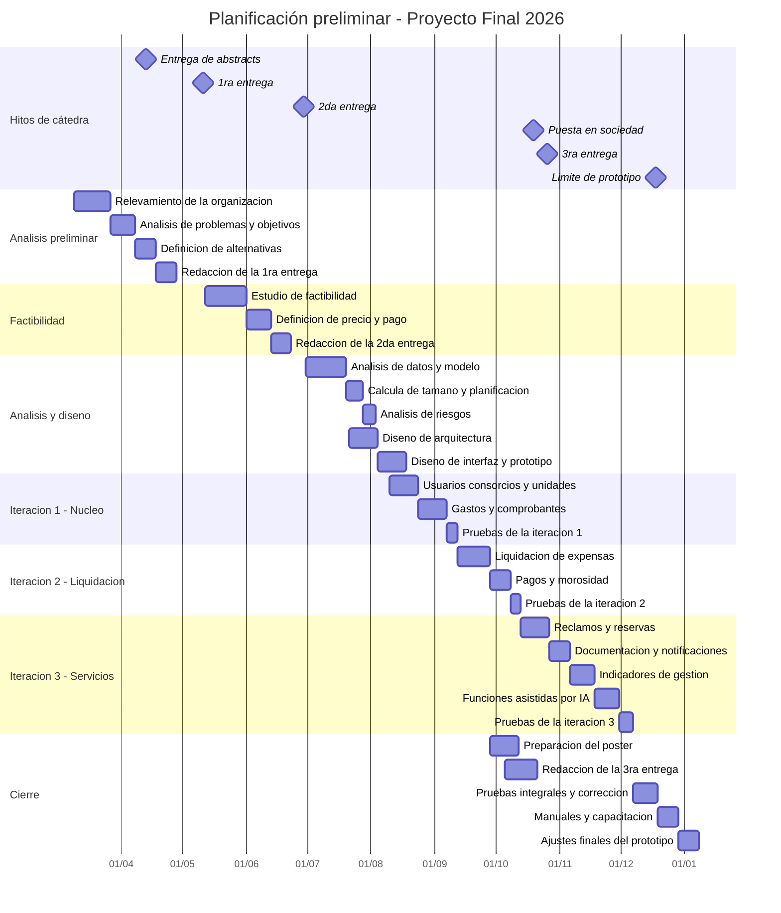

# 4. Propuesta de alternativas de solución

> **Requisito de la cátedra (1° Entrega, punto 4):** *"Propuesta de alternativas de solución (2).
> Incluir abstract, entorno tecnológico, recursos humanos y tecnología necesaria. Comparación de las
> alternativas propuestas. Por cada alternativa definir funciones incluidas y excluidas. Diagrama de
> Gantt preliminar (planificación temporal del sistema y recursos)."*

---

## 4.1 Requerimientos que debe satisfacer cualquier alternativa

Antes de proponer alternativas se fija qué debe hacer el sistema, con independencia de la tecnología.
Cada requerimiento funcional se justifica contra un objetivo del punto 3; ninguno existe porque sí.

### 4.1.1 Requerimientos funcionales

| Código | Requerimiento | Objetivo que satisface | Actor principal |
|---|---|---|---|
| RF-01 | Registrar y administrar los consorcios de la cartera | OBJ-1.2 | Administrador |
| RF-02 | Registrar las unidades funcionales con su coeficiente, validando que la suma por consorcio sea exactamente 100 % | OBJ-1.2 | Administrador |
| RF-03 | Administrar usuarios y roles, vinculando personas a unidades como propietario o inquilino | OBJ-5, OBJ-1.3 | Administrador |
| RF-04 | Registrar los gastos del consorcio asociados a rubro, proveedor y período | OBJ-1.1, OBJ-4.3 | Administrador |
| RF-05 | Adjuntar el comprobante digitalizado a cada gasto | OBJ-2.1 | Administrador |
| RF-06 | Extraer automáticamente los datos del comprobante a partir de su imagen o PDF, con confirmación humana obligatoria | OBJ-1.1 | Administrador |
| RF-07 | Liquidar las expensas del período prorrateando el total por coeficiente de cada unidad | OBJ-1 | Administrador |
| RF-08 | Generar y publicar la liquidación por unidad en formato descargable | OBJ-1, OBJ-2.2 | Administrador / Consorcista |
| RF-09 | Registrar pagos, imputarlos a la liquidación y calcular deuda e intereses por mora | OBJ-4.1 | Administrador |
| RF-10 | Consultar gastos y comprobantes filtrando por consorcio, período y rubro | OBJ-2.2 | Consorcista |
| RF-11 | Registrar reclamos con estado, responsable y fecha | OBJ-3.1 | Consorcista |
| RF-12 | Clasificar automáticamente el rubro y la urgencia del reclamo y sugerir un proveedor del registro | OBJ-3.2 | Sistema |
| RF-13 | Seguir el historial completo de un reclamo hasta su cierre | OBJ-3.1 | Consorcista / Administrador |
| RF-14 | Notificar por correo los cambios de estado de reclamos y la publicación de liquidaciones | OBJ-3.3 | Sistema |
| RF-15 | Administrar los espacios comunes y sus reglas de uso | OBJ-5.2 | Administrador |
| RF-16 | Reservar espacios comunes validando las reglas y evitando superposiciones | OBJ-5.2 | Consorcista |
| RF-17 | Registrar proveedores con histórico de trabajos realizados y costos | OBJ-4.3 | Administrador |
| RF-18 | Publicar novedades y comunicados del consorcio | OBJ-5.1 | Administrador |
| RF-19 | Cargar la documentación del consorcio: reglamento de copropiedad, reglamento interno, actas y contratos | OBJ-5.1 | Administrador |
| RF-20 | Consultar la documentación del consorcio en lenguaje natural, obteniendo la respuesta con cita del documento y fragmento de origen | OBJ-5.3 | Consorcista |
| RF-21 | Presentar un panel de indicadores de gestión al administrador | OBJ-4 | Administrador |
| RF-22 | Informar la morosidad por consorcio y por unidad, con su evolución mensual | OBJ-4.1 | Administrador |
| RF-23 | Analizar el gasto por rubro y señalar desvíos respecto del promedio histórico | OBJ-4.2 | Administrador |
| RF-24 | Ordenar los proveedores por costo acumulado y recurrencia de contratación | OBJ-4.3 | Administrador |
| RF-25 | Informar el tiempo medio de resolución de reclamos por tipo y urgencia | OBJ-4.4 | Administrador |
| RF-26 | Registrar en bitácora de auditoría toda operación que modifique datos económicos | Seguridad | Sistema |

### 4.1.2 Requerimientos no funcionales

| Código | Requerimiento | Categoría |
|---|---|---|
| RNF-01 | Diseño adaptable, con visualización correcta en computadoras, tabletas y teléfonos | Usabilidad |
| RNF-02 | Compatibilidad con las dos últimas versiones estables de los navegadores mayoritarios | Compatibilidad |
| RNF-03 | Autorización verificada por rol **y por consorcio** en cada operación: un consorcista nunca accede a datos de un consorcio al que no pertenece | Seguridad |
| RNF-04 | Las contraseñas se almacenan con función de derivación de clave resistente a fuerza bruta; nunca en texto plano ni con hash simple | Seguridad |
| RNF-05 | Toda comunicación cifrada en tránsito | Seguridad |
| RNF-06 | Tiempo de respuesta inferior a 2 segundos en el 95 % de las operaciones de consulta | Rendimiento |
| RNF-07 | La liquidación completa de un consorcio de 100 unidades se resuelve en menos de 30 segundos | Rendimiento |
| RNF-08 | Disponibilidad mensual igual o superior al 99 %, medida sobre horario hábil | Disponibilidad |
| RNF-09 | Copias de respaldo diarias con retención de 30 días y procedimiento de restauración probado | Continuidad |
| RNF-10 | Mensajes de error informativos, redactados para el usuario final y sin exponer detalles técnicos | Usabilidad |
| RNF-11 | Las pantallas destinadas al consorcista cumplen las pautas WCAG 2.1 nivel AA | Accesibilidad |
| RNF-12 | El registro de auditoría es de solo agregado: no puede alterarse ni borrarse desde la aplicación | Seguridad |
| RNF-13 | El tratamiento de datos personales cumple la Ley 25.326 | Legal |
| RNF-14 | Ante falla o indisponibilidad de un servicio externo, la funcionalidad afectada degrada a su equivalente manual sin bloquear el sistema | Robustez |
| RNF-15 | El proveedor de servicios de inteligencia artificial es reemplazable sin modificar la lógica de negocio | Mantenibilidad |

RNF-14 y RNF-15 son consecuencia directa de las decisiones de diseño sobre las funciones asistidas:
ninguna función crítica del negocio puede quedar bloqueada porque un servicio de terceros falle o
agote su cuota.

---

## 4.2 Alternativa A — Aplicación web integrada sobre plataforma en la nube gestionada

### Abstract

Desarrollo a medida de una aplicación web única que resuelve tanto la interfaz del administrador como
la del consorcista, construida sobre un entorno de ejecución que combina interfaz y lógica de negocio
en un mismo proyecto y se despliega sobre una plataforma en la nube gestionada. La base de datos es
relacional, administrada como servicio, y el almacenamiento de comprobantes se resuelve con un
servicio de objetos asociado a la misma plataforma. Los procesos periódicos —recordatorios de
vencimiento, cierre de período— se ejecutan mediante tareas programadas de la propia plataforma. Las
funciones asistidas por inteligencia artificial se consumen como servicio externo detrás de una
interfaz propia que las hace reemplazables. La organización no administra servidores, sistemas
operativos ni parches de seguridad de infraestructura: el despliegue se dispara desde el repositorio
de código.

### Entorno tecnológico

| Capa | Tecnología |
|---|---|
| Interfaz de usuario | Biblioteca de componentes declarativa con tipado estático, renderizado en servidor para las vistas públicas |
| Lógica de negocio | Ejecutada en el servidor dentro del mismo proyecto que la interfaz, mediante acciones de servidor y manejadores de ruta |
| Acceso a datos | Mapeador objeto-relacional con esquema tipado y migraciones versionadas |
| Base de datos | Motor relacional administrado como servicio, con soporte de índices vectoriales para la búsqueda semántica sobre documentación |
| Almacenamiento de archivos | Servicio de almacenamiento de objetos para comprobantes y documentación |
| Autenticación | Biblioteca de autenticación con sesiones y control de acceso basado en roles |
| Correo saliente | Servicio de envío transaccional con capa gratuita |
| Tareas programadas | Planificador de la propia plataforma de despliegue |
| Servicios de IA | Servicio externo de extracción documental, clasificación de texto y generación de vectores semánticos, detrás de una interfaz propia |
| Despliegue | Plataforma en la nube gestionada, integración continua desde el repositorio |
| Control de versiones | Repositorio distribuido con revisión de cambios |

### Recursos humanos necesarios

| Rol | Personas | Dedicación estimada |
|---|---|---|
| Líder de proyecto | 1 | Parcial, coordinación y control de avance |
| Analista funcional | 1 | Alta en las etapas de análisis y diseño |
| Diseñador de interfaz | 1 | Media, concentrada en el diseño y el prototipo |
| Programador | 2 | Alta durante la construcción |
| Tester | 1 | Media, creciente hacia el cierre |

El equipo real son **dos personas** que asumen los cinco roles, con distribución explicitada en el
punto 10. La alternativa A es viable con esa dotación precisamente porque un único entorno de
ejecución cubre interfaz y servidor: no hace falta un especialista por capa.

### Tecnología necesaria en la organización cliente

Ninguna incorporación. Los equipos existentes con navegador actualizado y conexión a internet son
suficientes. Los consorcistas acceden desde su propio teléfono o computadora.

### Costos de infraestructura

| Concepto | Costo mensual estimado |
|---|---|
| Plataforma de despliegue | USD 0 en capa gratuita, USD 20 al superarla |
| Base de datos administrada | USD 0 hasta el volumen previsto, USD 19 en el plan siguiente |
| Almacenamiento de comprobantes | USD 0 en capa gratuita, luego por consumo |
| Servicio de correo transaccional | USD 0 hasta 3.000 envíos mensuales |
| Servicios de IA | USD 0 en capa gratuita para el volumen previsto |
| Dominio propio | USD 15 anuales |
| **Total** | **USD 0 a 45 mensuales según el volumen** |

El volumen previsto —418 unidades, 11 consorcios, alrededor de 900 gastos y 70 reclamos mensuales—
entra cómodamente en las capas gratuitas. El costo aparece recién al multiplicar por varias veces la
cartera actual.

### Funciones incluidas

Todos los requerimientos funcionales del punto 4.1.1, agrupados en módulos:

| Módulo | Requerimientos |
|---|---|
| Usuarios, roles y accesos | RF-03 |
| Consorcios y unidades funcionales | RF-01, RF-02 |
| Gastos y comprobantes | RF-04, RF-05, RF-06, RF-10 |
| Liquidación de expensas | RF-07, RF-08 |
| Pagos y morosidad | RF-09 |
| Reclamos | RF-11, RF-12, RF-13 |
| Reservas de espacios comunes | RF-15, RF-16 |
| Proveedores | RF-17 |
| Comunicación y documentación | RF-18, RF-19, RF-20 |
| Notificaciones | RF-14 |
| Indicadores de gestión | RF-21, RF-22, RF-23, RF-24, RF-25 |
| Auditoría | RF-26 |

### Funciones excluidas

| Función excluida | Motivo |
|---|---|
| Pasarela de pagos integrada | Requiere contrato con un procesador de pagos y habilitación bancaria por consorcio. El sistema registra el pago; no lo procesa |
| Aplicación móvil nativa | El diseño adaptable cubre el caso de uso. Una aplicación nativa duplicaría el esfuerzo de construcción y mantenimiento sin resolver un problema identificado |
| Contabilidad completa e integración impositiva | Excede el alcance de un sistema de administración de consorcios y exige competencia contable que el equipo no tiene |
| Liquidación de sueldos del personal de edificios | Se mantiene en el sistema de liquidación de haberes actual; el sistema registra el gasto resultante |
| Asambleas, votaciones y actas con validez legal | Requiere firma digital conforme a la Ley 25.506 y un análisis jurídico específico |
| Predicción de expensas y puntaje predictivo de morosidad | La organización no tiene histórico digitalizado suficiente para entrenar y validar un modelo. Queda como evolución posterior, una vez acumulados 18 a 24 meses de datos en el sistema |
| Múltiples idiomas | La cartera y el mercado objetivo son de habla hispana |
| Conciliación bancaria automática | Depende de convenios de acceso a extractos por consorcio |

---

## 4.3 Alternativa B — Cliente web independiente con servicio de aplicación propio sobre servidor dedicado

### Abstract

Desarrollo de una aplicación de página única para el navegador, completamente separada de un servicio
de aplicación que expone una interfaz de programación de tipo REST, ambos desplegados sobre un
servidor virtual privado contratado y administrado por el equipo de desarrollo. La base de datos
relacional se instala en ese mismo servidor o en uno contiguo. El almacenamiento de comprobantes se
resuelve en el sistema de archivos del servidor con copias de respaldo programadas. Los procesos
periódicos se ejecutan con un planificador del sistema operativo. Esta alternativa entrega control
total sobre el entorno de ejecución, la ubicación de los datos y las versiones de cada componente, a
cambio de asumir íntegramente la administración de la infraestructura.

### Entorno tecnológico

| Capa | Tecnología |
|---|---|
| Interfaz de usuario | Aplicación de página única con biblioteca de componentes y enrutamiento del lado del cliente |
| Servicio de aplicación | Plataforma de servidor con lenguaje compilado y tipado estático, exponiendo una interfaz REST |
| Acceso a datos | Mapeador objeto-relacional propio de la plataforma, con migraciones |
| Base de datos | Motor relacional empresarial instalado en el servidor |
| Almacenamiento de archivos | Sistema de archivos del servidor, con respaldo programado a almacenamiento externo |
| Autenticación | Testigos de acceso firmados, emitidos por el servicio de aplicación |
| Correo saliente | Servidor de correo propio o servicio de retransmisión contratado |
| Tareas programadas | Planificador del sistema operativo del servidor |
| Servicios de IA | Igual que la alternativa A: servicio externo detrás de una interfaz propia |
| Despliegue | Contenedores sobre servidor virtual privado, con servidor web inverso y certificados administrados manualmente |
| Control de versiones | Repositorio distribuido con revisión de cambios |

### Recursos humanos necesarios

Los mismos cinco roles de la alternativa A, con dos diferencias que pesan:

- **Se agrega la función de administración de infraestructura**: aprovisionamiento del servidor,
  endurecimiento del sistema operativo, actualizaciones de seguridad, certificados, respaldos y
  monitoreo. En un equipo de dos personas esta función no puede delegarse: la absorbe el mismo
  equipo, con dedicación estimada de 6 a 8 horas mensuales durante toda la vida del sistema.
- **Se duplica el esfuerzo de integración**: al estar el cliente y el servicio completamente
  separados, cada funcionalidad exige definir el contrato de la interfaz, implementarlo en el
  servidor, consumirlo en el cliente y mantener sincronizados ambos lados.

### Tecnología necesaria en la organización cliente

Ninguna adicional para los usuarios. Sí se requiere que el equipo de desarrollo contrate y administre
el servidor virtual privado, y que exista un responsable identificado para atender incidentes de
infraestructura fuera del horario laboral.

### Costos de infraestructura

| Concepto | Costo mensual estimado |
|---|---|
| Servidor virtual privado (4 vCPU, 8 GB de memoria) | USD 24 a 40 desde el primer día |
| Licencia del motor de base de datos | USD 0 en edición gratuita, con límite de tamaño de base; costo relevante al superarlo |
| Almacenamiento y copias de respaldo externas | USD 5 a 10 |
| Servicio de retransmisión de correo | USD 0 a 15 |
| Servicios de IA | USD 0 en capa gratuita |
| Dominio y certificados | USD 15 anuales |
| **Total** | **USD 30 a 65 mensuales desde el mes uno** |

### Funciones incluidas y excluidas

Idénticas a las de la alternativa A. **La diferencia entre las alternativas no es funcional sino
arquitectónica y operativa**, lo cual es deliberado: comparar dos alternativas con distinto alcance
funcional impediría decidir con criterio, porque se estaría eligiendo qué hacer y no cómo hacerlo.

---

## 4.4 Comparación de las alternativas

### 4.4.1 Comparación cualitativa

| Criterio | Alternativa A | Alternativa B |
|---|---|---|
| Costo de infraestructura el primer año | USD 0 a 45 mensuales, con arranque en cero | USD 30 a 65 mensuales desde el mes uno |
| Tiempo hasta el primer entregable funcionando | Menor: un solo proyecto, despliegue automático | Mayor: hay que aprovisionar y asegurar el servidor antes de la primera línea útil |
| Esfuerzo de construcción por funcionalidad | Menor: la lógica y la interfaz comparten proyecto y tipos | Mayor: contrato de interfaz, implementación y consumo por separado |
| Carga operativa permanente | Prácticamente nula: la plataforma administra sistema operativo, parches y certificados | 6 a 8 horas mensuales de administración, indefinidamente |
| Control sobre el entorno | Limitado a lo que la plataforma expone | Total |
| Ubicación de los datos | Determinada por las regiones que ofrece el proveedor | A elección, incluso en territorio nacional |
| Riesgo de dependencia del proveedor | Moderado: migrar exige rehacer despliegue y adaptadores de servicios | Bajo |
| Escalabilidad ante crecimiento de la cartera | Automática, con costo creciente por consumo | Manual: exige redimensionar el servidor |
| Adecuación a un equipo de dos personas sin área de sistemas | Alta | Baja |
| Curva de aprendizaje para el equipo | Media: un solo entorno, lenguaje único en cliente y servidor | Alta: dos entornos, dos lenguajes, más administración de infraestructura |
| Soporte a los indicadores de gestión | Consultas agregadas sobre la base relacional, con vistas materializadas | Equivalente |
| Continuidad tras la entrega académica | Alta: el costo cero permite mantenerlo publicado indefinidamente | Baja: el servidor deja de pagarse y el sistema se apaga |

### 4.4.2 Comparación cuantitativa — matriz de decisión ponderada

Los pesos se asignaron según su incidencia sobre los objetivos del punto 3 y sobre las restricciones
reales del proyecto: un equipo de dos personas, sin presupuesto de infraestructura y con plazos
académicos fijos. Escala de calificación: 1 a 5, donde 5 es mejor.

| Criterio | Peso | Alt. A | Ponderado A | Alt. B | Ponderado B | Fundamento del peso |
|---|---:|---:|---:|---:|---:|---|
| Costo total de propiedad | 20 % | 5 | 1,00 | 2 | 0,40 | El cliente es una administradora chica y el equipo no tiene presupuesto de infraestructura |
| Tiempo de construcción | 20 % | 5 | 1,00 | 3 | 0,60 | Los plazos de la cátedra son fijos e improrrogables |
| Carga operativa | 15 % | 5 | 0,75 | 2 | 0,30 | No hay área de sistemas ni en el cliente ni en el equipo |
| Mantenibilidad | 15 % | 4 | 0,60 | 4 | 0,60 | Ambas admiten buenas prácticas; empatan |
| Escalabilidad | 10 % | 4 | 0,40 | 3 | 0,30 | El crecimiento previsto es moderado |
| Control del entorno y de los datos | 10 % | 3 | 0,30 | 5 | 0,50 | Relevante por la Ley 25.326, pero mitigable con cláusulas y elección de región |
| Curva de aprendizaje | 10 % | 4 | 0,40 | 3 | 0,30 | El equipo tiene experiencia previa en ambos entornos |
| **Total** | **100 %** | | **4,45** | | **3,00** | |

### 4.4.3 Análisis de sensibilidad

La ventaja de A no depende de la ponderación elegida. Incluso llevando el peso de "control del
entorno y de los datos" al 30 % —el escenario más favorable a B, que supondría una exigencia de
radicación local de los datos— y repartiendo la diferencia proporcionalmente, A conserva la ventaja:
**3,95 contra 3,50**. B solo superaría a A si apareciera una restricción normativa dura de radicación
de datos en territorio nacional, que hoy no existe para este dominio.

### 4.4.4 Recomendación preliminar

La alternativa A es la recomendada. La justificación formal, incluyendo el estudio de factibilidad
completo, corresponde al punto 5 de la segunda entrega; aquí solo se anticipa el resultado de la
comparación.

---

## 4.5 Diagrama de Gantt preliminar

### 4.5.1 Supuestos de planificación

- Equipo de 2 personas con dedicación de 12 horas semanales cada una, es decir **24 horas semanales**
  de capacidad conjunta.
- Fechas de la cátedra tomadas como hitos no negociables.
- Enfoque iterativo e incremental, con tres iteraciones de construcción. La justificación de la
  metodología corresponde al punto 8.
- **Esta planificación es preliminar.** Las duraciones de construcción se refinan en el punto 10, a
  partir del cálculo de tamaño del punto 9, tal como exige la consigna.

### 4.5.2 Diagrama

*Ilustración 7 — Diagrama de Gantt preliminar.*

### 4.5.3 Asignación preliminar de recursos

| Etapa | Rol predominante | Distribución en el equipo | Horas estimadas |
|---|---|---|---|
| Análisis preliminar | Analista funcional | Ambos integrantes | 60 |
| Factibilidad | Líder de proyecto y analista | Ambos integrantes | 45 |
| Análisis y diseño | Analista y diseñador | Integrante 1: datos y arquitectura. Integrante 2: interfaz | 90 |
| Iteración 1 | Programador | Ambos, con revisión cruzada de código | 110 |
| Iteración 2 | Programador | Ambos | 120 |
| Iteración 3 | Programador y tester | Integrante 1: indicadores y funciones asistidas. Integrante 2: reclamos, reservas y comunicación | 150 |
| Cierre | Tester e instructor | Ambos | 80 |
| **Total preliminar** | | | **655 horas** |

Este total es una estimación por analogía y por juicio experto, apropiada para una planificación
preliminar. El punto 9 lo recalcula con un método formal de dimensionamiento y el punto 10 ajusta el
cronograma en consecuencia.

### 4.5.4 Camino crítico preliminar

El camino crítico atraviesa: análisis de datos y modelo → diseño de arquitectura → iteración 1 →
iteración 2 → iteración 3 → pruebas integrales → ajustes finales del prototipo. La liquidación de
expensas (iteración 2) es la actividad de mayor riesgo de desvío: concentra la lógica de negocio más
compleja del sistema y todo lo posterior depende de que esté correcta. Se trata en el punto 11.

---

## Referencias

- Fowler, M. (2014). *Microservices and the First Law of Distributed Object Design*.
  martinfowler.com.
- Pressman, R. S., & Maxim, B. R. (2020). *Ingeniería del software: un enfoque práctico* (9.ª ed.).
  McGraw-Hill.
- Project Management Institute. (2021). *Guía de los fundamentos para la dirección de proyectos*
  (Guía del PMBOK) (7.ª ed.). PMI.
- Sommerville, I. (2016). *Software Engineering* (10.ª ed.). Pearson.
