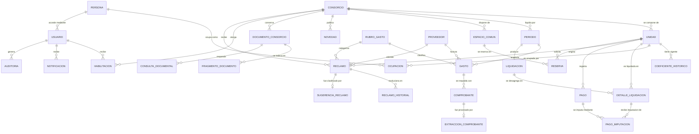

# 7. Análisis de datos

> **Requisito de la cátedra (3° Entrega, punto 7):** *"Análisis de datos."*

---

## 7.1 Alcance y punto de partida

El modelo de datos que se presenta reemplaza al elaborado en la revisión anterior del proyecto, que
resultaba insuficiente frente a los requerimientos del punto 4. El modelo previo contenía siete
entidades —administrador, edificio, departamento, inquilino, incidencia, gastos y expensa— con tres
deficiencias que impedían satisfacer los requerimientos actuales:

| Deficiencia del modelo anterior | Consecuencia | Corrección adoptada |
|---|---|---|
| Confundía persona con rol: `Inquilino` era a la vez la persona y su vínculo con la unidad | Un propietario que además habita su unidad no tenía representación; un inquilino que se muda perdía su historia | Se separa `Persona` de `Ocupacion`, que es el vínculo con vigencia temporal |
| El departamento no tenía coeficiente | El prorrateo, que es el núcleo del negocio, no era representable | `Unidad` incorpora el coeficiente, con vigencia histórica en `CoeficienteHistorico` |
| El gasto se vinculaba directamente a la expensa, sin rubro ni proveedor | Impedía todo indicador de gestión: no se podía agrupar por rubro ni evaluar proveedores | Se incorporan `RubroGasto` y `Proveedor`, ambos obligatorios en el gasto |

Se adopta el término **unidad funcional** en lugar de "departamento" por ser el que utiliza el Código
Civil y Comercial, y porque comprende cocheras, locales y bauleras, que también tributan expensas.

## 7.2 Reglas de negocio que gobiernan los datos

Estas reglas son el fundamento de las restricciones del modelo. Cada una se implementa como
restricción de base de datos siempre que sea posible, y como validación de aplicación cuando no lo
sea.

| Código | Regla | Implementación |
|---|---|---|
| RN-01 | La suma de los coeficientes de las unidades de un consorcio debe ser exactamente 100,000000 % | Validación de aplicación en cada alta o modificación; verificación obligatoria antes de liquidar |
| RN-02 | Un coeficiente solo puede modificarse hacia el futuro. Las liquidaciones ya emitidas conservan el coeficiente vigente al momento de emitirse | `CoeficienteHistorico` con vigencia; `DetalleLiquidacion` almacena el coeficiente aplicado |
| RN-03 | Un gasto pertenece a un único consorcio y a un único período, y no puede modificarse una vez que el período fue liquidado | Restricción de clave foránea; verificación de estado del período |
| RN-04 | Todo gasto debe estar clasificado como ordinario o extraordinario | Atributo obligatorio en `RubroGasto`, con posibilidad de excepción por gasto |
| RN-05 | Las expensas ordinarias son a cargo del ocupante; las extraordinarias, del propietario, conforme a la Ley 27.551 | Se calculan dos subtotales por unidad en `DetalleLiquidacion` |
| RN-06 | Un período solo puede liquidarse una vez. Corregir exige anular la liquidación y emitir una nueva, dejando ambas registradas | Estado del período; `Liquidacion` con estado y referencia a la liquidación que anula |
| RN-07 | La suma de los importes de `DetalleLiquidacion` debe igualar el total de `Liquidacion`, con tolerancia cero | Verificación posterior al cálculo, con ajuste de redondeo asignado a la unidad de mayor coeficiente |
| RN-08 | Un pago se imputa a una o varias liquidaciones de una misma unidad, en orden de antigüedad | Tabla de imputación `PagoImputacion` |
| RN-09 | Una unidad no puede tener dos ocupaciones vigentes del mismo tipo en la misma fecha | Restricción de exclusión sobre el rango de vigencia |
| RN-10 | Una reserva no puede superponerse con otra confirmada del mismo espacio común | Restricción de exclusión sobre el rango horario |
| RN-11 | Un reclamo siempre tiene un estado y, salvo en el estado inicial, un responsable asignado | Verificación en la transición de estado |
| RN-12 | Un usuario solo accede a datos de los consorcios sobre los que tiene una habilitación vigente | Filtro obligatorio por consorcio en toda consulta; ver el punto 12 |
| RN-13 | La nómina nominada de deudores solo es visible para el administrador y el consejo de propietarios | Autorización por rol; el consorcista ve únicamente el dato agregado |
| RN-14 | Ninguna salida de un servicio automático impacta en un dato económico sin confirmación humana | `ExtraccionComprobante` es una entidad separada del `Gasto`; el gasto se crea recién al confirmar |
| RN-15 | Toda operación que modifica un dato económico queda registrada en la bitácora de auditoría | Disparadores de base de datos sobre las tablas involucradas |

## 7.3 Modelo conceptual

### 7.3.1 Diagrama entidad-relación

*Ilustración 8 — Diagrama entidad-relación.*

### 7.3.2 Agrupación por subsistema

| Subsistema | Entidades | Requerimientos que soporta |
|---|---|---|
| Estructura del consorcio | `Consorcio`, `Unidad`, `CoeficienteHistorico`, `EspacioComun` | RF-01, RF-02, RF-15 |
| Personas y accesos | `Persona`, `Usuario`, `Ocupacion`, `Habilitacion` | RF-03 |
| Gastos | `RubroGasto`, `Proveedor`, `Gasto`, `Comprobante` | RF-04, RF-05, RF-10, RF-17 |
| Liquidación | `Periodo`, `Liquidacion`, `DetalleLiquidacion` | RF-07, RF-08 |
| Cobranzas | `Pago`, `PagoImputacion` | RF-09 |
| Reclamos | `Reclamo`, `ReclamoHistorial` | RF-11, RF-13 |
| Reservas | `Reserva` | RF-16 |
| Comunicación | `Novedad`, `DocumentoConsorcio`, `Notificacion` | RF-14, RF-18, RF-19 |
| Asistencia automática | `ExtraccionComprobante`, `SugerenciaReclamo`, `FragmentoDocumento`, `ConsultaDocumental` | RF-06, RF-12, RF-20 |
| Auditoría | `Auditoria` | RF-26 |

## 7.4 Diccionario de datos

Convenciones: **PK** clave primaria, **FK** clave foránea, **UQ** único, **NN** obligatorio. Todas las
entidades incluyen `creado_en` y `actualizado_en` de tipo marca temporal con zona horaria, omitidos
del detalle por repetitivos. Los identificadores son universalmente únicos, no secuenciales, para no
exponer el volumen de datos en las direcciones web.

### Consorcio

Un edificio o complejo sometido al régimen de propiedad horizontal.

| Atributo | Tipo | Restricción | Descripción |
|---|---|---|---|
| id | uuid | PK | Identificador |
| nombre | texto(120) | NN | Denominación de uso corriente |
| cuit | texto(13) | UQ, NN | Clave del consorcio como sujeto tributario |
| direccion | texto(200) | NN | Domicilio |
| localidad | texto(80) | NN | Localidad |
| fecha_alta | fecha | NN | Inicio de la administración |
| fecha_baja | fecha | | Fin de la administración; nulo si vigente |
| dia_vencimiento | entero | NN | Día del mes de vencimiento de las expensas, entre 1 y 28 |
| tasa_interes_mora | decimal(6,4) | NN | Tasa mensual de interés por mora fijada en asamblea |
| activo | booleano | NN | Estado |

### Unidad

Unidad funcional: departamento, cochera, local o baulera.

| Atributo | Tipo | Restricción | Descripción |
|---|---|---|---|
| id | uuid | PK | Identificador |
| consorcio_id | uuid | FK, NN | Consorcio al que pertenece |
| designacion | texto(20) | NN | Designación según el reglamento, por ejemplo "4°B" |
| tipo | enumerado | NN | departamento, cochera, local, baulera |
| piso | texto(10) | | Piso |
| superficie_m2 | decimal(8,2) | | Superficie según el reglamento |
| activa | booleano | NN | Estado |

Restricción: `UQ (consorcio_id, designacion)`.

### CoeficienteHistorico

Coeficiente de participación de la unidad, con vigencia temporal. Materializa RN-02.

| Atributo | Tipo | Restricción | Descripción |
|---|---|---|---|
| id | uuid | PK | Identificador |
| unidad_id | uuid | FK, NN | Unidad |
| coeficiente | decimal(12,8) | NN | Porcentaje de participación |
| vigente_desde | fecha | NN | Inicio de vigencia |
| vigente_hasta | fecha | | Fin de vigencia; nulo si es el vigente |
| motivo | texto(200) | | Razón del cambio: subdivisión, unificación, corrección |

### Persona

| Atributo | Tipo | Restricción | Descripción |
|---|---|---|---|
| id | uuid | PK | Identificador |
| apellido | texto(80) | NN | Apellido |
| nombre | texto(80) | NN | Nombre |
| tipo_documento | enumerado | NN | DNI, LC, LE, pasaporte, CUIT |
| numero_documento | texto(20) | UQ, NN | Número de documento |
| email | texto(160) | | Correo de contacto |
| telefono | texto(40) | | Teléfono de contacto |

### Ocupacion

Vínculo entre una persona y una unidad, con vigencia. Es la entidad que resuelve la deficiencia
principal del modelo anterior.

| Atributo | Tipo | Restricción | Descripción |
|---|---|---|---|
| id | uuid | PK | Identificador |
| unidad_id | uuid | FK, NN | Unidad |
| persona_id | uuid | FK, NN | Persona |
| tipo | enumerado | NN | propietario, inquilino |
| vigente_desde | fecha | NN | Inicio del vínculo |
| vigente_hasta | fecha | | Fin del vínculo; nulo si vigente |
| recibe_notificaciones | booleano | NN | Si recibe avisos por correo |

Restricción de exclusión que materializa RN-09: no pueden solaparse dos ocupaciones del mismo tipo
sobre la misma unidad.

### Usuario

Credencial de acceso. Se separa de `Persona` porque no toda persona registrada accede al sistema, y
porque los datos de autenticación tienen un ciclo de vida y un régimen de seguridad propios.

| Atributo | Tipo | Restricción | Descripción |
|---|---|---|---|
| id | uuid | PK | Identificador |
| persona_id | uuid | FK, UQ, NN | Persona titular |
| email | texto(160) | UQ, NN | Identificador de acceso |
| hash_password | texto(255) | NN | Contraseña derivada; nunca en texto plano |
| rol_global | enumerado | NN | administrador, operador, consorcista |
| email_verificado | booleano | NN | Verificación del correo |
| ultimo_acceso | marca temporal | | Último ingreso exitoso |
| intentos_fallidos | entero | NN | Contador para la limitación de intentos |
| bloqueado_hasta | marca temporal | | Bloqueo temporal por intentos fallidos |
| activo | booleano | NN | Estado |

### Habilitacion

Autoriza a un usuario sobre un consorcio determinado. Materializa RN-12: el aislamiento entre
consorcios es una entidad del modelo, no una condición dispersa en el código.

| Atributo | Tipo | Restricción | Descripción |
|---|---|---|---|
| id | uuid | PK | Identificador |
| usuario_id | uuid | FK, NN | Usuario |
| consorcio_id | uuid | FK, NN | Consorcio |
| rol | enumerado | NN | administrador, operador, consejo, consorcista |
| vigente_desde | fecha | NN | Inicio |
| vigente_hasta | fecha | | Fin; nulo si vigente |

Restricción: `UQ (usuario_id, consorcio_id, rol)`.

### RubroGasto

| Atributo | Tipo | Restricción | Descripción |
|---|---|---|---|
| id | uuid | PK | Identificador |
| nombre | texto(80) | UQ, NN | Denominación: ascensor, limpieza, energía eléctrica, sueldos, seguros |
| naturaleza | enumerado | NN | ordinario, extraordinario. Materializa RN-04 y RN-05 |
| es_recurrente | booleano | NN | Si se espera en todos los períodos; habilita la detección de faltantes |
| activo | booleano | NN | Estado |

### Proveedor

| Atributo | Tipo | Restricción | Descripción |
|---|---|---|---|
| id | uuid | PK | Identificador |
| razon_social | texto(160) | NN | Razón social |
| cuit | texto(13) | UQ | Clave única de identificación tributaria |
| rubro_principal_id | uuid | FK | Rubro habitual |
| telefono | texto(40) | | Contacto |
| email | texto(160) | | Contacto |
| atiende_urgencias | booleano | NN | Si atiende fuera de horario |
| activo | booleano | NN | Estado |

### Gasto

| Atributo | Tipo | Restricción | Descripción |
|---|---|---|---|
| id | uuid | PK | Identificador |
| periodo_id | uuid | FK, NN | Período al que se imputa |
| rubro_id | uuid | FK, NN | Rubro |
| proveedor_id | uuid | FK | Proveedor; nulo en gastos sin proveedor identificable |
| reclamo_id | uuid | FK | Reclamo que originó el gasto, si corresponde |
| descripcion | texto(300) | NN | Detalle |
| importe | decimal(14,2) | NN | Importe total; debe ser mayor que cero |
| fecha | fecha | NN | Fecha del comprobante |
| naturaleza | enumerado | NN | Hereda del rubro; puede excepcionarse por gasto |
| cuota_actual | entero | | Número de cuota, si el gasto se prorratea en varios períodos |
| cuota_total | entero | | Cantidad de cuotas |
| cargado_por | uuid | FK, NN | Usuario que lo registró |

### Comprobante

| Atributo | Tipo | Restricción | Descripción |
|---|---|---|---|
| id | uuid | PK | Identificador |
| gasto_id | uuid | FK, NN | Gasto que respalda |
| nombre_archivo | texto(255) | NN | Nombre original |
| tipo_mime | texto(80) | NN | Tipo de contenido validado |
| tamano_bytes | entero | NN | Tamaño |
| clave_almacenamiento | texto(400) | NN | Ubicación en el almacenamiento de objetos |
| hash_sha256 | texto(64) | NN | Huella del archivo; detecta alteración y duplicados |
| subido_por | uuid | FK, NN | Usuario que lo subió |

El campo `hash_sha256` cumple dos funciones: permite detectar que un comprobante fue reemplazado
después de liquidado, y evita cargar dos veces la misma factura, que era un error frecuente en el
proceso manual.

### Periodo

| Atributo | Tipo | Restricción | Descripción |
|---|---|---|---|
| id | uuid | PK | Identificador |
| consorcio_id | uuid | FK, NN | Consorcio |
| anio | entero | NN | Año |
| mes | entero | NN | Mes, entre 1 y 12 |
| estado | enumerado | NN | abierto, cerrado, liquidado, anulado |
| fecha_cierre | marca temporal | | Cierre de la carga de gastos |
| fecha_vencimiento | fecha | NN | Vencimiento del pago |

Restricción: `UQ (consorcio_id, anio, mes)`. Materializa RN-03 y RN-06.

### Liquidacion

| Atributo | Tipo | Restricción | Descripción |
|---|---|---|---|
| id | uuid | PK | Identificador |
| periodo_id | uuid | FK, UQ, NN | Período liquidado |
| total_ordinario | decimal(14,2) | NN | Suma de gastos ordinarios |
| total_extraordinario | decimal(14,2) | NN | Suma de gastos extraordinarios |
| total_general | decimal(14,2) | NN | Total del período |
| emitida_en | marca temporal | NN | Momento de emisión |
| emitida_por | uuid | FK, NN | Usuario que la ejecutó |
| estado | enumerado | NN | vigente, anulada |
| anula_a_id | uuid | FK | Liquidación que anula, si corresponde |

### DetalleLiquidacion

| Atributo | Tipo | Restricción | Descripción |
|---|---|---|---|
| id | uuid | PK | Identificador |
| liquidacion_id | uuid | FK, NN | Liquidación |
| unidad_id | uuid | FK, NN | Unidad |
| coeficiente_aplicado | decimal(12,8) | NN | Coeficiente vigente al emitir. Materializa RN-02 |
| importe_ordinario | decimal(14,2) | NN | A cargo del ocupante |
| importe_extraordinario | decimal(14,2) | NN | A cargo del propietario |
| deuda_anterior | decimal(14,2) | NN | Saldo impago de períodos anteriores |
| interes_mora | decimal(14,2) | NN | Interés calculado |
| ajuste_redondeo | decimal(14,2) | NN | Diferencia de redondeo asignada. Materializa RN-07 |
| total_unidad | decimal(14,2) | NN | Total a pagar |
| clave_documento | texto(400) | | Ubicación del documento descargable |

Restricción: `UQ (liquidacion_id, unidad_id)`.

### Pago y PagoImputacion

| `Pago` | Tipo | Restricción | Descripción |
|---|---|---|---|
| id | uuid | PK | Identificador |
| unidad_id | uuid | FK, NN | Unidad que paga |
| fecha_pago | fecha | NN | Fecha efectiva |
| importe | decimal(14,2) | NN | Importe recibido |
| medio | enumerado | NN | transferencia, efectivo, depósito, débito |
| referencia | texto(120) | | Número de operación |
| registrado_por | uuid | FK, NN | Usuario que lo registró |

| `PagoImputacion` | Tipo | Restricción | Descripción |
|---|---|---|---|
| id | uuid | PK | Identificador |
| pago_id | uuid | FK, NN | Pago |
| detalle_liquidacion_id | uuid | FK, NN | Detalle al que se imputa |
| importe_imputado | decimal(14,2) | NN | Parte del pago aplicada |

La imputación como entidad separada permite que un pago cubra parcialmente varios meses y que un mes
se cancele con varios pagos, que es el comportamiento real de la cobranza de expensas. Materializa
RN-08.

### Reclamo y ReclamoHistorial

| `Reclamo` | Tipo | Restricción | Descripción |
|---|---|---|---|
| id | uuid | PK | Identificador |
| consorcio_id | uuid | FK, NN | Consorcio |
| unidad_id | uuid | FK | Unidad que reclama; nulo si es de área común |
| creado_por | uuid | FK, NN | Usuario que lo generó |
| titulo | texto(140) | NN | Título |
| descripcion | texto | NN | Descripción del problema |
| alcance | enumerado | NN | individual, general |
| rubro_id | uuid | FK | Rubro asignado |
| urgencia | enumerado | NN | baja, media, alta, crítica |
| estado | enumerado | NN | abierto, asignado, en curso, resuelto, cerrado, rechazado |
| responsable_id | uuid | FK | Usuario responsable. Materializa RN-11 |
| proveedor_id | uuid | FK | Proveedor asignado |
| fecha_apertura | marca temporal | NN | Apertura |
| fecha_resolucion | marca temporal | | Resolución. Base del indicador OBJ-4.4 |

| `ReclamoHistorial` | Tipo | Restricción | Descripción |
|---|---|---|---|
| id | uuid | PK | Identificador |
| reclamo_id | uuid | FK, NN | Reclamo |
| estado_anterior | enumerado | | Estado previo |
| estado_nuevo | enumerado | NN | Estado alcanzado |
| comentario | texto | | Observación |
| usuario_id | uuid | FK, NN | Quien produjo el cambio |
| ocurrido_en | marca temporal | NN | Momento |

### EspacioComun y Reserva

| `EspacioComun` | Tipo | Restricción | Descripción |
|---|---|---|---|
| id | uuid | PK | Identificador |
| consorcio_id | uuid | FK, NN | Consorcio |
| nombre | texto(80) | NN | Denominación |
| capacidad_maxima | entero | | Cupo de personas |
| anticipacion_minima_horas | entero | NN | Anticipación mínima para reservar |
| anticipacion_maxima_dias | entero | NN | Anticipación máxima |
| duracion_maxima_horas | entero | NN | Duración máxima |
| reservas_max_mes_unidad | entero | NN | Tope mensual por unidad |
| requiere_deposito | booleano | NN | Si exige depósito de garantía |
| importe_deposito | decimal(14,2) | | Importe del depósito |
| activo | booleano | NN | Estado |

Estos atributos son la traducción a datos de las reglas del reglamento interno que hoy se aplican de
memoria y de manera desigual, según el relevamiento del punto 1.5.4.

| `Reserva` | Tipo | Restricción | Descripción |
|---|---|---|---|
| id | uuid | PK | Identificador |
| espacio_id | uuid | FK, NN | Espacio común |
| unidad_id | uuid | FK, NN | Unidad solicitante |
| solicitada_por | uuid | FK, NN | Usuario solicitante |
| desde | marca temporal | NN | Inicio |
| hasta | marca temporal | NN | Fin |
| cantidad_personas | entero | | Asistentes previstos |
| estado | enumerado | NN | pendiente, confirmada, cancelada, cumplida |
| observaciones | texto | | Observaciones |

Restricción de exclusión sobre `(espacio_id, rango horario)` para las reservas confirmadas, que
materializa RN-10 en la base de datos y no en el código de la aplicación.

### Novedad, DocumentoConsorcio y Notificacion

| `Novedad` | Tipo | Restricción | Descripción |
|---|---|---|---|
| id | uuid | PK | Identificador |
| consorcio_id | uuid | FK, NN | Consorcio |
| titulo | texto(140) | NN | Título |
| cuerpo | texto | NN | Contenido |
| publicada_por | uuid | FK, NN | Autor |
| publicada_en | marca temporal | NN | Publicación |
| fijada | booleano | NN | Si se fija al inicio del listado |

| `DocumentoConsorcio` | Tipo | Restricción | Descripción |
|---|---|---|---|
| id | uuid | PK | Identificador |
| consorcio_id | uuid | FK, NN | Consorcio |
| tipo | enumerado | NN | reglamento de copropiedad, reglamento interno, acta, contrato, póliza, otro |
| titulo | texto(200) | NN | Título |
| clave_almacenamiento | texto(400) | NN | Ubicación del archivo |
| hash_sha256 | texto(64) | NN | Huella del archivo |
| fecha_documento | fecha | | Fecha del documento |
| visible_consorcistas | booleano | NN | Si es accesible a los consorcistas |
| estado_indexacion | enumerado | NN | pendiente, procesando, indexado, error |

| `Notificacion` | Tipo | Restricción | Descripción |
|---|---|---|---|
| id | uuid | PK | Identificador |
| usuario_id | uuid | FK, NN | Destinatario |
| tipo | enumerado | NN | liquidación publicada, cambio de estado de reclamo, reserva confirmada, vencimiento próximo, novedad |
| titulo | texto(140) | NN | Título |
| cuerpo | texto | NN | Contenido |
| entidad_tipo | texto(60) | | Entidad referida |
| entidad_id | uuid | | Identificador de la entidad referida |
| enviada_en | marca temporal | | Envío efectivo |
| leida_en | marca temporal | | Lectura |
| estado_envio | enumerado | NN | pendiente, enviada, fallida |

### Entidades de la capa de asistencia automática

Estas cuatro entidades existen por una decisión de diseño explícita: **el resultado de un
procesamiento automático se conserva separado del dato definitivo**. Esto permite auditar la precisión
del procesamiento, sostener el informe de pruebas del punto 15 y garantizar RN-14.

| `ExtraccionComprobante` | Tipo | Restricción | Descripción |
|---|---|---|---|
| id | uuid | PK | Identificador |
| comprobante_id | uuid | FK, NN | Comprobante procesado |
| proveedor_detectado | texto(160) | | Razón social extraída |
| cuit_detectado | texto(13) | | Clave extraída |
| fecha_detectada | fecha | | Fecha extraída |
| importe_detectado | decimal(14,2) | | Importe extraído |
| rubro_sugerido_id | uuid | FK | Rubro sugerido |
| confianza | decimal(4,3) | | Nivel de confianza global, entre 0 y 1 |
| confianza_por_campo | json | | Confianza discriminada por campo |
| estado | enumerado | NN | pendiente, confirmada, corregida, descartada |
| confirmada_por | uuid | FK | Usuario que confirmó |
| campos_corregidos | json | | Qué campos debió corregir la persona |
| procesado_en | marca temporal | NN | Momento del procesamiento |

`campos_corregidos` es el dato que permite medir la precisión real de la extracción en producción y
decidir si conviene mantener, ajustar o retirar la función.

| `SugerenciaReclamo` | Tipo | Restricción | Descripción |
|---|---|---|---|
| id | uuid | PK | Identificador |
| reclamo_id | uuid | FK, UQ, NN | Reclamo |
| rubro_sugerido_id | uuid | FK | Rubro sugerido |
| urgencia_sugerida | enumerado | | Urgencia sugerida |
| proveedor_sugerido_id | uuid | FK | Proveedor sugerido |
| horas_estimadas | entero | | Estimación de resolución |
| confianza | decimal(4,3) | | Nivel de confianza |
| aceptada | booleano | | Si el operador aceptó la sugerencia sin modificarla |
| procesado_en | marca temporal | NN | Momento del procesamiento |

| `FragmentoDocumento` | Tipo | Restricción | Descripción |
|---|---|---|---|
| id | uuid | PK | Identificador |
| documento_id | uuid | FK, NN | Documento de origen |
| numero_fragmento | entero | NN | Orden dentro del documento |
| pagina | entero | | Página de origen, para la cita |
| contenido | texto | NN | Texto del fragmento |
| vector | vector(768) | NN | Representación semántica, con índice vectorial |

| `ConsultaDocumental` | Tipo | Restricción | Descripción |
|---|---|---|---|
| id | uuid | PK | Identificador |
| consorcio_id | uuid | FK, NN | Consorcio consultado |
| usuario_id | uuid | FK, NN | Quien consultó |
| pregunta | texto | NN | Pregunta formulada |
| respuesta | texto | | Respuesta generada |
| fragmentos_citados | json | NN | Identificadores de los fragmentos utilizados |
| sin_respaldo | booleano | NN | Verdadero cuando no se halló fragmento pertinente y se respondió que no hay respaldo documental |
| util | booleano | | Valoración del usuario |
| consultado_en | marca temporal | NN | Momento |

El campo `sin_respaldo` registra explícitamente los casos en que el sistema se abstuvo de responder.
Es la evidencia de que la función no improvisa cuando la documentación no contiene la respuesta.

### Auditoria

| Atributo | Tipo | Restricción | Descripción |
|---|---|---|---|
| id | bigserial | PK | Identificador secuencial |
| usuario_id | uuid | FK | Autor de la operación; nulo en procesos automáticos |
| accion | enumerado | NN | alta, modificación, baja, liquidación, anulación, acceso |
| entidad_tipo | texto(60) | NN | Entidad afectada |
| entidad_id | uuid | NN | Identificador de la instancia |
| datos_anteriores | json | | Estado previo |
| datos_nuevos | json | | Estado posterior |
| direccion_ip | inet | | Origen de la solicitud |
| ocurrido_en | marca temporal | NN | Momento |

Tabla de solo agregado: la aplicación no dispone de permisos de actualización ni de borrado sobre
ella, conforme a RNF-12.

## 7.5 Volumetría y proyección de crecimiento

Base de estimación: 11 consorcios, 418 unidades, 900 gastos mensuales y 70 reclamos mensuales.

| Entidad | Registros al inicio | Crecimiento anual | A 5 años |
|---|---:|---:|---:|
| Consorcio | 11 | +3 | 26 |
| Unidad | 418 | +110 | 968 |
| Persona | 520 | +150 | 1.270 |
| Usuario | 300 | +120 | 900 |
| Gasto | 10.800 | +10.800 | 65.000 |
| Comprobante | 10.800 | +10.800 | 65.000 |
| Liquidacion | 132 | +132 | 790 |
| **DetalleLiquidacion** | **5.016** | **+5.016** | **35.000** |
| Pago | 4.500 | +4.500 | 27.000 |
| PagoImputacion | 5.400 | +5.400 | 32.000 |
| Reclamo | 840 | +840 | 5.000 |
| ReclamoHistorial | 3.360 | +3.360 | 20.000 |
| Reserva | 600 | +600 | 3.600 |
| FragmentoDocumento | 2.200 | +900 | 6.700 |
| Auditoria | 45.000 | +45.000 | 270.000 |

| Concepto | Volumen |
|---|---|
| Registros totales a 5 años | Menos de 600.000 |
| Tamaño estimado de la base relacional a 5 años | Inferior a 2 GB |
| Almacenamiento de comprobantes, 250 KB promedio | Alrededor de 16 GB a 5 años |
| Documentos del consorcio | Menos de 1 GB |

`DetalleLiquidacion` es la tabla de mayor crecimiento entre las consultadas con frecuencia y la que
sostiene los indicadores de morosidad; sus índices se definen en el punto 12. El volumen total está
holgadamente dentro de los límites de las capas gratuitas evaluadas en el punto 4, lo que confirma la
factibilidad técnica del punto 5.2.

## 7.6 Índices previstos

| Tabla | Índice | Propósito |
|---|---|---|
| `Unidad` | (consorcio_id, activa) | Listados por consorcio |
| `Gasto` | (periodo_id, rubro_id) | Liquidación y análisis por rubro |
| `Gasto` | (proveedor_id, fecha) | Indicador de proveedores, RF-24 |
| `DetalleLiquidacion` | (unidad_id, liquidacion_id) | Estado de cuenta por unidad |
| `DetalleLiquidacion` | (liquidacion_id) | Emisión y control de cuadratura |
| `PagoImputacion` | (detalle_liquidacion_id) | Cálculo de saldo pendiente |
| `Reclamo` | (consorcio_id, estado, fecha_apertura) | Bandeja de reclamos e indicador OBJ-4.4 |
| `Reserva` | Índice GiST sobre (espacio_id, rango horario) | Detección de superposición, RN-10 |
| `FragmentoDocumento` | Índice vectorial sobre el vector | Búsqueda semántica, RF-20 |
| `Auditoria` | (entidad_tipo, entidad_id, ocurrido_en) | Consulta de la historia de un registro |
| `Comprobante` | (hash_sha256) | Detección de comprobantes duplicados |

## 7.7 Vistas de apoyo a los indicadores

Los indicadores del punto 12 se construyen sobre vistas que encapsulan la lógica de agregación,
evitando que el cálculo se repita en la aplicación:

| Vista | Contenido | Indicador que soporta |
|---|---|---|
| `v_saldo_unidad` | Saldo pendiente por unidad: total liquidado menos total imputado | RF-22 |
| `v_morosidad_consorcio` | Deuda vencida y su porcentaje sobre la masa liquidada, por consorcio y por mes | RF-22 |
| `v_gasto_rubro_periodo` | Importe por rubro y período, con promedio móvil de los doce períodos anteriores | RF-23 |
| `v_desempeno_proveedor` | Costo acumulado, cantidad de contrataciones y tiempo medio de resolución por proveedor | RF-24 |
| `v_resolucion_reclamos` | Tiempo entre apertura y resolución, agrupado por rubro y urgencia | RF-25 |
| `v_precision_asistencia` | Porcentaje de extracciones confirmadas sin corrección y de sugerencias aceptadas | Punto 15 |

La última vista no responde a un requerimiento funcional del cliente: mide la precisión de las
funciones asistidas y es la que permite decidir con datos si conviene sostenerlas.

## 7.8 Consideraciones sobre datos personales

Conforme al punto 5.3.2:

| Categoría | Atributos | Tratamiento |
|---|---|---|
| Identificatorios | Nombre, apellido, documento | Acceso restringido a administrador y operador |
| De contacto | Correo, teléfono | Rectificables por el propio titular |
| Económicos sensibles | Saldo, mora, historial de pagos | **Acceso restringido conforme a RN-13.** El consorcista ve exclusivamente su propia unidad; el conjunto ve solo el dato agregado sin identificación |
| De autenticación | Contraseña derivada | Nunca legible ni recuperable; solo restablecible |
| De navegación | Bitácora de auditoría, dirección IP | Retención de 24 meses, luego se anonimiza la dirección IP |

**Los datos personales de los consorcistas no se envían a servicios externos de procesamiento.** Lo
que se procesa es la imagen del comprobante, el texto del reclamo y la documentación reglamentaria
del consorcio, ninguno de los cuales contiene la nómina de propietarios ni información de deuda.

---

## Referencias

- Congreso de la Nación Argentina. (2000). *Ley N.º 25.326 de Protección de los Datos Personales*.
- Congreso de la Nación Argentina. (2014). *Ley N.º 26.994. Código Civil y Comercial de la Nación*.
- Congreso de la Nación Argentina. (2020). *Ley N.º 27.551 de Alquileres*.
- Date, C. J. (2003). *An Introduction to Database Systems* (8.ª ed.). Addison-Wesley.
- Elmasri, R., & Navathe, S. B. (2016). *Fundamentals of Database Systems* (7.ª ed.). Pearson.
- Silberschatz, A., Korth, H. F., & Sudarshan, S. (2019). *Database System Concepts* (7.ª ed.).
  McGraw-Hill.
