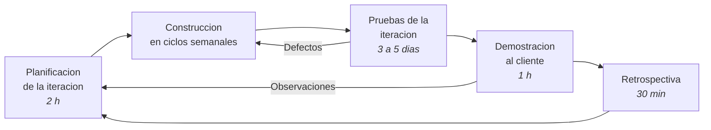

# 8. Definición de la metodología de desarrollo — Justificación

> **Requisito de la cátedra (3° Entrega, punto 8):** *"Definición de la metodología de desarrollo a
> utilizar – Justificación. Si la metodología seleccionada es estructurada, definir el tipo de
> prototipación."*

---

## 8.1 Criterios de selección

La metodología se elige contra las condiciones reales del proyecto, no por preferencia. Las
condiciones relevantes surgen de los puntos anteriores:

| Condición | Origen | Implicancia metodológica |
|---|---|---|
| Equipo de **2 personas** que asumen los cinco roles | Punto 4.2 | Toda ceremonia que exija roles diferenciados es sobrecarga |
| Capacidad de **24 horas semanales** conjuntas | Punto 4.5.1 | El tiempo dedicado a proceso se descuenta del tiempo de construcción |
| **Fechas de entrega fijas e improrrogables** | Cronograma de cátedra | El alcance es la única variable ajustable; el plazo no lo es |
| Requerimientos **bien conocidos y estables** en el núcleo | Puntos 1 y 2: la liquidación de expensas está regulada por ley | El núcleo no requiere descubrimiento iterativo |
| Requerimientos **inciertos en la periferia** | Funciones asistidas y búsqueda semántica, brechas del punto 5.2.2 | Estas sí requieren exploración y validación temprana |
| **Cliente disponible pero no dedicado** | Grupo Delta tiene 5 empleados con tareas propias | Es irreal exigir presencia diaria del cliente |
| Necesidad de **validación en paralelo** de la liquidación | Punto 5.1.2 | El proceso más crítico exige demostración antes de aceptación |
| **Entregables parciales aceptados y pagados** | Punto 6.4.1 | Cada iteración debe producir algo funcional y demostrable |

## 8.2 Alternativas metodológicas evaluadas

| Metodología | Ajuste al proyecto | Decisión |
|---|---|---|
| **Cascada** | Los requerimientos del núcleo son estables, lo que la haría viable. Pero concentra toda la validación al final, incompatible con el pago contra entregables del punto 6.4.1 y con la necesidad de validar en paralelo la liquidación. Además no admite la exploración que exigen las funciones asistidas | Descartada |
| **Scrum canónico** | Prescribe tres roles —dueño de producto, maestro de scrum, equipo de desarrollo—, cinco eventos y estimación relativa. Con dos personas, los roles se superponen hasta perder sentido y las ceremonias consumen una porción desproporcionada de las 24 horas semanales | Descartada en su forma completa |
| **Programación extrema** | Sus prácticas técnicas —integración continua, pruebas primero, refactorización, propiedad colectiva del código— encajan bien con un equipo de dos. Pero la programación en pares consumiría la mitad de la capacidad conjunta, y el desarrollo guiado por pruebas de manera estricta no es sostenible con el nivel de experiencia del equipo en el entorno elegido | Adoptada parcialmente |
| **Proceso unificado ágil** | Buen ajuste conceptual: iterativo, incremental y dirigido por casos de uso. Su documentación asociada es más pesada de lo que dos personas pueden sostener | Adoptada parcialmente |
| **Modelo incremental con prácticas ágiles seleccionadas** | Combina la estructura de fases que exige la entrega académica con la capacidad de validar y corregir cada incremento | **Adoptada** |

## 8.3 Metodología adoptada

> **Se adopta un modelo de desarrollo iterativo e incremental, con tres iteraciones de construcción y
> un conjunto acotado de prácticas ágiles seleccionadas por su relación entre beneficio y costo para
> un equipo de dos personas.**

No se declara "Scrum" porque no se van a cumplir sus reglas, y afirmar que se sigue un marco que no
se sigue es peor que no seguirlo. Lo que se adopta se enumera explícitamente.

### 8.3.1 Estructura de iteraciones

Cada iteración de construcción produce un incremento **desplegado y demostrable**, no un conjunto de
componentes a integrar después.

| Iteración | Alcance funcional | Requerimientos | Duración |
|---|---|---|---|
| **Iteración 1 — Núcleo** | Usuarios, roles y habilitaciones; consorcios, unidades y coeficientes; gastos, rubros, proveedores y comprobantes | RF-01 a RF-05, RF-10, RF-17, RF-26 | 6 semanas |
| **Iteración 2 — Liquidación** | Períodos, liquidación de expensas, emisión de documentos por unidad, pagos, imputación y morosidad | RF-07, RF-08, RF-09 | 6 semanas |
| **Iteración 3 — Servicios y análisis** | Reclamos, reservas, novedades, documentación, notificaciones, indicadores de gestión y funciones asistidas | RF-11 a RF-16, RF-18 a RF-25, RF-06, RF-12, RF-20 | 8 semanas |

El orden no es arbitrario y responde a tres criterios:

1. **Dependencia de datos.** No se puede liquidar sin unidades, coeficientes y gastos.
2. **Riesgo decreciente.** La liquidación es el proceso de mayor riesgo técnico y de negocio, y se
   ubica lo más temprano posible después de sus dependencias, para que un desvío tenga margen de
   recuperación.
3. **Alineación con el pago contra entregables** del punto 6.4.1: cada iteración corresponde a un
   entregable facturable.

Las funciones asistidas se ubican al final deliberadamente: son las de mayor incertidumbre y las
únicas cuya ausencia no impide operar el sistema. Si el plazo se comprime, son las primeras
candidatas a reducirse, y esa decisión queda tomada de antemano en lugar de improvisarse bajo
presión.

### 8.3.2 Ciclo interno de cada iteración

### 8.3.3 Prácticas adoptadas y prácticas descartadas

| Práctica | ¿Se adopta? | Fundamento |
|---|---|---|
| Iteraciones de duración fija con incremento desplegable | **Sí** | Es el núcleo de la metodología |
| Reunión de planificación al inicio de cada iteración | **Sí**, 2 horas | Necesaria para comprometer alcance |
| Registro de pendientes priorizado | **Sí** | Un único listado ordenado por valor y riesgo, en el gestor del repositorio |
| Sincronización diaria de pie | **No** | Con dos personas que trabajan coordinadas, es redundante. Se reemplaza por dos sincronizaciones semanales de 15 minutos |
| Demostración al cierre de la iteración | **Sí**, 1 hora con el cliente | Es la base de la aceptación del entregable y del pago |
| Retrospectiva | **Sí**, 30 minutos | Barata y con retorno alto: es lo que permite corregir la estimación entre iteraciones |
| Estimación relativa por puntos de historia | **No** | El dimensionamiento formal del punto 9 ya provee la base de estimación en horas |
| Integración continua | **Sí** | Verificación automática en cada envío al repositorio: compilación, análisis estático y pruebas |
| Revisión cruzada de código | **Sí** | Ningún cambio se integra a la rama principal sin revisión del otro integrante. Es la práctica de mayor retorno en un equipo de dos |
| Programación en pares | **No como norma**, sí puntualmente | Consumiría la mitad de la capacidad. Se reserva para el cálculo de liquidación y para el control de autorización, donde un error tiene costo alto |
| Desarrollo guiado por pruebas | **Parcialmente** | Obligatorio en la lógica de liquidación, prorrateo, intereses e imputación de pagos. Opcional en el resto |
| Refactorización continua | **Sí** | Con revisión cruzada como control |
| Propiedad colectiva del código | **Sí** | Ninguno de los dos integrantes puede ser el único que entiende una parte del sistema |
| Definición de terminado | **Sí** | Ver 8.3.4 |

### 8.3.4 Definición de terminado

Un requerimiento se considera terminado únicamente cuando cumple **todas** estas condiciones:

1. El código está integrado a la rama principal y revisado por el otro integrante.
2. Las pruebas automatizadas correspondientes pasan y la verificación automática del repositorio está
   en verde.
3. La autorización por rol y por consorcio está verificada, conforme a RNF-03 y RN-12.
4. La funcionalidad opera correctamente en teléfono, según RNF-01.
5. Los mensajes de error son comprensibles para el usuario final, según RNF-10.
6. Está desplegado en el entorno de demostración y es accesible.
7. Si modifica datos económicos, registra en la bitácora de auditoría, según RN-15.
8. La documentación asociada está actualizada.

El punto 3 se incluye explícitamente porque el aislamiento entre consorcios es el defecto de seguridad
más probable y más grave de este sistema: exponer los datos de un consorcio a otro. Verificarlo en
cada requerimiento, y no en una revisión final, es la forma de evitarlo.

### 8.3.5 Gestión de la configuración

| Aspecto | Definición |
|---|---|
| Repositorio | Único, distribuido, con la rama principal siempre desplegable |
| Ramas | Una rama por requerimiento, integrada mediante solicitud de incorporación con revisión obligatoria |
| Mensajes de confirmación | Referencian el código de requerimiento, por ejemplo `RF-07` |
| Versionado | Semántico, con etiqueta por cada iteración cerrada |
| Entornos | Desarrollo local, demostración desplegado automáticamente desde la rama principal, y producción desplegado manualmente desde una etiqueta |
| Esquema de base de datos | Migraciones versionadas en el repositorio; ningún cambio manual sobre la base |

## 8.4 Estrategia de prototipación

La consigna exige definir el tipo de prototipación cuando la metodología es estructurada. La adoptada
es iterativa, pero se define igualmente porque el prototipo es un entregable exigido y porque en este
proyecto conviven dos tipos de prototipo con propósitos distintos.

### 8.4.1 Prototipo de interfaz — desechable, de baja y media fidelidad

| Aspecto | Definición |
|---|---|
| Propósito | Validar la navegación y la disposición de la información con el cliente **antes** de construir |
| Fidelidad | Baja al inicio, bocetos; media después, maquetas navegables sin lógica |
| Destino | **Se descarta.** No se convierte en código de producción |
| Momento | Etapa de diseño, previa a la iteración 1 |
| Pantallas prototipadas | Panel del administrador, carga de gasto con comprobante, ejecución de la liquidación, estado de cuenta de la unidad, alta y seguimiento de reclamo, panel de indicadores |
| Validación | Dos sesiones con el cliente: una con la responsable de liquidaciones y otra con el socio gerente |

Es desechable de manera deliberada: convertir una maqueta en producción arrastra decisiones tomadas
para comunicar, no para funcionar.

### 8.4.2 Prototipo del sistema — evolutivo

| Aspecto | Definición |
|---|---|
| Propósito | Construir el sistema por incrementos, cada uno funcional y desplegado |
| Fidelidad | Alta desde la iteración 1: código de producción, no simulación |
| Destino | **Evoluciona hasta convertirse en el sistema.** Es el prototipo exigido por el punto 13 |
| Momento | Iteraciones 1 a 3 |
| Validación | Demostración al cierre de cada iteración, con aceptación formal del cliente |

### 8.4.3 Pruebas de concepto exploratorias — desechables

Para las dos brechas técnicas identificadas en el punto 5.2.2 se construyen pruebas de concepto
aisladas, **antes** de comprometer la funcionalidad en una iteración:

| Prueba de concepto | Qué se verifica | Criterio de aceptación | Momento |
|---|---|---|---|
| Extracción de datos de comprobantes | Precisión sobre 30 comprobantes reales de Grupo Delta, de proveedores y formatos variados | Al menos el 80 % de los campos correctos sin corrección humana | Antes de la iteración 3 |
| Búsqueda semántica sobre reglamentos | Pertinencia de los fragmentos recuperados sobre un reglamento de copropiedad real, con 20 preguntas frecuentes | Al menos el 85 % de las preguntas con el fragmento correcto entre los tres primeros resultados | Antes de la iteración 3 |

Si una prueba de concepto no alcanza su criterio, el requerimiento asociado se reduce o se posterga.
Se decide con evidencia y de manera anticipada, no descubriendo el problema a mitad de la
construcción. Esto se registra como decisión de mitigación en el punto 11.

## 8.5 Justificación de la elección

**1. Es la única metodología compatible con la estructura de pagos comprometida.** El punto 6.4.1 ata
cada cuota a la aceptación de un entregable funcional. Eso exige que el sistema esté operativo por
partes, lo que cascada no produce y un enfoque incremental sí.

**2. Ubica el riesgo alto temprano y el riesgo incierto tarde.** La liquidación —mayor riesgo de
negocio, requerimientos estables— se construye en la iteración 2, con dos iteraciones por delante
para absorber desvíos. Las funciones asistidas —mayor incertidumbre técnica, prescindibles— quedan en
la iteración 3, donde su reducción no compromete el sistema.

**3. Descarta explícitamente las prácticas que no se pueden sostener.** Un equipo de dos personas con
24 horas semanales que declarara seguir Scrum completo estaría documentando una ficción. Adoptar
cinco prácticas y cumplirlas es más honesto y más útil que enunciar quince y cumplir la mitad.

**4. Respeta la restricción de plazo fijo variando el alcance.** Las fechas de la cátedra no se
negocian. Con incrementos priorizados, si la capacidad no alcanza, lo que se recorta está decidido de
antemano y es lo de menor valor, en lugar de entregarse un sistema completo a medio terminar.

**5. Es compatible con la disponibilidad real del cliente.** Una demostración de una hora cada seis a
ocho semanas es sostenible para una organización de cinco personas; una revisión diaria no lo es.

## 8.6 Riesgos de la metodología

| Riesgo | Mitigación | Se trata en |
|---|---|---|
| Con iteraciones largas, un error de comprensión se detecta tarde | Demostraciones parciales informales a mitad de iteración, sin formalidad de aceptación | Punto 11 |
| La revisión cruzada se vuelve un trámite cuando ambos integrantes están apurados | Lista de verificación de revisión con los ocho puntos de la definición de terminado | Punto 15 |
| La deuda técnica se acumula por priorizar funcionalidad | Se reserva el 10 % de la capacidad de cada iteración para refactorización | Punto 10 |
| El cliente no dispone del tiempo comprometido para las demostraciones | Las fechas se acuerdan al inicio del proyecto y se confirman con dos semanas de anticipación | Punto 11 |

---

## Referencias

- Beck, K. (2004). *Extreme Programming Explained: Embrace Change* (2.ª ed.). Addison-Wesley.
- Larman, C. (2004). *Agile and Iterative Development: A Manager's Guide*. Addison-Wesley.
- Pressman, R. S., & Maxim, B. R. (2020). *Ingeniería del software: un enfoque práctico* (9.ª ed.).
  McGraw-Hill.
- Schwaber, K., & Sutherland, J. (2020). *La Guía de Scrum*.
- Sommerville, I. (2016). *Software Engineering* (10.ª ed.). Pearson.
