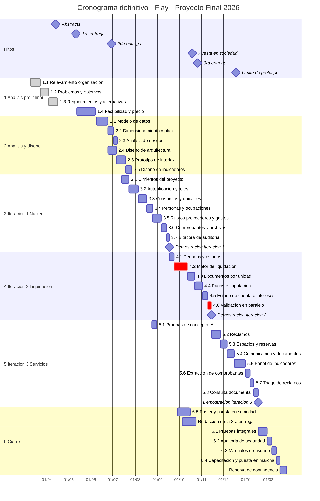

# 10. Diagrama de Gantt

> **Requisito de la cátedra (3° Entrega, punto 10):** *"Elaboración del Diagrama de Gantt según los
> resultados del punto anterior."*

---

## 10.1 Base de la planificación

Este cronograma reemplaza al preliminar del punto 4.5 y se construye sobre los resultados del
dimensionamiento del punto 9, tal como exige la consigna.

| Parámetro | Valor | Origen |
|---|---:|---|
| Esfuerzo comprometido | 770 h | Punto 9.11 |
| Capacidad semanal del equipo | 24 h | 2 personas × 12 h |
| Semanas disponibles | 41 | 09/03/2026 a 18/12/2026 |
| Capacidad total | 984 h | 41 × 24 |
| Reserva de contingencia | 214 h, 21,7 % | Punto 9.11 |
| Reserva para refactorización | 10 % de cada iteración | Punto 8.6 |

### Diferencias respecto del cronograma preliminar

| Aspecto | Preliminar (punto 4.5) | Definitivo | Motivo del cambio |
|---|---:|---:|---|
| Esfuerzo total | 655 h | 770 h | El dimensionamiento formal corrigió una subestimación del 17,6 % |
| Duración de la iteración 1 | 6,2 semanas | 9,2 semanas | 221 h medidas contra 110 h estimadas por analogía |
| Duración de la iteración 2 | 4,4 semanas | 8,1 semanas | La liquidación concentra la lógica más compleja del sistema |
| Duración de la iteración 3 | 8,0 semanas | 10,1 semanas | Se incorporó el esfuerzo de las pruebas de concepto |
| Alcance | 526 PF | 433 PF | Decisión de alcance del punto 9.11 |
| Contingencia explícita | No prevista | 214 h | Exigida por la holgura del 5 % que arrojó el alcance completo |

## 10.2 Estructura de descomposición del trabajo

| Código | Paquete de trabajo | Horas | Requerimientos |
|---|---|---:|---|
| **1** | **Análisis preliminar** | **108** | |
| 1.1 | Relevamiento de la organización y de los procesos | 34 | Punto 1 |
| 1.2 | Análisis de problemas y de objetivos | 26 | Puntos 2 y 3 |
| 1.3 | Definición de requerimientos y de alternativas | 30 | Punto 4 |
| 1.4 | Estudio de factibilidad y definición de precio | 18 | Puntos 5 y 6 |
| **2** | **Análisis y diseño** | **123** | |
| 2.1 | Modelo de datos y diccionario | 32 | Punto 7 |
| 2.2 | Dimensionamiento y planificación | 16 | Puntos 9 y 10 |
| 2.3 | Análisis de riesgos | 10 | Punto 11 |
| 2.4 | Diseño de la arquitectura | 24 | Punto 12 |
| 2.5 | Prototipo de interfaz desechable y validación con el cliente | 26 | Punto 8.4.1 |
| 2.6 | Diseño del módulo de indicadores | 15 | Punto 12 |
| **3** | **Iteración 1 — Núcleo** | **221** | |
| 3.1 | Cimientos: proyecto, esquema, migraciones e integración continua | 34 | — |
| 3.2 | Autenticación, roles y habilitaciones por consorcio | 44 | RF-03, RNF-03, RNF-04 |
| 3.3 | Consorcios, unidades y coeficientes | 42 | RF-01, RF-02 |
| 3.4 | Personas y ocupaciones | 26 | RF-03 |
| 3.5 | Rubros, proveedores y gastos | 40 | RF-04, RF-17 |
| 3.6 | Comprobantes y almacenamiento de archivos | 24 | RF-05, RF-10 |
| 3.7 | Bitácora de auditoría | 11 | RF-26, RN-15 |
| **4** | **Iteración 2 — Liquidación** | **194** | |
| 4.1 | Períodos y control de estado | 22 | RN-03, RN-06 |
| 4.2 | Motor de liquidación: prorrateo, ordinarias y extraordinarias, cuadratura | 62 | RF-07, RN-01 a RN-07 |
| 4.3 | Generación de documentos por unidad | 34 | RF-08 |
| 4.4 | Pagos e imputación | 38 | RF-09, RN-08 |
| 4.5 | Estado de cuenta y cálculo de intereses | 24 | RF-09 |
| 4.6 | Validación en paralelo contra la planilla del cliente | 14 | Punto 5.1.2 |
| **5** | **Iteración 3 — Servicios y análisis** | **243** | |
| 5.1 | Pruebas de concepto de las funciones asistidas | 22 | Punto 8.4.3 |
| 5.2 | Reclamos con estados, historial y responsables | 44 | RF-11, RF-13 |
| 5.3 | Espacios comunes y reservas | 32 | RF-15, RF-16 |
| 5.4 | Novedades, documentación y notificaciones | 34 | RF-14, RF-18, RF-19 |
| 5.5 | Panel de indicadores de gestión | 52 | RF-21 a RF-25 |
| 5.6 | Extracción asistida de comprobantes | 24 | RF-06 |
| 5.7 | Triage asistido de reclamos | 15 | RF-12 |
| 5.8 | Consulta documental en lenguaje natural | 20 | RF-20 |
| **6** | **Cierre** | **112** | |
| 6.1 | Pruebas integrales y corrección de defectos | 42 | Punto 15 |
| 6.2 | Auditoría de seguridad externa y remediación | 22 | Punto 18 |
| 6.3 | Manuales de usuario | 18 | Punto 16 |
| 6.4 | Capacitación y puesta en marcha | 14 | Punto 17 |
| 6.5 | Poster y puesta en sociedad | 16 | Cátedra |
| | **Total** | **770** | |

## 10.3 Diagrama de Gantt definitivo

*Ilustración 9 — Diagrama de Gantt definitivo.*

## 10.4 Camino crítico

```mermaid
flowchart LR
    A["2.1 Modelo<br/>de datos"] --> B["2.4 Diseno de<br/>arquitectura"]
    B --> C["3.1 Cimientos"]
    C --> D["3.2 Autenticacion<br/>y roles"]
    D --> E["3.3 Consorcios<br/>y unidades"]
    E --> F["3.5 Gastos"]
    F --> G["4.2 Motor de<br/>liquidacion"]
    G --> H["4.3 Documentos<br/>por unidad"]
    H --> I["4.4 Pagos e<br/>imputacion"]
    I --> J["4.6 Validacion<br/>en paralelo"]
    J --> K["5.5 Panel de<br/>indicadores"]
    K --> L["6.1 Pruebas<br/>integrales"]
    L --> M["6.2 Auditoria<br/>de seguridad"]
    M --> N["Prototipo<br/>18/12/2026"]

    style G fill:#ffd9d9
    style J fill:#ffd9d9
```

| Actividad crítica | Horas | Por qué es crítica |
|---|---:|---|
| 4.2 Motor de liquidación | 62 | Concentra el 8 % del esfuerzo total y toda la lógica de negocio regulada. Un error aquí invalida el sistema y no se detecta con pruebas superficiales |
| 4.6 Validación en paralelo | 14 | Es condición de aceptación del entregable 3 y de su cobro. Depende de la disponibilidad del cliente, que no controlamos |
| 5.5 Panel de indicadores | 52 | Satisface el requisito obligatorio de la cátedra sobre toma de decisiones. No es negociable |
| 6.2 Auditoría de seguridad externa | 22 | Depende de un tercero y su remediación no puede estimarse hasta conocer los hallazgos |

**Duración del camino crítico:** 32 semanas de las 41 disponibles. Las 9 semanas restantes constituyen
la reserva de contingencia, ubicada al final del cronograma y no distribuida entre las actividades,
para que no se consuma silenciosamente.

## 10.5 Asignación de recursos

| Paquete | Integrante 1 | Integrante 2 | Modalidad |
|---|---|---|---|
| 1 Análisis preliminar | 50 % | 50 % | Trabajo conjunto |
| 2.1 Modelo de datos | 70 % | 30 % | Integrante 1 conduce |
| 2.4 Arquitectura | 70 % | 30 % | Integrante 1 conduce |
| 2.5 Prototipo de interfaz | 20 % | 80 % | Integrante 2 conduce |
| 3.1 Cimientos | 60 % | 40 % | Integrante 1 conduce |
| 3.2 Autenticación y roles | 50 % | 50 % | **Programación en pares**: superficie de seguridad |
| 3.3 a 3.7 | 50 % | 50 % | Trabajo paralelo con revisión cruzada |
| 4.2 Motor de liquidación | 50 % | 50 % | **Programación en pares**: núcleo del negocio |
| 4.3 a 4.5 | 40 % | 60 % | Integrante 2 conduce |
| 5.2 a 5.4 | 30 % | 70 % | Integrante 2 conduce |
| 5.5 Indicadores | 80 % | 20 % | Integrante 1 conduce |
| 5.1, 5.6 a 5.8 Funciones asistidas | 80 % | 20 % | Integrante 1 conduce |
| 6 Cierre | 50 % | 50 % | Trabajo conjunto |

Los dos paquetes marcados como programación en pares son los únicos donde se acepta consumir el doble
de capacidad, conforme al criterio del punto 8.3.3: la autorización por consorcio y el cálculo de
liquidación son los lugares donde un error tiene el costo más alto y la detección más tardía.

## 10.6 Curva de esfuerzo

| Mes | Paquetes activos | Horas planificadas | Acumulado |
|---|---|---:|---:|
| Marzo 2026 | 1.1, 1.2 | 60 | 60 |
| Abril 2026 | 1.2, 1.3 | 48 | 108 |
| Mayo 2026 | 1.4, 2.1 | 44 | 152 |
| Junio 2026 | 2.1 a 2.4 | 72 | 224 |
| Julio 2026 | 2.5, 2.6, 3.1, 3.2 | 96 | 320 |
| Agosto 2026 | 3.3 a 3.7, 5.1 | 108 | 428 |
| Septiembre 2026 | 4.1 a 4.4, 6.5 | 112 | 540 |
| Octubre 2026 | 4.5, 4.6, 5.2 a 5.4, 6.5 | 104 | 644 |
| Noviembre 2026 | 5.5 a 5.8, 6.1 | 96 | 740 |
| Diciembre 2026 | 6.2 a 6.4 | 30 | 770 |

El pico se ubica entre agosto y octubre, coincidiendo con la construcción del núcleo y de la
liquidación. Es también el período de mayor carga académica del cursado, lo que se registra como
riesgo en el punto 11.

## 10.7 Hitos de control

| Hito | Fecha objetivo | Criterio de cumplimiento |
|---|---|---|
| Entrega de abstracts | 13/04/2026 | Dos abstracts presentados |
| Primera entrega | 11/05/2026 | Puntos 1 a 4 aprobados por la cátedra |
| Segunda entrega | 29/06/2026 | Puntos 5 y 6 aprobados |
| Prototipo de interfaz validado | 24/07/2026 | Aceptación del cliente sobre las seis pantallas principales |
| Demostración de la iteración 1 | 04/09/2026 | Alta de consorcio, unidades y gastos con comprobante, operativa de extremo a extremo |
| Demostración de la iteración 2 | 30/10/2026 | Liquidación de un consorcio real coincidente con la planilla del cliente |
| Puesta en sociedad | 19 al 21/10/2026 | Poster expuesto y sistema demostrable |
| Tercera entrega | 26/10/2026 | Puntos 7 a 12 aprobados |
| Demostración de la iteración 3 | 27/11/2026 | Indicadores y funciones asistidas operativas |
| Auditoría de seguridad superada | 09/12/2026 | Sin hallazgos de severidad alta pendientes |
| Entrega del prototipo | 18/12/2026 | Sistema desplegado, manuales entregados |

El hito del 30/10/2026 es el de mayor valor de control: si la liquidación de un consorcio real no
coincide con la planilla del cliente en esa fecha, el proyecto está en problemas y quedan siete
semanas para reaccionar. Está deliberadamente ubicado antes de que se agote la contingencia.

## 10.8 Política de gestión de desvíos

| Desvío acumulado | Acción |
|---|---|
| Hasta 40 h, menos del 20 % de la reserva | Se absorbe con la reserva; se registra en la retrospectiva |
| De 40 a 100 h | Se suspende la reserva de refactorización del 10 % y se aumenta la dedicación semanal a 30 h |
| De 100 a 160 h | Se difiere la consulta documental en lenguaje natural (RF-20, 20 h) y el triage asistido (RF-12, 15 h) |
| Más de 160 h | Se difiere además la extracción asistida de comprobantes (RF-06, 24 h) y se reduce el panel de indicadores a los cuatro indicadores vinculados a objetivos del punto 3 |

El orden de recorte está fijado de antemano, de mayor a menor prescindibilidad, y respeta la
restricción de no afectar los requisitos obligatorios de la cátedra hasta el último escalón. Decidir
esto ahora, y no bajo la presión de la fecha, es lo que evita recortar lo equivocado.

---

## Referencias

- Kerzner, H. (2017). *Project Management: A Systems Approach to Planning, Scheduling, and
  Controlling* (12.ª ed.). Wiley.
- Project Management Institute. (2021). *Guía de los fundamentos para la dirección de proyectos*
  (Guía del PMBOK) (7.ª ed.). PMI.
- Pressman, R. S., & Maxim, B. R. (2020). *Ingeniería del software: un enfoque práctico* (9.ª ed.).
  McGraw-Hill.
