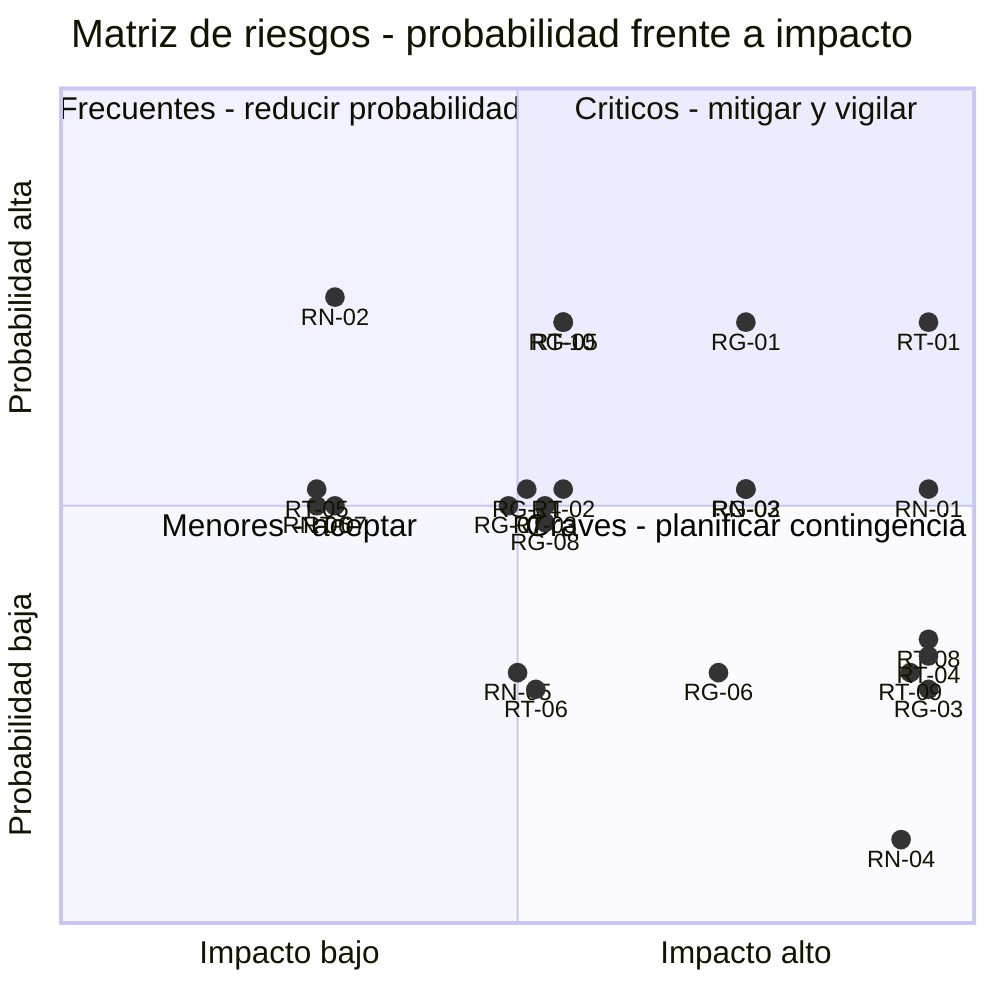

# 11. Análisis de riesgos

> **Requisito de la cátedra (3° Entrega, punto 11):** *"Análisis de riesgos."*

---

## 11.1 Metodología

Se aplica un proceso de gestión de riesgos en cuatro pasos: identificación, análisis cualitativo,
planificación de respuestas y seguimiento. Los riesgos se identificaron a partir del relevamiento del
punto 1, de las brechas técnicas del punto 5.2.2, del análisis de sensibilidad del punto 5.4.7 y de
los supuestos del punto 3.6.

### Escalas

| Probabilidad | Valor | Criterio |
|---|:---:|---|
| Muy baja | 1 | Menos del 10 % |
| Baja | 2 | Entre 10 % y 30 % |
| Media | 3 | Entre 30 % y 50 % |
| Alta | 4 | Entre 50 % y 75 % |
| Muy alta | 5 | Más del 75 % |

| Impacto | Valor | Criterio sobre el proyecto |
|---|:---:|---|
| Muy bajo | 1 | Menos de 8 h de desvío o efecto imperceptible |
| Bajo | 2 | De 8 a 24 h de desvío |
| Medio | 3 | De 24 a 60 h, o pérdida de una funcionalidad secundaria |
| Alto | 4 | Más de 60 h, o pérdida de una funcionalidad comprometida |
| Muy alto | 5 | Compromete una entrega de la cátedra o la viabilidad del sistema |

**Exposición = Probabilidad × Impacto.** Umbrales: 1 a 4 bajo, 5 a 9 moderado, 10 a 14 alto, 15 a 25
crítico.

## 11.2 Registro de riesgos

### Riesgos técnicos

| ID | Riesgo | P | I | Exp. | Nivel |
|---|---|:---:|:---:|:---:|---|
| **RT-01** | El motor de liquidación produce resultados que no coinciden con la planilla del cliente y la causa no se identifica rápidamente | 4 | 5 | **20** | Crítico |
| **RT-02** | La prueba de concepto de extracción de comprobantes no alcanza el 80 % de campos correctos, por variedad de formatos y calidad de las fotos | 3 | 3 | 9 | Moderado |
| **RT-03** | La búsqueda semántica sobre reglamentos devuelve fragmentos poco pertinentes y las respuestas resultan inútiles | 3 | 3 | 9 | Moderado |
| **RT-04** | Un defecto de autorización permite que un usuario acceda a datos de un consorcio ajeno | 2 | 5 | 10 | Alto |
| **RT-05** | La generación de documentos de liquidación para un consorcio de 96 unidades excede el tiempo de RNF-07 | 3 | 2 | 6 | Moderado |
| **RT-06** | El proveedor de la plataforma modifica los límites de su capa gratuita y aparece un costo no previsto | 2 | 3 | 6 | Moderado |
| **RT-07** | El servicio externo de procesamiento automático queda indisponible o agota su cuota en un momento de uso | 3 | 2 | 6 | Moderado |
| **RT-08** | Pérdida o corrupción de datos por un error en una migración de esquema | 2 | 5 | 10 | Alto |
| **RT-09** | La extracción de comprobantes carga un importe erróneo que llega a una liquidación emitida | 2 | 5 | 10 | Alto |
| **RT-10** | Los coeficientes migrados desde los reglamentos en papel contienen errores y no suman 100 % | 4 | 3 | 12 | Alto |

### Riesgos de gestión y de proyecto

| ID | Riesgo | P | I | Exp. | Nivel |
|---|---|:---:|:---:|:---:|---|
| **RG-01** | La capacidad de 24 h semanales no se sostiene por superposición con parciales y finales de otras materias | 4 | 4 | **16** | Crítico |
| **RG-02** | La estimación de 1,6 h por punto de función resulta optimista y el esfuerzo real supera las 984 h de capacidad | 3 | 4 | 12 | Alto |
| **RG-03** | Enfermedad o indisponibilidad prolongada de uno de los dos integrantes | 2 | 5 | 10 | Alto |
| **RG-04** | El cliente no dispone del tiempo comprometido para las demostraciones y validaciones | 3 | 3 | 9 | Moderado |
| **RG-05** | Aparecen requerimientos nuevos durante la construcción y se aceptan sin ajustar el plazo | 4 | 3 | 12 | Alto |
| **RG-06** | La auditoría de seguridad externa arroja hallazgos de severidad alta a dos semanas del límite | 2 | 4 | 8 | Moderado |
| **RG-07** | La cátedra observa una entrega y exige rehacer una porción de la documentación | 3 | 3 | 9 | Moderado |
| **RG-08** | La deuda técnica acumulada vuelve inviable agregar funcionalidad en la iteración 3 | 3 | 3 | 9 | Moderado |

### Riesgos de negocio y de la organización

| ID | Riesgo | P | I | Exp. | Nivel |
|---|---|:---:|:---:|:---:|---|
| **RN-01** | Grupo Delta no convierte la capacidad liberada en cartera nueva y el proyecto no se justifica económicamente | 3 | 5 | **15** | Crítico |
| **RN-02** | Los consorcistas no adoptan el canal digital y la comunicación sigue dispersa | 4 | 2 | 8 | Moderado |
| **RN-03** | La responsable de liquidaciones se resiste a abandonar su planilla | 3 | 4 | 12 | Alto |
| **RN-04** | Un incidente de exposición de datos personales deriva en denuncia ante la autoridad de aplicación | 1 | 5 | 5 | Moderado |
| **RN-05** | Un competidor lanza una solución equivalente a precio menor durante el desarrollo | 2 | 3 | 6 | Moderado |
| **RN-06** | La inflación desactualiza el precio y erosiona el margen antes de la primera actualización | 3 | 2 | 6 | Moderado |

## 11.3 Matriz de probabilidad e impacto

*Ilustración 10 — Matriz de riesgos probabilidad-impacto.*

## 11.4 Planes de respuesta

Solo se detallan los riesgos de nivel crítico y alto. Los moderados se aceptan con seguimiento; los
bajos, sin acción.

### RT-01 — Discrepancia en el motor de liquidación · Exposición 20 · Crítico

| | |
|---|---|
| **Estrategia** | Mitigar |
| **Detonante** | Una liquidación de prueba difiere de la planilla del cliente en cualquier importe |
| **Acciones preventivas** | Desarrollo guiado por pruebas obligatorio sobre prorrateo, intereses e imputación, según el punto 8.3.3. Programación en pares en el paquete 4.2, según el punto 10.5. Casos de prueba construidos a partir de tres liquidaciones reales de consorcios de distinto tamaño, obtenidas antes de escribir el código. Verificación automática de cuadratura con tolerancia cero, según RN-07 |
| **Plan de contingencia** | Operación en paralelo durante dos períodos completos, según el punto 5.1.2. Si a la fecha del hito del 30/10/2026 la diferencia persiste, se congela el resto del desarrollo hasta resolverla: es la única funcionalidad sin la cual el sistema no tiene sentido |
| **Reserva asignada** | 40 h de las 214 de contingencia |
| **Responsable** | Ambos integrantes |
| **Seguimiento** | **2026-09-10** — al cerrar la iteración 1 se solicitan formalmente a Grupo Delta las **tres liquidaciones reales** de consorcios de distinto tamaño que la acción preventiva exige. Son la entrada de los casos de prueba del paquete 4.2 y **la iteración 2 no arranca sin ellas** (FR-027 de `002-nucleo`): sin planilla contra la cual comparar, el detonante del riesgo no se puede observar. Pendiente de respuesta del cliente |

### RG-01 — Capacidad semanal no sostenida · Exposición 16 · Crítico

| | |
|---|---|
| **Estrategia** | Mitigar y aceptar parcialmente |
| **Detonante** | Dos semanas consecutivas por debajo de 18 h efectivas |
| **Acciones preventivas** | Calendario académico de ambos integrantes cargado en la planificación desde marzo. El pico de esfuerzo se ubicó entre agosto y octubre reconociendo que coincide con el pico académico, y por eso la contingencia es del 21,7 % y no del 15 %. Registro semanal de horas efectivas frente a planificadas |
| **Plan de contingencia** | Aplicación de la política de desvíos del punto 10.8, que fija el orden de recorte de antemano |
| **Reserva asignada** | 80 h |
| **Responsable** | Líder de proyecto |

### RN-01 — La capacidad liberada no se convierte en cartera · Exposición 15 · Crítico

| | |
|---|---|
| **Estrategia** | Transferir al cliente y mitigar |
| **Detonante** | Al mes 12 de operación, la cartera no creció respecto de las 418 unidades iniciales |
| **Acciones preventivas** | El hallazgo del punto 5.4.7 se comunica formalmente a Grupo Delta **antes** de la firma: la factibilidad económica depende de una decisión comercial que es del cliente y no del sistema. Se incorporan al panel de indicadores las métricas que permiten verificar la liberación de capacidad —horas de liquidación y evolución de la morosidad— para que la organización pueda constatar que la condición se cumple |
| **Plan de contingencia** | Revisión del esquema de precios a los 12 meses, con posibilidad de migrar a un abono reducido si la cartera no creció. Preferimos conservar al cliente con menor margen antes que perderlo |
| **Responsable** | Líder de proyecto |

### RT-10 — Errores en los coeficientes migrados · Exposición 12 · Alto

| | |
|---|---|
| **Estrategia** | Mitigar |
| **Detonante** | La suma de coeficientes de un consorcio no da exactamente 100,000000 % |
| **Acciones preventivas** | Validación automática en la carga, según RN-01, que impide cerrar la carga de un consorcio con coeficientes inconsistentes. Doble carga independiente por parte de las dos administrativas para los tres consorcios más grandes, con comparación automática. Cotejo de la primera liquidación de cada consorcio contra la última planilla del cliente |
| **Plan de contingencia** | El histórico de coeficientes del punto 7 permite corregir hacia el futuro sin alterar liquidaciones ya emitidas, según RN-02. Si el error se detecta después de liquidar, se emite una liquidación rectificativa |
| **Responsable** | Integrante 1 y el cliente |

### RG-02 — Estimación optimista · Exposición 12 · Alto

| | |
|---|---|
| **Estrategia** | Mitigar |
| **Detonante** | Al cierre de la iteración 1, las horas reales superan en más del 20 % las 221 planificadas |
| **Acciones preventivas** | La razón de productividad se recalibra al cierre de cada iteración con las horas efectivamente insumidas, según el punto 9.9.2. La iteración 1 se planificó primero y con mayor detalle precisamente para que funcione como calibración temprana |
| **Plan de contingencia** | Recálculo del cronograma completo con la razón corregida y aplicación de la política de desvíos del punto 10.8 |
| **Responsable** | Líder de proyecto |

### RG-05 — Requerimientos nuevos durante la construcción · Exposición 12 · Alto

| | |
|---|---|
| **Estrategia** | Evitar |
| **Detonante** | Cualquier pedido del cliente que no figure entre los requerimientos del punto 4.1 |
| **Acciones preventivas** | Alcance comprometido documentado y aceptado en el contrato. Todo pedido nuevo se registra, se dimensiona en puntos de función y se presupuesta como desarrollo a pedido, según el punto 6.3.1. **Ningún requerimiento nuevo entra al alcance sin sacar otro de valor equivalente**, y esa regla se explicita al cliente al inicio |
| **Plan de contingencia** | Se difiere a la fase posterior, sumándose al listado del punto 9.11 |
| **Responsable** | Líder de proyecto |

### RN-03 — Resistencia de la responsable de liquidaciones · Exposición 12 · Alto

| | |
|---|---|
| **Estrategia** | Mitigar |
| **Detonante** | La responsable continúa liquidando en su planilla después del segundo período de operación en paralelo |
| **Acciones preventivas** | Participación de la responsable en la validación del prototipo de interfaz, en el paquete 2.5: es usuaria y no destinataria del sistema. Operación en paralelo con comparación al centavo, de modo que la confianza se construya con evidencia y no con argumentos. El sistema no le quita control: le muestra cada paso del cálculo, incluido el prorrateo por unidad |
| **Plan de contingencia** | Extensión del paralelo a un tercer período. Si la resistencia persiste, se escala al socio gerente como decisión de la organización, no del proveedor |
| **Responsable** | Líder de proyecto |

### RT-04 — Defecto de autorización entre consorcios · Exposición 10 · Alto

| | |
|---|---|
| **Estrategia** | Evitar |
| **Acciones preventivas** | El aislamiento se modela como entidad, `Habilitacion` del punto 7, y no como condición dispersa en el código. Filtro obligatorio por consorcio en la capa de acceso a datos, no en cada consulta. Verificación de autorización incluida en la definición de terminado del punto 8.3.4, punto 3. Programación en pares en el paquete 3.2. Pruebas automatizadas específicas de acceso cruzado por cada entidad expuesta |
| **Plan de contingencia** | La auditoría externa del paquete 6.2 tiene el aislamiento entre consorcios como primer punto de alcance. Un hallazgo de este tipo bloquea la puesta en producción |
| **Responsable** | Ambos integrantes |

### RT-08 — Pérdida de datos por migración de esquema · Exposición 10 · Alto

| | |
|---|---|
| **Estrategia** | Mitigar |
| **Acciones preventivas** | Migraciones versionadas en el repositorio, sin cambios manuales sobre la base, según el punto 8.3.5. Toda migración se aplica primero en el entorno de demostración con una copia de los datos reales. Copia de respaldo verificada inmediatamente antes de cada migración en producción |
| **Plan de contingencia** | Restauración desde la copia diaria, con procedimiento probado según RNF-09. La prueba de restauración se ejecuta antes de la puesta en marcha y no cuando se la necesita |
| **Responsable** | Integrante 1 |

### RT-09 — Importe erróneo de la extracción llega a una liquidación · Exposición 10 · Alto

| | |
|---|---|
| **Estrategia** | Evitar |
| **Acciones preventivas** | La extracción **nunca** crea un gasto: crea un registro `ExtraccionComprobante` separado, y el gasto se genera al confirmar una persona, según RN-14. El formulario destaca los campos con confianza baja. El comprobante permanece adjunto y visible junto al importe cargado, de modo que la verificación es inmediata |
| **Plan de contingencia** | El campo `campos_corregidos` permite medir la precisión real; si cae por debajo del umbral, la función se desactiva por configuración sin tocar el código, según RNF-14 |
| **Responsable** | Integrante 1 |

### RG-03 — Indisponibilidad de un integrante · Exposición 10 · Alto

| | |
|---|---|
| **Estrategia** | Mitigar |
| **Acciones preventivas** | Propiedad colectiva del código y revisión cruzada obligatoria, según el punto 8.3.3: ninguno de los dos puede ser el único que entiende una parte del sistema. Documentación de decisiones de arquitectura en el repositorio. Ningún paquete de trabajo está asignado al 100 % a un solo integrante |
| **Plan de contingencia** | El integrante disponible sostiene el camino crítico —liquidación e indicadores— y se difiere todo lo demás según el punto 10.8 |
| **Responsable** | Ambos |

## 11.5 Riesgos que se aceptan sin acción

| ID | Riesgo | Fundamento de la aceptación |
|---|---|---|
| RT-06 | Cambio en los límites de la capa gratuita | El costo máximo previsto es de USD 45 mensuales, absorbible. Se monitorea el consumo mensualmente |
| RN-02 | Baja adopción de los consorcistas | El beneficio principal no depende de ella, según el punto 5.1.1. Se acepta con seguimiento del indicador de OBJ-5 |
| RN-05 | Aparición de un competidor | Fuera del control del proyecto. La ventaja competitiva declarada en el punto 1.4 no es tecnológica sino de relación con el cliente |
| RN-06 | Desactualización del precio por inflación | Mitigado estructuralmente por la actualización trimestral del punto 6.3.4 |

## 11.6 Seguimiento

| Actividad | Frecuencia | Responsable |
|---|---|---|
| Revisión del registro de riesgos | Al cierre de cada iteración, en la retrospectiva | Líder de proyecto |
| Registro de horas efectivas frente a planificadas | Semanal | Ambos |
| Recálculo de la razón de productividad | Al cierre de cada iteración | Líder de proyecto |
| Verificación de detonantes de riesgos críticos | Quincenal | Líder de proyecto |
| Reporte de estado al cliente | Al cierre de cada iteración | Líder de proyecto |

### Detonantes verificados

| Riesgo | Detonante | Verificación | Resultado |
|---|---|---|---|
| RT-02 | La prueba de concepto de extracción no alcanza el 80 % | Ejecutada el 11/09/2026 sobre 30 comprobantes de formatos variados, antes de abrir la iteración 3 (punto 8.4.3) | **No se activa**: 99,3 % de campos correctos. Resultado y proveedor elegido en el punto 14.3; caso PI-01 del punto 15 |
| RT-03 | La búsqueda semántica no ubica el fragmento correcto entre los tres primeros en el 85 % de las preguntas | Ejecutada el 11/09/2026 sobre un reglamento de 72 artículos y 20 preguntas | **No se activa**: 100 %, contra 80 % de una búsqueda por palabras sin servicio externo. Punto 14.3; caso PI-06 del punto 15 |

### Indicadores de seguimiento

| Indicador | Valor esperado | Umbral de alerta |
|---|---|---|
| Horas efectivas semanales | 24 h | Menos de 18 h dos semanas seguidas |
| Desvío acumulado de esfuerzo | Menos del 10 % | Más del 20 % |
| Reserva de contingencia consumida | Proporcional al avance | Consumo superior al avance en más de 15 puntos |
| Defectos abiertos de severidad alta | 0 | Más de 2 |
| Diferencia entre liquidación del sistema y planilla del cliente | $ 0 | Cualquier valor distinto de cero |

## 11.7 Síntesis

| Nivel | Cantidad | Riesgos |
|---|---:|---|
| Crítico | 3 | RT-01, RG-01, RN-01 |
| Alto | 7 | RT-04, RT-08, RT-09, RT-10, RG-02, RG-03, RG-05, RN-03 |
| Moderado | 12 | RT-02, RT-03, RT-05, RT-06, RT-07, RG-04, RG-06, RG-07, RG-08, RN-02, RN-04, RN-05, RN-06 |
| **Reserva de contingencia total** | **214 h** | 40 h a RT-01, 80 h a RG-01, 94 h sin asignar |

Los tres riesgos críticos son de naturaleza distinta y esa distinción importa: **RT-01 es técnico** y
se resuelve con disciplina de ingeniería; **RG-01 es de capacidad** y se resuelve con contingencia y
recorte planificado; **RN-01 es de negocio y no está bajo nuestro control**, por lo que la respuesta
correcta no es intentar mitigarlo sino comunicarlo con claridad al cliente antes de que firme.

---

## Referencias

- Boehm, B. W. (1991). Software Risk Management: Principles and Practices. *IEEE Software*, 8(1),
  32–41.
- International Organization for Standardization. (2018). *ISO 31000:2018 Risk management —
  Guidelines*.
- Project Management Institute. (2021). *Guía de los fundamentos para la dirección de proyectos*
  (Guía del PMBOK) (7.ª ed.). PMI.
- Pressman, R. S., & Maxim, B. R. (2020). *Ingeniería del software: un enfoque práctico* (9.ª ed.).
  McGraw-Hill.
