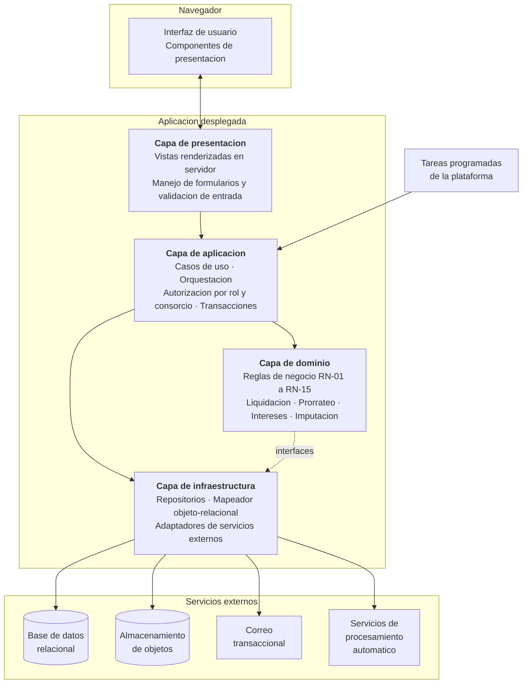
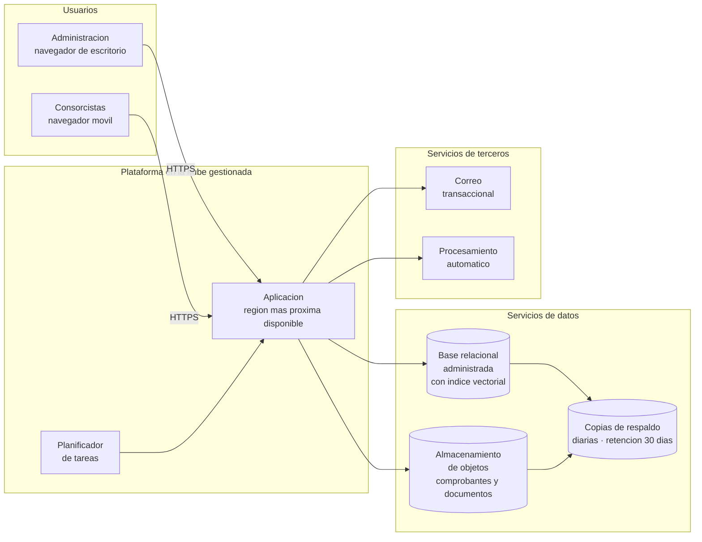
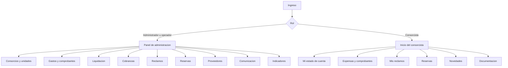
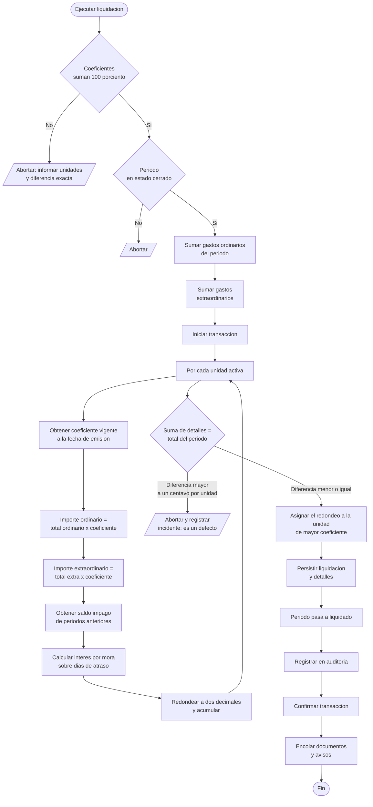
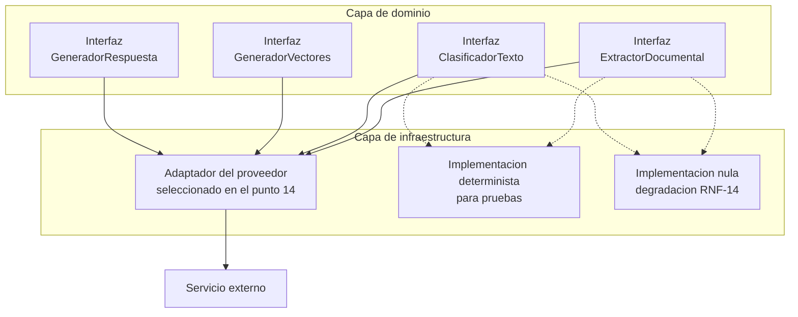
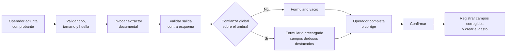
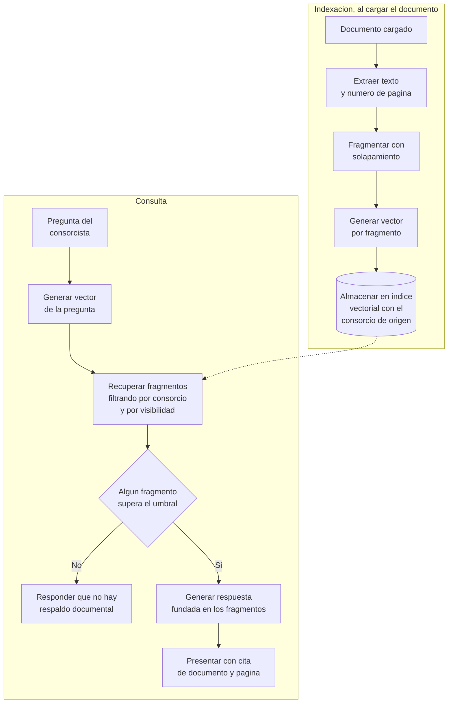

# 12. Diseño

> **Requisito de la cátedra (3° Entrega, punto 12):** *"Diseño."*

---

## 1. Arquitectura de la solución

### 1.1 Estilo arquitectónico

Se adopta una **arquitectura en capas dentro de un despliegue único**, sobre el entorno de ejecución
definido en la alternativa A del punto 4.2. La decisión de no distribuir el sistema en servicios
independientes es deliberada y responde al punto 5.5: un equipo de dos personas sin capacidad de
operación de infraestructura no debe multiplicar las unidades a desplegar y monitorear. La separación
que importa —la lógica de negocio aislada de la interfaz y del acceso a datos— se logra por capas, no
por procesos.

*Ilustración 11 — Arquitectura de la solución.*

### 1.2 Responsabilidad de cada capa

| Capa | Responsabilidad | Lo que **no** hace |
|---|---|---|
| Presentación | Renderizar vistas, recibir formularios, validar formato de entrada, presentar errores comprensibles | No contiene reglas de negocio ni consulta la base directamente |
| Aplicación | Orquestar casos de uso, **verificar autorización por rol y por consorcio**, abrir y cerrar transacciones, registrar auditoría | No implementa cálculos de negocio |
| Dominio | Reglas RN-01 a RN-15, cálculo de prorrateo, intereses e imputación. **No conoce la base de datos ni el entorno web** | No accede a infraestructura: depende de interfaces que la infraestructura implementa |
| Infraestructura | Persistencia, almacenamiento de archivos, envío de correo, invocación de servicios externos | No decide nada del negocio |

La regla de dependencia es unidireccional hacia el dominio: el dominio define las interfaces que
necesita y la infraestructura las implementa. Esto es lo que hace verificable RNF-15 —el proveedor de
servicios automáticos es reemplazable— y lo que permite probar la lógica de liquidación sin base de
datos, tal como exige el desarrollo guiado por pruebas del punto 8.3.3.

### 1.3 Decisiones de arquitectura registradas

| # | Decisión | Alternativa descartada | Fundamento |
|---:|---|---|---|
| 1 | Despliegue único en capas | Servicios independientes | Punto 5.5: sin capacidad de operación |
| 2 | Instancia única multiempresa, con aislamiento por `Habilitacion` | Una base de datos por administradora | El modelo comercial del punto 6.2 requiere amortizar entre clientes; una base por cliente multiplicaría el costo de migraciones y de operación |
| 3 | El aislamiento por consorcio se aplica en la capa de acceso a datos | Filtro en cada consulta | RT-04 del punto 11: un filtro olvidado en una consulta expone datos ajenos. Aplicarlo en un solo lugar convierte el olvido en imposible |
| 4 | Los servicios externos se consumen a través de interfaces del dominio | Invocación directa desde la aplicación | RNF-14 y RNF-15: reemplazo y degradación |
| 5 | Documentos de liquidación generados en proceso diferido | Generación sincrónica | RNF-07: 96 documentos no se generan en 30 segundos de forma sincrónica |
| 6 | Indicadores calculados sobre vistas de base de datos | Cálculo en la aplicación | Punto 7.7: la agregación se resuelve donde están los datos |

---

## 2. Modelo de despliegue

| Tarea programada | Frecuencia | Propósito |
|---|---|---|
| Generación diferida de documentos de liquidación | Al disparar una liquidación | RNF-07 |
| Indexación de documentos cargados | Al cargar un documento | RF-20 |
| Recálculo de vistas de indicadores | Diario, de madrugada | RF-21 a RF-25 |
| Verificación de la copia de respaldo | Diaria | RNF-09 |

---

## 3. Modelo físico de datos

El modelo lógico del punto 7 se materializa con las siguientes decisiones físicas:

| Decisión | Fundamento |
|---|---|
| Identificadores universalmente únicos en lugar de secuenciales | No exponer el volumen de datos en las direcciones web |
| Importes en decimal de precisión fija, nunca en punto flotante | Un error de redondeo en dinero de terceros es inaceptable |
| Coeficientes con ocho decimales | La suma debe dar exactamente 100 % sobre hasta 96 unidades |
| Restricciones de exclusión en la base para RN-09 y RN-10 | La integridad se garantiza en la base, no en el código de la aplicación |
| La imputación de pagos se resuelve en una tabla propia, aplicando el orden de antigüedad | RN-08: un pago puede cubrir varios períodos y un período recibir varios pagos |
| Bitácora de auditoría poblada por disparadores | Ninguna ruta de código puede omitirla |
| Bitácora sin permisos de actualización ni borrado para el usuario de la aplicación | RNF-12 |
| Índice vectorial sobre los fragmentos de documento | RF-20 |
| Vistas materializadas para los indicadores, refrescadas de madrugada | RNF-06 sobre el panel |

Los índices previstos figuran en el punto 7.6 y las vistas de apoyo en el 7.7.

---

## 4. Casos de uso

### 4.1 Diagrama de casos de uso

```mermaid
flowchart TB
    subgraph ACT[" "]
        direction TB
        ADM(["Administrador"])
        OPE(["Operador"])
        CON(["Consorcista"])
        SIS(["Sistema"])
    end

    subgraph SISTEMA["Flay"]
        direction TB
        CU01["CU-01 Administrar<br/>consorcios y unidades"]
        CU02["CU-02 Registrar gasto<br/>con comprobante"]
        CU03["CU-03 Liquidar<br/>expensas del periodo"]
        CU04["CU-04 Registrar pago<br/>e imputar"]
        CU05["CU-05 Consultar gastos<br/>y comprobantes"]
        CU06["CU-06 Descargar<br/>expensa propia"]
        CU07["CU-07 Crear reclamo<br/>y seguirlo"]
        CU08["CU-08 Gestionar<br/>reclamo"]
        CU09["CU-09 Reservar<br/>espacio comun"]
        CU10["CU-10 Consultar<br/>documentacion"]
        CU11["CU-11 Consultar panel<br/>de indicadores"]
        CU12["CU-12 Publicar<br/>novedad"]
        CU13["CU-13 Extraer datos<br/>del comprobante"]
        CU14["CU-14 Clasificar<br/>reclamo"]
        CU15["CU-15 Notificar<br/>por correo"]
    end

    ADM --> CU01
    ADM --> CU03
    ADM --> CU11
    ADM --> CU08
    OPE --> CU02
    OPE --> CU04
    OPE --> CU08
    OPE --> CU12
    CON --> CU05
    CON --> CU06
    CON --> CU07
    CON --> CU09
    CON --> CU10
    SIS --> CU13
    SIS --> CU14
    SIS --> CU15

    CU02 -.->|include| CU13
    CU07 -.->|include| CU14
    CU03 -.->|include| CU15
    CU08 -.->|include| CU15
```

*Ilustración 12 — Diagrama de casos de uso.*

### 4.2 CU-03 — Liquidar expensas del período

Es el caso de uso central del sistema y el de mayor riesgo según el punto 11.

| | |
|---|---|
| **Actor principal** | Administrador |
| **Objetivo** | Distribuir los gastos del período entre las unidades y emitir la liquidación |
| **Requerimientos** | RF-07, RF-08 |
| **Objetivos que satisface** | OBJ-1, OBJ-1.2, OBJ-1.3 |
| **Precondiciones** | El período está en estado cerrado. Los coeficientes suman exactamente 100 %. Todos los gastos tienen rubro asignado. El usuario tiene habilitación de administrador sobre el consorcio |
| **Postcondición de éxito** | Existe una liquidación en estado vigente con un detalle por unidad; el período pasa a estado liquidado; se encolan los documentos y los avisos por correo |
| **Postcondición de fracaso** | Ningún dato se modifica: la operación es transaccional |

**Flujo principal**

1. El administrador selecciona el consorcio y el período cerrado.
2. El sistema presenta el resumen de gastos del período, discriminando ordinarios de extraordinarios,
   y señala los rubros recurrentes sin gasto cargado.
3. El administrador confirma la ejecución.
4. El sistema verifica que los coeficientes vigentes sumen 100,000000 % (RN-01).
5. El sistema calcula el total ordinario y el total extraordinario.
6. Por cada unidad activa, el sistema calcula el importe ordinario y el extraordinario aplicando el
   coeficiente vigente a la fecha de emisión, y almacena ese coeficiente en el detalle (RN-02).
7. El sistema obtiene el saldo impago de períodos anteriores y calcula el interés por mora con la
   tasa del consorcio.
8. El sistema verifica la cuadratura: la suma de los detalles debe igualar el total (RN-07). La
   diferencia de redondeo se asigna a la unidad de mayor coeficiente y se registra en el campo
   correspondiente.
9. El sistema persiste la liquidación y sus detalles en una única transacción, cambia el estado del
   período a liquidado y registra la operación en la bitácora de auditoría (RN-15).
10. El sistema encola la generación diferida de los documentos por unidad y el envío de avisos.
11. El sistema informa el resultado con el total liquidado y la cantidad de unidades alcanzadas.

**Flujos alternativos**

| # | Condición | Comportamiento |
|---|---|---|
| 4a | Los coeficientes no suman 100 % | Se aborta y se informa qué unidades revisar, con la diferencia exacta. No se emite nada |
| 2a | Falta un gasto de un rubro recurrente | Se advierte antes de confirmar; el administrador puede continuar bajo su responsabilidad o volver a cargar el gasto |
| 8a | La cuadratura falla por un importe mayor a un centavo por unidad | Se aborta y se registra el incidente: indica un defecto de cálculo, no un redondeo |
| 3a | El período ya fue liquidado | Se rechaza la operación (RN-06). Para corregir se debe anular la liquidación vigente |
| 6a | El consorcio no tiene unidades activas | Se aborta y se informa |
| 9a | Falla la persistencia | La transacción revierte por completo; el período permanece cerrado |

**Reglas aplicadas:** RN-01, RN-02, RN-03, RN-04, RN-05, RN-06, RN-07, RN-15.

### 4.3 CU-02 — Registrar gasto con comprobante

| | |
|---|---|
| **Actor principal** | Operador |
| **Requerimientos** | RF-04, RF-05, RF-06 |
| **Precondiciones** | El período está abierto; el usuario tiene habilitación sobre el consorcio |
| **Postcondición** | Existe un gasto con su comprobante adjunto, imputado al período |

**Flujo principal**

1. El operador selecciona el consorcio y el período abierto, y adjunta la imagen o el PDF del
   comprobante.
2. El sistema valida el tipo y el tamaño del archivo, calcula su huella y verifica que no exista otro
   comprobante con la misma huella.
3. El sistema invoca el servicio de extracción documental y crea un registro `ExtraccionComprobante`
   con los valores detectados y su nivel de confianza. **No crea el gasto** (RN-14).
4. El sistema presenta el formulario precargado, destacando visualmente los campos cuya confianza es
   baja y mostrando el comprobante junto al formulario.
5. El operador verifica, corrige lo que corresponda y confirma.
6. El sistema registra qué campos fueron corregidos, crea el gasto, vincula el comprobante y registra
   la operación en la bitácora.

**Flujos alternativos**

| # | Condición | Comportamiento |
|---|---|---|
| 2a | La huella ya existe | Se advierte que el comprobante ya fue cargado y se muestra el gasto asociado |
| 3a | El servicio de extracción falla o su cuota está agotada | Se presenta el formulario vacío para carga manual y se informa que la asistencia no está disponible (RNF-14) |
| 3b | La confianza global es inferior al umbral | No se precarga ningún campo: una precarga poco confiable induce a confirmar sin verificar, que es peor que no precargar |
| 5a | El período se cerró mientras el operador completaba | Se rechaza y se informa (RN-03) |

### 4.4 CU-07 — Crear reclamo y seguirlo

| | |
|---|---|
| **Actor principal** | Consorcista |
| **Requerimientos** | RF-11, RF-12, RF-13 |
| **Postcondición** | Existe un reclamo en estado abierto, con rubro y urgencia asignados y notificación enviada |

**Flujo principal**

1. El consorcista describe el problema e indica si afecta a su unidad o a un área común.
2. El sistema invoca el servicio de clasificación y obtiene rubro, urgencia, proveedor sugerido y
   estimación de resolución, que persiste en `SugerenciaReclamo`.
3. El sistema crea el reclamo en estado abierto con los valores sugeridos.
4. El sistema notifica al administrador y al operador del consorcio.
5. El consorcista consulta el estado y el historial en cualquier momento.

**Reglas aplicadas:** RN-11 —el reclamo siempre tiene estado, y responsable asignado fuera del estado inicial— y RN-15.

**Flujos alternativos**

| # | Condición | Comportamiento |
|---|---|---|
| 2a | El servicio de clasificación no está disponible | El reclamo se crea sin rubro ni urgencia; el operador los asigna manualmente (RNF-14) |
| 3a | El operador modifica la clasificación | Se registra que la sugerencia no fue aceptada, dato que alimenta la medición de precisión |

### 4.5 CU-09 — Reservar espacio común

| | |
|---|---|
| **Actor principal** | Consorcista |
| **Requerimientos** | RF-16 |
| **Precondiciones** | La unidad no registra deuda vencida, si el consorcio lo exige por reglamento |

**Flujo principal**

1. El consorcista selecciona el espacio y consulta la agenda de disponibilidad.
2. Elige fecha, horario y cantidad de personas.
3. El sistema valida, en este orden: anticipación mínima y máxima, duración máxima, cupo de personas,
   tope mensual por unidad y ausencia de superposición con reservas confirmadas (RN-10).
4. El sistema crea la reserva y notifica al solicitante y al administrador.

**Flujos alternativos**

| # | Condición | Comportamiento |
|---|---|---|
| 3a | Alguna regla no se cumple | Se rechaza informando **qué regla concreta** y cuál es el valor admitido |
| 3b | Existe superposición | La restricción de exclusión de la base la rechaza aun ante solicitudes simultáneas |
| 3c | El espacio requiere depósito de garantía | La reserva queda en estado pendiente hasta que el administrador confirme la recepción |

### 4.6 CU-10 — Consultar documentación del consorcio

| | |
|---|---|
| **Actor principal** | Consorcista |
| **Requerimientos** | RF-20 |
| **Objetivo que satisface** | OBJ-5.3 |

**Flujo principal**

1. El consorcista formula una pregunta en lenguaje natural.
2. El sistema recupera los fragmentos más pertinentes de la documentación del consorcio, restringido
   a los documentos marcados como visibles para consorcistas y **exclusivamente del consorcio al que
   el usuario pertenece**.
3. El sistema genera una respuesta fundada en esos fragmentos y **cita el documento y la página**.
4. Se registra la consulta con los fragmentos utilizados.

**Flujos alternativos**

| # | Condición | Comportamiento |
|---|---|---|
| 2a | Ningún fragmento supera el umbral de pertinencia | El sistema responde que no encontró respaldo en la documentación cargada y sugiere consultar a la administración. Se marca `sin_respaldo`. **El sistema no responde sin fundamento documental** |
| 3a | El servicio no está disponible | Se ofrece la búsqueda por texto y la descarga de los documentos (RNF-14) |

---

## 5. Diseño de la interfaz

### 5.1 Principios

| Principio | Aplicación | Requerimiento |
|---|---|---|
| Diseño desde el móvil | Las pantallas del consorcista se diseñan primero para teléfono | RNF-01 |
| Una acción principal por pantalla | El botón de acción es único y evidente | RNF-03 del punto 1 |
| Errores accionables | Cada mensaje indica qué pasó y qué hacer, sin vocabulario técnico | RNF-10 |
| Contraste y tamaño verificados | Contraste mínimo 4,5:1, área táctil mínima de 44 píxeles, navegación completa por teclado | RNF-11 |
| Sin dependencias de un navegador particular | Verificación sobre las dos últimas versiones estables de los navegadores mayoritarios | RNF-02 |
| El dinero siempre con su respaldo | Todo importe presentado enlaza al comprobante o al detalle que lo origina | OBJ-2 |

El último principio no es estético: es la traducción a interfaz del problema central del punto 2. Un
importe sin respaldo accesible reproduce la opacidad que el sistema viene a resolver.

### 5.2 Mapa de navegación

### 5.3 Pantallas prototipadas

Las seis pantallas que se validan con el cliente en el paquete 2.5 del punto 10.2:

| Pantalla | Elementos principales | Usuario validador |
|---|---|---|
| Panel de administración | Consorcios con su estado de liquidación del mes, reclamos abiertos, morosidad de la cartera, alertas de desvío de gasto | Socio gerente |
| Carga de gasto con comprobante | Zona de arrastre del archivo, vista previa del comprobante junto al formulario precargado, campos de confianza baja destacados | Responsable de liquidaciones |
| Ejecución de la liquidación | Resumen de gastos por rubro, advertencia de rubros recurrentes faltantes, verificación de coeficientes, confirmación en dos pasos | Responsable de liquidaciones |
| Estado de cuenta de la unidad | Saldo, detalle del período, deuda anterior, intereses, descarga del comprobante de expensa | Consorcista |
| Alta y seguimiento de reclamo | Descripción, adjunto opcional, línea de tiempo de estados | Consorcista |
| Panel de indicadores | Los seis indicadores del apartado 9 con sus filtros | Socio gerente |

La confirmación en dos pasos de la liquidación responde a RN-06: es una operación que no se deshace
sin dejar rastro, y la interfaz debe reflejar esa gravedad.

---

## 6. Diseño de la lógica de liquidación

Es el componente de mayor riesgo (RT-01) y por eso se diseña con detalle.

### Decisiones de cálculo

| Decisión | Fundamento |
|---|---|
| Aritmética decimal de precisión fija en todo el cálculo | El punto flotante introduce errores de representación inaceptables en dinero de terceros |
| Redondeo a dos decimales solo al final de cada importe unitario | Redondear en pasos intermedios amplifica la diferencia acumulada |
| La diferencia de redondeo se asigna a la unidad de mayor coeficiente y se registra en un campo propio | Es auditable y explicable ante un propietario que pregunte |
| El coeficiente aplicado se copia al detalle | RN-02: una liquidación pasada debe poder reconstruirse aunque el coeficiente haya cambiado |
| Una diferencia mayor a un centavo por unidad aborta la operación | Ese orden de magnitud no es redondeo: es un defecto de cálculo, y emitir sería peor que fallar |
| Toda la operación en una sola transacción | Una liquidación a medias es peor que ninguna |

---

## 7. Diseño de notificaciones y procesos programados

| Notificación | Disparador | Destinatarios | Requerimiento |
|---|---|---|---|
| Liquidación publicada | Documentos generados | Ocupantes de cada unidad con notificaciones activas | RF-14 |
| Cambio de estado de reclamo | Transición de estado | Autor del reclamo y responsable | RF-14 |
| Reserva confirmada o rechazada | Cambio de estado | Solicitante | RF-14 |
| Novedad publicada | Alta de novedad | Consorcistas del consorcio | RF-18 |

El envío es asincrónico: se persiste la notificación en estado pendiente y una tarea programada la
despacha, reintentando ante fallas. Una falla del servicio de correo no debe hacer fallar la
liquidación, que es la operación que importa.

---

## 8. Diseño del módulo de asistencia automática

### 8.1 Principios de diseño de esta capa

Cuatro principios gobiernan las tres funciones asistidas. No son recomendaciones: son restricciones
de diseño verificables en las pruebas del punto 15.

| # | Principio | Verificación |
|---|---|---|
| 1 | **Ninguna salida automática impacta en un dato económico sin confirmación humana** (RN-14) | El gasto solo se crea desde la acción de confirmar del operador |
| 2 | **Toda respuesta sobre documentación cita su fuente**; sin fuente, no hay respuesta | Prueba con preguntas cuya respuesta no está en la documentación cargada |
| 3 | **Degradación elegante**: la indisponibilidad del servicio no bloquea ninguna función del negocio (RNF-14) | Prueba de cada función con el servicio deshabilitado |
| 4 | **Proveedor reemplazable** sin tocar la lógica de negocio (RNF-15) | Existe una implementación alternativa determinística usada en las pruebas |

### 8.2 Estructura

La existencia de tres implementaciones por interfaz —la real, la determinística para pruebas y la
nula para degradación— es lo que hace que RNF-14 y RNF-15 sean propiedades del diseño y no promesas.

### 8.3 Función 1 — Extracción asistida de comprobantes

*Ilustración 13 — Flujo de la carga asistida de comprobantes.*

| Aspecto | Definición |
|---|---|
| Entrada | Imagen o PDF del comprobante, sin ningún dato personal de consorcistas |
| Salida | Proveedor, CUIT, fecha, importe, rubro sugerido y confianza por campo |
| Validación | La salida se valida contra un esquema estricto antes de usarse; una salida malformada se descarta y equivale a la indisponibilidad del servicio |
| Umbral de precarga | Si la confianza global no lo supera, no se precarga nada |
| Medición | `campos_corregidos` permite calcular la precisión real en producción |
| Criterio de retiro | Si la precisión medida cae por debajo del 70 % durante un mes, la función se desactiva por configuración |

### 8.4 Función 2 — Triage asistido de reclamos

| Aspecto | Definición |
|---|---|
| Entrada | Título y descripción del reclamo, más la lista de rubros y proveedores del consorcio |
| Salida | Rubro, urgencia, proveedor sugerido y estimación de horas de resolución |
| Naturaleza | **Sugerencia, no decisión.** El operador la modifica libremente y su modificación se registra |
| Restricción | El proveedor sugerido se limita a los registrados en el consorcio: el sistema no inventa proveedores |
| Degradación | El reclamo se crea igual, sin clasificar |

### 8.5 Función 3 — Consulta sobre la documentación del consorcio

| Aspecto | Definición |
|---|---|
| Alcance del índice | Reglamento de copropiedad, reglamento interno, actas y contratos. **Nunca datos personales ni de deuda** |
| Aislamiento | El filtro por consorcio se aplica en la recuperación, antes de generar la respuesta. Un consorcista no puede obtener contenido del reglamento de otro consorcio |
| Fundamentación obligatoria | Si ningún fragmento supera el umbral de pertinencia, se responde que no hay respaldo. Se registra en `sin_respaldo` |
| Cita | Toda respuesta indica documento y página, de modo que el consorcista pueda verificarla |
| Degradación | Búsqueda por texto y descarga directa de los documentos |

La fundamentación obligatoria es la decisión de diseño más importante de esta función: en un contexto
donde la respuesta puede versar sobre obligaciones económicas de una persona, una afirmación sin
respaldo documental es un daño, no una comodidad.

---

## 9. Módulo de indicadores para la toma de decisiones

> Este módulo satisface el **requisito obligatorio** de la cátedra: *"herramientas de análisis de la
> información que asistan a gerentes/administradores en la toma de decisiones (…) un conjunto de
> indicadores, gráficos y/o reportes (…) basadas en datos del sistema"*.

### 9.1 Enfoque

Los indicadores se construyen **exclusivamente con datos generados por la operación del sistema**: no
hay carga manual de datos para el tablero ni fuentes externas. Se implementan como vistas agregadas
en la base de datos, refrescadas de madrugada, y se presentan con gráficos en la aplicación. Se
descartó integrar una herramienta externa de inteligencia de negocios porque el volumen no lo
justifica —punto 7.5, menos de 600.000 registros a cinco años— y porque agregaría un servicio más a
operar, contra el criterio del punto 5.5.

**Cada indicador responde a una decisión concreta.** Un indicador que no cambia ninguna decisión es
un adorno, y no se incluye.

### 9.2 Los seis indicadores

#### I-1 · Morosidad por consorcio y su evolución

| | |
|---|---|
| **Decisión que soporta** | Sobre qué consorcios y qué unidades iniciar gestión de cobranza, y en qué momento |
| **Objetivo** | OBJ-4.1 · **Requerimiento** RF-22 |
| **Fórmula** | Deuda vencida del consorcio dividida por la masa liquidada acumulada, expresada en porcentaje |
| **Fuente** | `v_morosidad_consorcio`, sobre `DetalleLiquidacion` y `PagoImputacion` |
| **Presentación** | Serie de tiempo mensual por consorcio, con línea de referencia en la meta del 12 % |
| **Detalle** | Al seleccionar un consorcio, nómina de unidades en mora ordenada por antigüedad. **Restringida a administrador y consejo por RN-13** |
| **Alerta** | Un consorcio que supera el 15 %, o que crece 3 puntos en dos meses |

#### I-2 · Gasto por rubro y detección de desvíos

| | |
|---|---|
| **Decisión que soporta** | Qué rubro auditar o renegociar antes de cerrar el período |
| **Objetivo** | OBJ-4.2 · **Requerimiento** RF-23 |
| **Fórmula** | Desvío porcentual del gasto del rubro respecto del promedio móvil de los doce períodos anteriores del mismo consorcio |
| **Fuente** | `v_gasto_rubro_periodo` |
| **Presentación** | Barras apiladas por rubro y período, con los desvíos superiores al 30 % destacados |
| **Alerta** | Desvío superior al 30 %, o ausencia de gasto en un rubro marcado como recurrente |

La comparación es contra el promedio móvil del propio consorcio y no contra un valor fijo,
precisamente por la amenaza A2 del FODA: en contexto inflacionario, un valor de referencia estático
señalaría desvíos donde solo hay actualización de precios.

#### I-3 · Desempeño y costo por proveedor

| | |
|---|---|
| **Decisión que soporta** | A qué proveedor contratar para cada tipo de trabajo |
| **Objetivo** | OBJ-4.3 · **Requerimiento** RF-24 |
| **Fórmula** | Costo acumulado, cantidad de contrataciones, costo promedio por intervención y tiempo medio entre asignación y resolución, por proveedor y rubro |
| **Fuente** | `v_desempeno_proveedor` |
| **Presentación** | Tabla ordenable y dispersión de costo promedio frente a tiempo de resolución |
| **Valor** | Es el indicador que hace medible OS-7, que el punto 1.2 registraba sin indicador |

#### I-4 · Tiempo de resolución de reclamos

| | |
|---|---|
| **Decisión que soporta** | Dónde reforzar la capacidad de mantenimiento y qué proveedores están respondiendo tarde |
| **Objetivo** | OBJ-4.4 · **Requerimiento** RF-25 |
| **Fórmula** | Mediana y percentil 90 del tiempo entre apertura y resolución, agrupado por rubro y urgencia |
| **Fuente** | `v_resolucion_reclamos` |
| **Presentación** | Barras por rubro, con la meta de 72 horas para urgencias marcada |
| **Valor** | Hace medible OS-6, que el punto 1.2 registraba sin indicador |

Se usa mediana y percentil 90 en lugar de promedio porque unos pocos reclamos de resolución muy larga
distorsionan el promedio y ocultan el comportamiento habitual.

#### I-5 · Carga administrativa de la liquidación

| | |
|---|---|
| **Decisión que soporta** | Si la capacidad liberada por el sistema se está materializando; es la verificación del supuesto crítico del riesgo RN-01 |
| **Objetivo** | OBJ-1 |
| **Fórmula** | Tiempo transcurrido entre la apertura y la liquidación de cada período, y proporción de gastos cargados con asistencia sin corrección |
| **Presentación** | Serie de tiempo por consorcio, con la línea de base de 38 horas mensuales del punto 2.7 |

#### I-6 · Panel consolidado de la cartera

| | |
|---|---|
| **Decisión que soporta** | Dónde poner la atención hoy |
| **Requerimiento** | RF-21 |
| **Contenido** | Estado de liquidación del mes por consorcio; morosidad de la cartera contra la meta; reclamos abiertos por urgencia y antigüedad; alertas de desvío de gasto pendientes de revisión; unidades incorporadas en los últimos doce meses |

### 9.3 Trazabilidad de los indicadores

| Indicador | Objetivo del punto 3 | Objetivo de la organización del punto 1.2 | Causa del punto 2 que revierte |
|---|---|---|---|
| I-1 Morosidad | OBJ-4.1 | OS-2 | C4.2 |
| I-2 Gasto por rubro | OBJ-4.2 | OS-5 | C4.1 |
| I-3 Proveedores | OBJ-4.3 | **OS-7, antes sin indicador** | C4.3 |
| I-4 Reclamos | OBJ-4.4 | **OS-6, antes sin indicador** | C3, C4.1 |
| I-5 Carga administrativa | OBJ-1 | OS-1, OS-4 | C1 |
| I-6 Panel consolidado | OBJ-4 | Todos | C4 |

Con I-3 e I-4 la organización pasa de tener 5 de 7 objetivos secundarios medibles a tener los 7, que
es exactamente la meta declarada en OBJ-4.

---

## 10. Matriz de trazabilidad

Verificación de que cada requerimiento tiene diseño y de que ningún objetivo quedó sin cobertura.

| RF | Objetivo | Entidades principales | Caso de uso | Iteración |
|---|---|---|---|---|
| RF-01 | OBJ-1.2 | Consorcio | CU-01 | 1 |
| RF-02 | OBJ-1.2 | Unidad, CoeficienteHistorico | CU-01 | 1 |
| RF-03 | OBJ-5, OBJ-1.3 | Persona, Usuario, Ocupacion, Habilitacion | CU-01 | 1 |
| RF-04 | OBJ-1.1, OBJ-4.3 | Gasto, RubroGasto, Proveedor | CU-02 | 1 |
| RF-05 | OBJ-2.1 | Comprobante | CU-02 | 1 |
| RF-06 | OBJ-1.1 | ExtraccionComprobante | CU-13 | 3 |
| RF-07 | OBJ-1 | Periodo, Liquidacion, DetalleLiquidacion | CU-03 | 2 |
| RF-08 | OBJ-1, OBJ-2.2 | DetalleLiquidacion | CU-03, CU-06 | 2 |
| RF-09 | OBJ-4.1 | Pago, PagoImputacion | CU-04 | 2 |
| RF-10 | OBJ-2.2 | Gasto, Comprobante | CU-05 | 1 |
| RF-11 | OBJ-3.1 | Reclamo | CU-07 | 3 |
| RF-12 | OBJ-3.2 | SugerenciaReclamo | CU-14 | 3 |
| RF-13 | OBJ-3.1 | ReclamoHistorial | CU-07, CU-08 | 3 |
| RF-14 | OBJ-3.3 | Notificacion | CU-15 | 3 |
| RF-15 | OBJ-5.2 | EspacioComun | CU-01 | 3 |
| RF-16 | OBJ-5.2 | Reserva | CU-09 | 3 |
| RF-17 | OBJ-4.3 | Proveedor | CU-01 | 1 |
| RF-18 | OBJ-5.1 | Novedad | CU-12 | 3 |
| RF-19 | OBJ-5.1 | DocumentoConsorcio | CU-12 | 3 |
| RF-20 | OBJ-5.3 | FragmentoDocumento, ConsultaDocumental | CU-10 | 3 |
| RF-21 | OBJ-4 | Vistas de indicadores | CU-11 | 3 |
| RF-22 | OBJ-4.1 | `v_morosidad_consorcio` | CU-11 | 3 |
| RF-23 | OBJ-4.2 | `v_gasto_rubro_periodo` | CU-11 | 3 |
| RF-24 | OBJ-4.3 | `v_desempeno_proveedor` | CU-11 | 3 |
| RF-25 | OBJ-4.4 | `v_resolucion_reclamos` | CU-11 | 3 |
| RF-26 | Seguridad | Auditoria | Transversal | 1 |

### Cobertura de objetivos

| Objetivo | Requerimientos que lo cubren | Estado |
|---|---|---|
| OBJ-1 Automatizar la liquidación | RF-07, RF-08 | Cubierto |
| OBJ-1.1 Carga con asistencia | RF-04, RF-06 | Cubierto |
| OBJ-1.2 Coeficientes validados | RF-01, RF-02 | Cubierto |
| OBJ-1.3 Ejecutable por cualquier habilitado | RF-03, RF-07 | Cubierto |
| OBJ-2.1 Comprobantes digitales | RF-05 | Cubierto |
| OBJ-2.2 Consulta por consorcio, período y rubro | RF-10 | Cubierto |
| OBJ-3.1 Estado, responsable y fecha | RF-11, RF-13 | Cubierto |
| OBJ-3.2 Clasificación al ingresar | RF-12 | Cubierto |
| OBJ-3.3 Notificación de cambios | RF-14 | Cubierto |
| OBJ-4.1 Morosidad en tiempo real | RF-09, RF-22 | Cubierto |
| OBJ-4.2 Evolución del gasto y desvíos | RF-23 | Cubierto |
| OBJ-4.3 Histórico por proveedor | RF-17, RF-24 | Cubierto |
| OBJ-4.4 Tiempo de resolución | RF-25 | Cubierto |
| OBJ-5.1 Fuente única de información | RF-18, RF-19 | Cubierto |
| OBJ-5.2 Reservas con reglas explícitas | RF-15, RF-16 | Cubierto |
| OBJ-5.3 Consulta en lenguaje natural | RF-20 | Cubierto |

**Ningún objetivo del punto 3 quedó sin requerimiento, y ningún requerimiento del punto 4 quedó sin
diseño.**

---

## 11. Seguridad del diseño

> Este apartado satisface el segundo **requisito obligatorio** de la cátedra sobre buenas prácticas
> de seguridad, en su dimensión de diseño. El punto 18 desarrolla la política operativa completa.

### 11.1 Autenticación

| Medida | Definición | Requerimiento |
|---|---|---|
| Almacenamiento de contraseñas | Función de derivación de clave con costo configurable, resistente a fuerza bruta. Nunca texto plano ni hash simple | RNF-04 |
| Política de contraseñas | Longitud mínima de 12 caracteres, cotejo contra listas de contraseñas filtradas. Sin reglas de composición arbitrarias, que empeoran las contraseñas reales | — |
| Limitación de intentos | Bloqueo temporal progresivo tras intentos fallidos, registrado en `Usuario` | — |
| Sesiones | Cookies con marcas de solo servidor, seguro y misma procedencia; expiración por inactividad y renovación del identificador al iniciar sesión | — |
| Restablecimiento | Enlace de un solo uso con vencimiento breve; el mensaje no revela si el correo existe | — |

### 11.2 Autorización — el control central del sistema

Es el riesgo RT-04 y el punto donde este sistema puede fallar peor: exponer los datos de un consorcio
a otro.

| Medida | Definición |
|---|---|
| Modelo | El acceso se determina por `Habilitacion`, que vincula usuario, consorcio y rol con vigencia (RN-12) |
| Aplicación | **El filtro por consorcio se aplica en la capa de acceso a datos**, no en cada consulta. Ninguna consulta puede omitirlo por olvido |
| Verificación por caso de uso | La capa de aplicación valida el rol antes de ejecutar, independientemente de lo que la interfaz muestre u oculte |
| Datos sensibles | La nómina nominada de deudores se restringe a administrador y consejo (RN-13); el consorcista accede solo a su propia unidad |
| Recuperación de documentación | El filtro por consorcio y por visibilidad se aplica **antes** de generar la respuesta, no después |
| Pruebas | Pruebas automatizadas de acceso cruzado por cada entidad expuesta, incluidas en la definición de terminado del punto 8.3.4 |

### 11.3 Validación de entrada y protección de datos

| Riesgo | Medida |
|---|---|
| Inyección en consultas | Consultas parametrizadas exclusivamente, a través del mapeador objeto-relacional |
| Ejecución de código en el navegador | Escapado por defecto del entorno de renderizado; política de seguridad de contenido restrictiva |
| Falsificación de petición entre sitios | Testigo por formulario y cookies de misma procedencia |
| Carga de archivos maliciosos | Validación de tipo por contenido y no por extensión, límite de tamaño, almacenamiento fuera del alcance de ejecución, entrega mediante enlaces firmados de vencimiento corto |
| Referencias directas a objetos | Identificadores universalmente únicos más verificación de pertenencia al consorcio en cada acceso |
| Validación de datos | Esquemas de validación en el límite de confianza, aplicados tanto en el cliente como en el servidor. La validación del cliente es comodidad; la del servidor es la que cuenta |
| Salida de servicios externos | Validada contra esquema antes de usarse; una salida malformada se descarta |

### 11.4 Protección de la información

| Medida | Definición |
|---|---|
| Cifrado en tránsito | Obligatorio en toda comunicación, con redirección forzada y transporte estricto (RNF-05) |
| Cifrado en reposo | Provisto por la plataforma para base de datos y almacenamiento de objetos |
| Minimización hacia terceros | A los servicios externos se envía únicamente el comprobante, el texto del reclamo o la documentación reglamentaria. **Nunca la nómina de propietarios ni datos de deuda** |
| Copias de respaldo | Diarias, con retención de 30 días y restauración probada antes de la puesta en marcha | 
| Retención | Bitácora de auditoría 24 meses, luego se anonimiza la dirección IP |
| Portabilidad | Exportación completa en formato abierto, conforme al contrato del punto 6.4.5 |
| Tratamiento de datos personales | Conforme a la Ley 25.326, según el detalle del punto 5.3.2 y del punto 18 (RNF-13) |

### 11.5 Auditoría

| Medida | Definición |
|---|---|
| Cobertura | Toda operación que modifica un dato económico, más los accesos a datos sensibles (RN-15) |
| Mecanismo | Disparadores de base de datos: ninguna ruta de código puede omitir el registro |
| Inalterabilidad | Tabla de solo agregado; el usuario de la aplicación carece de permisos de actualización y borrado (RNF-12) |
| Contenido | Usuario, acción, entidad, estado anterior y posterior, dirección de origen y momento |

### 11.6 Verificación externa

La auditoría de seguridad contratada en el punto 6.1.2 cubre, en este orden de prioridad:

1. Aislamiento entre consorcios y entre administradoras.
2. Autenticación y gestión de sesiones.
3. Tratamiento de archivos cargados por los usuarios.
4. Autorización en cada caso de uso, con especial atención a los datos de deuda.
5. Las diez categorías de riesgo más frecuentes en aplicaciones web.

Un hallazgo de severidad alta bloquea la puesta en producción, conforme al hito del punto 10.7.

---

## Referencias

- Bass, L., Clements, P., & Kazman, R. (2021). *Software Architecture in Practice* (4.ª ed.).
  Addison-Wesley.
- Evans, E. (2003). *Domain-Driven Design: Tackling Complexity in the Heart of Software*.
  Addison-Wesley.
- Fowler, M. (2002). *Patterns of Enterprise Application Architecture*. Addison-Wesley.
- Martin, R. C. (2017). *Clean Architecture: A Craftsman's Guide to Software Structure and Design*.
  Prentice Hall.
- Nielsen, J. (1994). *Usability Engineering*. Morgan Kaufmann.
- OWASP Foundation. (2021). *OWASP Top Ten Web Application Security Risks*.
- World Wide Web Consortium. (2018). *Web Content Accessibility Guidelines (WCAG) 2.1*.
