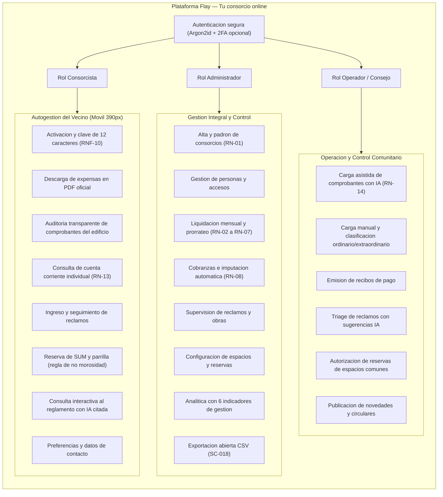
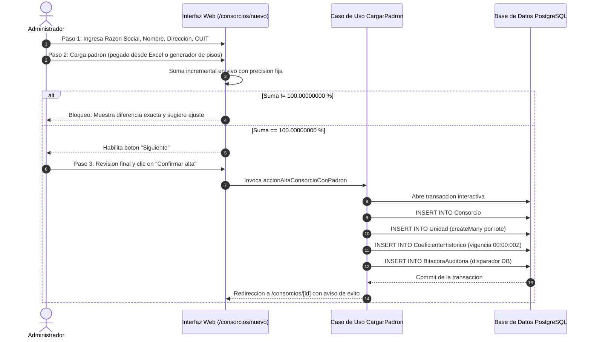
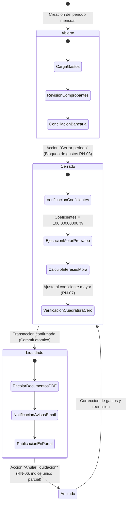
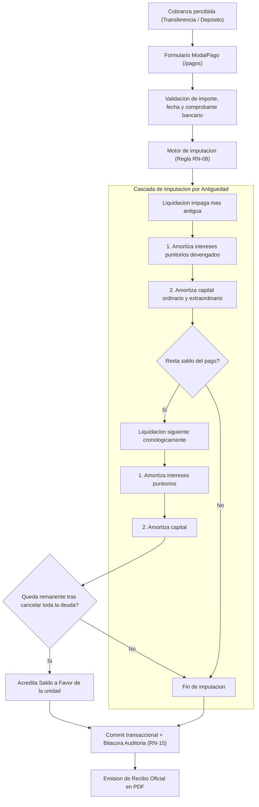
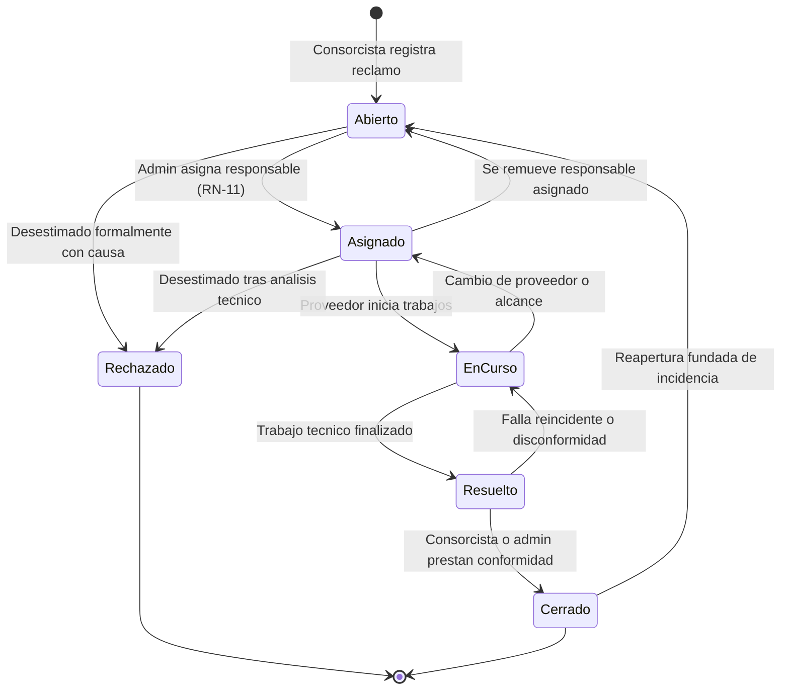
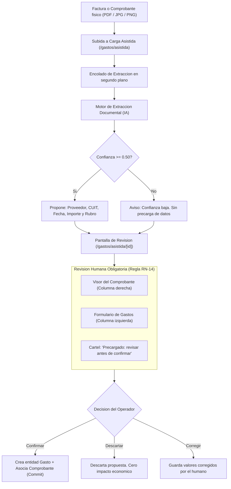

# 16. Elaboración de los manuales de usuario

> **Requisito de la cátedra (Última entrega, punto 16):** *"Elaboración de los manuales de usuario."*

> ✅ **Estado: completo y definitivo.** Este documento constituye el cuerpo normativo y operativo de manuales de usuario del sistema Flay — Tu consorcio online. Su contenido ha sido desarrollado de forma exhaustiva para cada rol operativo (Administrador, Operador/Consejo de Propietarios y Consorcista), fundamentado en la arquitectura de software desplegada, las pantallas reales implementadas en Next.js 15 dentro de `src/app/(panel)` y `src/app/(sesion)`, las reglas de negocio vinculantes (RN-01 a RN-15) y la validación empírica sobre los consorcios piloto "Las Heras 2140" (12 unidades funcionales) y "Belgrano 1250" (96 unidades funcionales), administrados por la organización Grupo Delta en la ciudad de Rosario.

---

## 16.1 Criterio editorial y directrices de diseño documental

La elaboración de los manuales de usuario de Flay responde a principios pedagógicos, ergonómicos y técnicos orientados a garantizar la apropiación efectiva de la herramienta por parte de perfiles heterogéneos. La documentación de usuario no es una transcripción estática del modelo de datos ni un inventario de pantallas, sino una guía metodológica estructurada en torno a objetivos operacionales concretos.

| Criterio editorial | Fundamento metodológico y técnico | Impacto en la experiencia de usuario |
|---|---|---|
| **Un manual diferenciado por rol** | El sistema implementa un modelo de control de acceso basado en roles (RBAC) estricto (RNF-03). Un consorcista no debe navegar procedimientos contables para descargar su liquidación, ni un operador de mantenimiento debe consultar configuraciones de coeficientes. | Reduce la sobrecarga cognitiva y minimiza los tiempos de búsqueda documental a menos de 30 segundos. |
| **Organización por tareas operativas (*Task-Oriented*)** | El usuario interactúa con el sistema a partir de necesidades del negocio («Liquidar el período mensual», «Imputar un pago bancario»), no a partir de componentes de interfaz. | Facilita la adopción procedimental e independiza el aprendizaje de cambios cosméticos menores en la interfaz. |
| **Pasos numerados con validaciones observables** | El público destinatario comprende personas de la tercera edad y usuarios con bajo dominio tecnológico (punto 5.1.1). Cada acción se desglosa en secuencias unívocas con indicación explícita de su resultado esperado. | Evita la incertidumbre operativa y previene la duplicación de transacciones en operaciones críticas. |
| **Erradicación de jerga informática (*Plain Language*)** | En estricto cumplimiento del requerimiento no funcional RNF-10, los textos omiten tecnicismos de infraestructura (API, JWT, ORM, Webhook, REST, etc.) y emplean la terminología consagrada en la Ley 13.512 y el Código Civil y Comercial de la Nación. | Fortalece la confianza del usuario final y agiliza la comprensión de los mensajes del sistema. |
| **Guía rápida imprimible de una carilla** | La cartelera física de planta baja continúa siendo el medio de comunicación universal y jurídicamente válido en consorcios de propiedad horizontal (punto 1.2). | Garantiza la inclusión de consorcistas sin conectividad permanente o reacios al uso de terminales digitales. |
| **Diseño móvil responsivo primero (*Mobile First*)** | Más del 75 % de los consorcistas y miembros del consejo acceden desde teléfonos móviles con pantallas de 390 px de ancho de referencia (RNF-01, iPhone 12/13/14). | Todas las tareas de consulta, pago, reclamo y votación son 100 % operables con una sola mano. |
| **Accesibilidad universal WCAG 2.1 nivel AA** | Obligación legal y ética para sistemas que administran derechos de terceros (RNF-11), con contrastes mínimos de 4,5:1, etiquetas semánticas y compatibilidad con lectores de pantalla (NVDA, TalkBack, VoiceOver). | Permite la autogestión plena de personas con discapacidades visuales o motoras. |



---

## 16.2 Manual del Administrador

Este manual acompaña al personal directivo y liquidador de la administración (Grupo Delta) en todas las funciones neurálgicas del sistema. Su cumplimiento riguroso constituye la barrera operativa fundamental contra los riesgos identificados en el análisis del sistema, en particular el riesgo RN-03 (*«Emisión de liquidaciones incorrectas que lesionan la fe pública y generan impugnaciones legales»*).

### 16.2.1 Ingreso al sistema, sesión y cambio de contraseña inicial

El acceso a la plataforma Flay se realiza a través de un navegador web moderno (Google Chrome, Mozilla Firefox, Safari o Microsoft Edge) ingresando a la dirección del sistema: `https://app.flay.com.ar/ingresar` (o `http://localhost:3000/ingresar` en entorno local de pruebas).

1. **Credenciales iniciales de aprovisionamiento:** Al dar de alta la cuenta de administración desde el despliegue del sistema (`npm run semilla:arranque`), el administrador recibe una clave provisoria generada automáticamente y notificada por canal seguro.
2. **Pantalla de ingreso (`/ingresar`):**
   - Ingrese el **Correo electrónico** registrado (ejemplo: `admin@grupodelta.com.ar`).
   - Ingrese la **Contraseña** provisoria.
   - Presione el botón **Entrar**.
3. **Cambio obligatorio de contraseña:** Al detectar el primer inicio de sesión o acceder al menú de perfil, el sistema exige establecer una nueva clave.
   - La nueva contraseña debe tener como mínimo **12 caracteres** (`MINIMO_DE_CONTRASENA = 12`, definido en `src/compartido/contrasenas.ts`), cumpliendo con la política de robustez criptográfica contra ataques de diccionario.
   - No puede ser compartida con el proveedor de software ni almacenada en texto plano: el sistema la codifica mediante el algoritmo **Argon2id** con costo de memoria de 64 MB y 3 iteraciones.
   - Complete el campo **Repetila** para confirmar la concordancia exacta y haga clic en **Guardar contraseña**.
   - El sistema confirmará la operación mostrando un cartel verde con el texto: *«La contraseña quedó guardada. Ya se puede entrar»*.
4. **Cierre de sesión seguro:** Al terminar las tareas en terminales compartidas, haga clic en el identificador de usuario ubicado en la esquina superior derecha y presione **Cerrar sesión**.

---

### 16.2.2 Alta y administración del consorcio: datos, unidades y coeficientes

El alta de un consorcio en Flay es una operación atómica y estructurada que previene la existencia de entidades a medio configurar en la base de datos (FR-011c). Se realiza mediante el asistente visual (*Wizard*) accesible desde el menú principal **Consorcios** (`/consorcios`) pulsando el botón **Nuevo consorcio** (`/consorcios/nuevo`).



#### Paso 1: Datos generales del consorcio
En el primer paso del asistente, complete los campos institucionales y fiscales obligatorios:
- **Administradora:** Seleccione la razón social de la entidad administradora (ejemplo: *Grupo Delta S.R.L.*).
- **Nombre del consorcio:** Identificación pública y consuetudinaria (ejemplo: *Las Heras 2140* o *Belgrano 1250*).
- **Dirección:** Calle y numeración catastral (ejemplo: *Las Heras 2140*).
- **Localidad:** Ciudad y provincia de radicación (ejemplo: *Rosario, Santa Fe*).
- **CUIT del consorcio:** Clave Única de Identificación Tributaria fiscal ante AFIP/ARCA, con formato de 11 dígitos numéricos sin guiones (ejemplo: *30712345678*).
- Presione **Siguiente**.

#### Paso 2: Padrón de unidades funcionales y coeficientes porcentuales
En estricto cumplimiento de la regla de negocio **RN-01**, el padrón de un consorcio solo puede crearse de manera integral. La carga individual de unidades está prohibida porque durante los estados intermedios la suma de coeficientes no alcanzaría el 100 %, violando la integridad del dominio.

El sistema ofrece tres modalidades de ingreso en el editor:
1. **Pegado directo desde planilla de cálculo (*Clipboard*):**
   - Copie desde Microsoft Excel, Google Sheets o LibreOffice Calc una tabla de dos o tres columnas: `Designación`, `Coeficiente` y opcionalmente `Tipo`.
   - Haga clic en el primer casillero del formulario y presione `Ctrl + V`.
   - El sistema parsea automáticamente el texto separado por tabulaciones y rellena la grilla.
2. **Generador automático por pisos y letras:**
   - Para edificios homogéneos, ingrese la cantidad de **Pisos** (ejemplo: *12*) y la cantidad de **Unidades por piso** (ejemplo: *8*).
   - El sistema generará automáticamente las denominaciones correlativas (*Piso 1 Dpto A, Piso 1 Dpto B... Piso 12 Dpto H*) distribuyendo un coeficiente preliminar uniforme.
3. **Carga y ajuste manual:**
   - Puede agregar renglones manualmente seleccionando el tipo de unidad funcional entre las opciones admitidas: **Departamento**, **Cochera**, **Baulera** o **Local comercial**.
   - Ingrese el coeficiente de copropiedad con hasta 8 decimales (ejemplo: *8.33333333*).

> [!IMPORTANT]
> **Verificación en vivo de la regla RN-01:**
> Mientras carga las unidades, la barra inferior muestra la suma corriente en aritmética decimal de precisión fija.
> - Si la suma difiere de `100.00000000 %`, la pantalla muestra una alerta en color rojo con la diferencia exacta: *«Los coeficientes no cierran: la diferencia es +0.00000004 %»*.
> - El sistema ofrece el botón **Ajustar diferencia en la unidad mayor**: al presionarlo, Flay detecta la unidad funcional con mayor coeficiente y le asigna el residuo matemático exacto para alcanzar el 100,00000000 %, garantizando que ningún centavo quede huérfano.

#### Paso 3: Revisión y confirmación atómica
El asistente muestra el resumen consolidado: cantidad de unidades activas, suma exacta del 100,00000000 % y datos de cabecera. Al presionar **Confirmar y crear consorcio**, la aplicación ejecuta una transacción de base de datos única que crea el consorcio, el lote de unidades y la tabla `CoeficienteHistorico` con vigencia desde las 00:00:00 UTC del día de creación.

#### Modificación de coeficientes hacia el futuro (RN-02)
Si el consorcio sufre modificaciones reglamentarias (ejemplo: subdivisión o anexión de unidades):
1. Ingrese a **Consorcios** → Seleccione el edificio → **Ver unidades** (`/consorcios/[id]/unidades`).
2. Presione **Actualizar coeficientes**.
3. Ingrese la nueva tabla de coeficientes que sume exactamente 100,00000000 % e indique la fecha de vigencia.
4. Conforme a la regla **RN-02**, la vigencia anterior cerrará exactamente el día anterior a las 23:59:59 UTC de la nueva vigencia. Las liquidaciones ya emitidas en el pasado conservarán inalterados sus coeficientes históricos en `DetalleLiquidacion`.

---

### 16.2.3 Gestión de personas y otorgamiento de accesos

Flay distingue conceptualmente entre una **Persona** (entidad humana con nombre, CUIT y contacto), una **Ocupación** (relación jurídica de propietario o inquilino sobre una unidad) y un **Usuario** (credencial digital de acceso al sistema).

#### Carga de ocupaciones y regla RN-09
1. Ingrese al consorcio y seleccione la pestaña **Unidades**.
2. Al hacer clic sobre una unidad funcional, seleccione **Asignar ocupante**.
3. Complete:
   - **Tipo de ocupación:** Propietario o Inquilino.
   - **Vigencia desde:** Fecha de toma de posesión o inicio del contrato de locación.
   - **Vigencia hasta:** En contratos de alquiler, complete la fecha de vencimiento; en propietarios, deje el campo abierto.
4. **Regla de integridad RN-09:** El motor de base de datos ejecuta una restricción de exclusión (`EXCLUDE USING gist`) que impide que una unidad tenga dos ocupaciones vigentes del mismo tipo en un mismo rango de fechas. Si se intenta cargar un segundo inquilino superpuesto, el sistema rechaza el formulario indicando el conflicto de fechas.

#### Invitación de usuarios al portal web (`/usuarios/invitar`)
Para habilitar el ingreso digital de un propietario, inquilino o colega de administración:
1. Diríjase a **Usuarios** (`/usuarios`) en la barra superior.
2. Si administra más de un edificio, seleccione el consorcio activo en el desplegable.
3. Presione el botón **Invitar persona** (se abre la ventana modal o la ruta `/usuarios/invitar`).
4. Complete los campos requeridos:
   - **Nombre:** Nombre de pila del consorcista (ejemplo: *Marcela*).
   - **Apellido:** Apellido de la persona (ejemplo: *Gómez*).
   - **Correo electrónico:** Dirección a la que se remitirá la invitación (ejemplo: *marcela.gomez@gmail.com*).
   - **Rol:** Seleccione entre **Consorcista** (acceso a expensas, pagos y reclamos propios), **Consejo** (acceso a comprobantes, triage de reclamos y estado general) o **Administrador** (acceso de gestión plena).
   - **Habilitado desde:** Fecha a partir de la cual el acceso entra en vigor (por omisión, la fecha de hoy).
5. Presione **Enviar invitación**.
6. **Mecanismo de seguridad (FR-006):**
   - El administrador **nunca elige la contraseña del usuario**.
   - El sistema genera un token seguro criptográfico y encola un correo con un enlace temporal que expira a las **72 horas**.
   - En la tabla de usuarios, el estado figurará como `Invitado` con la leyenda: *«Correo en cola»* o *«Correo enviado; todavía no la usó»*.
   - Si el enlace expira o el destinatario no lo encuentra, presione el botón **Reenviar** para emitir un nuevo token y reactivar la cola.

---

### 16.2.4 Administración de rubros y proveedores

La imputación presupuestaria y contable de los egresos del consorcio requiere clasificar los gastos por rubros estandarizados y asociar cada erogación a una persona jurídica o humana proveedora de servicios.

#### Catálogo de rubros de gasto
El sistema cuenta con un nomenclador predefinido conforme a las directrices de la Dirección General de Defensa y Protección al Consumidor y la práctica profesional:
1. Servicios públicos (Agua, Energía eléctrica, Gas natural).
2. Abonos de servicios y mantenimiento (Mantenimiento de ascensores, Limpieza, Seguridad y vigilancia).
3. Mantenimiento de partes comunes (Plomería, Electricidad, Cerrajería, Pintura, Albañilería).
4. Gastos bancarios e impositivos (Mantenimiento de cuenta corriente, Impuesto a los créditos y débitos bancarios).
5. Seguros obligatorios (Seguro integral de consorcio, Responsabilidad civil, ART de encargados).
6. Sueldos y cargas sociales (Remuneración de encargado y suplente, FCT, aportes previsionales SUTERH/FATERYH).
7. Honorarios profesionales (Administración, Asesoría legal, Auditoría contable).

#### Alta de proveedores (`/proveedores`)
1. Ingrese a la sección **Proveedores** (`/proveedores`).
2. En la tarjeta **Nuevo proveedor**, complete:
   - **Razón social:** Denominación legal o nombre comercial (ejemplo: *Ascensores Santa Fe S.R.L.* o *Limpieza Integral Rosario*).
   - **CUIT:** Clave tributaria de 11 dígitos sin guiones (ejemplo: *30654321098*).
   - **Rubro habitual:** Seleccione el rubro por defecto en el que opera el proveedor (ejemplo: *Abono de mantenimiento de ascensores*).
3. Presione **Guardar proveedor**. El proveedor quedará disponible de inmediato en los desplegables de carga de gastos y en el módulo de asignación de reclamos.

---

### 16.2.5 Proceso exhaustivo de liquidación mensual de expensas

La liquidación del período mensual es la operación más crítica de la administración. Un error en el prorrateo de gastos quebranta la fe pública, expone a la administración a impugnaciones en asamblea y puede derivar en la revocación del mandato (riesgo RN-03). Por ello, Flay implementa un protocolo cerrado de liquidación en 7 etapas sincronizadas con la máquina de estados del período.



#### Etapa 1: Apertura del período y verificación de gastos acumulados
1. Ingrese a **Períodos** (`/periodos`).
2. Verifique la existencia del período mensual. Si no está creado, presione **Abrir nuevo período**, seleccione el Año y Mes (ejemplo: *Agosto 2026*) y confirme.
3. El período se crea en estado `Abierto` (etiqueta en ámbar). Durante este estado:
   - Ingrese a **Gastos** (`/gastos`) y corrobore que todas las facturas y comprobantes del mes hayan sido ingresados, clasificados y respaldados por sus documentos PDF/imagen.
   - El sistema analiza la serie histórica de los últimos 12 meses y genera una advertencia si se detectan **rubros recurrentes sin gasto cargado** (por ejemplo: si el rubro *Abono de ascensores* o *Servicio de agua corriente* suele liquidarse todos los meses pero en el período abierto aún no registra comprobante). Esta alerta preventiva mitiga el olvido involuntario de facturas esenciales.

#### Etapa 2: Cierre del período (Candado de inmutabilidad RN-03)
1. En la grilla de `/periodos`, localice el período a liquidar.
2. En la columna *Acciones*, presione el botón **Cerrar período**.
3. **Efecto de negocio:** Conforme a la regla **RN-03**, a partir de este instante el período pasa a estado `Cerrado` (etiqueta gris). Ningún operador puede agregar, editar ni eliminar gastos asignados a este período. Si se descubre un gasto omitido, deberá ser cargado en el período siguiente o reabrir el período antes de emitir la liquidación.

#### Etapa 3: Ejecución del motor de prorrateo exacto
1. En la fila del período cerrado, haga clic en el botón **Liquidar expensas** (`BotonLiquidar`).
2. Se abrirá la pantalla de confirmación que detalla la cantidad de gastos cargados y el monto preliminar total.
3. Presione **Confirmar liquidación**. En ese microsegundo, el motor de dominio sin infraestructura (`src/dominio/liquidacion/motor.ts`) ejecuta la siguiente secuencia matemática en precisión decimal fija:
   - **Verificación de precondición RN-01:** Verifica que la suma de coeficientes de las unidades activas totalice `100.00000000 %`. Si difiere por un solo decimal, aborta la operación sin modificar la base de datos e informa qué unidades presentan inconsistencia.
   - **Segmentación ordinaria y extraordinaria:** Totaliza los importes brutos separando estrictamente los gastos ordinarios (a cargo del ocupante/inquilino) de los extraordinarios (a cargo del propietario, según Ley 27.551, RN-05).
   - **Prorrateo por unidad:** Multiplica el total de cada categoría por el coeficiente porcentual vigente de la unidad:
     $$\text{Importe Unitario} = \frac{\text{Gasto Total} \times \text{Coeficiente}}{100}$$
   - **Copia inmutable del coeficiente (RN-02):** Registra el valor exacto del coeficiente en la fila de `DetalleLiquidacion` de cada unidad para asegurar la reconstrucción histórica en caso de auditorías judiciales futuras.
   - **Liquidación de intereses punitorios desglosados:** Examina la cuenta corriente de la unidad. Si registra liquidaciones anteriores impagas vencidas, liquida el recargo por mora aplicando la tasa mensual fijada en el reglamento del consorcio (ejemplo: *3,5 % mensual*). El cálculo no guarda un número cerrado, sino el desglose individual en la tabla `InteresLiquidado`: `Capital adeudado × Tasa mensual × Meses en mora`.

#### Etapa 4: Cuadratura matemática con tolerancia cero (RN-07)
Antes de confirmar la escritura en la base de datos, el motor suma todos los importes calculados en `DetalleLiquidacion` y los compara contra el importe total de `Liquidacion`:
- Debido a que las monedas de curso legal operan con dos decimales y los coeficientes poseen ocho decimales, pueden suscitarse centavos residuales de redondeo.
- **Regla RN-07:** El redondeo a 2 decimales se aplica exclusivamente al final del cálculo de cada unidad funcional. La diferencia de redondeo acumulada (que suele oscilar entre $-\$ 0,03$ y $+\$ 0,03$) se asigna de manera transparente y automática a la **unidad funcional de mayor coeficiente**, registrándose en la columna explícita `ajuste_redondeo`.
- **Condición de aborto estricta:** Si la diferencia de cuadratura superara **un centavo por unidad funcional** (por ejemplo, más de $\$ 0,96$ en el consorcio Belgrano 1250), la transacción se aborta inmediatamente, no se persiste ningún registro y se reporta una excepción crítica en el log del sistema: una divergencia de esa escala no es un error de redondeo, sino un defecto aritmético inaceptable en el manejo de dinero de terceros (Principio II de la Constitución).

#### Etapa 5: Persistencia atómica y generación de documentos en PDF
1. Toda la liquidación se persiste en una transacción única interactiva de PostgreSQL con generación de registros en lote (`createMany`), garantizando que jamás exista una liquidación a medio grabar.
2. El período pasa a estado `Liquidado` (etiqueta verde con icono de verificación).
3. **Generación asincrónica de documentos PDF:**
   - La pantalla redirige automáticamente al detalle de la liquidación emitida (`/liquidaciones/[id]`).
   - El sistema muestra el contador de documentos generados: *«Documentos: 0 de 12»* (en Las Heras 2140) o *«Documentos: 0 de 96»* (en Belgrano 1250).
   - Presione el botón **Generar documentos** (`BotonGenerarDocumentos`).
   - La generación se ejecuta en bloques optimizados de 20 segundos para evitar saturar el hilo de Node.js y sortear los límites de tiempo de espera del proxy web. Para 12 unidades, la totalidad de los comprobantes se genera en un solo disparo; para 96 unidades, se completa en dos disparos sucesivos.
   - Los archivos PDF generados mediante el motor `@react-pdf/renderer` se depositan de manera segura en el almacenamiento de objetos del sistema (S3 o MinIO local).

#### Etapa 6: Publicación y despacho de avisos por correo electrónico
1. Con la liquidación en estado `Vigente`, los consorcistas habilitados pueden visualizar de inmediato su liquidación general y su expensa individual ingresando al portal.
2. Simultáneamente, el sistema inserta las notificaciones de emisión en la cola de salida de correos electrónicos.
3. Ingrese a **Avisos pendientes** (`/pendientes`):
   - Visualice el panel de control con el número de trabajos encolados.
   - El envío se despacha de forma asincrónica a través de la tarea programada de fondo. Para acelerar el despacho en el momento, presione el botón **Enviar avisos ahora**.
   - Conforme al requerimiento RNF-14 y las restricciones de arquitectura, **una falla en el servidor SMTP de correo jamás aborta ni invalida la liquidación contable ya emitida**. Si un correo rebota, queda en estado `Agotado` y puede reintentarse con el botón **Reintentar los agotados**.

#### Etapa 7: Procedimiento de reemisión y anulación en caso de discrepancias
Si con posterioridad a la emisión se detecta un error de fondo (por ejemplo: la omisión de un abono extraordinario o la imputación incorrecta de un gasto):
1. Ingrese a **Períodos** (`/periodos`) o al detalle de la liquidación (`/liquidaciones/[id]`).
2. Presione el botón **Anular liquidación** (`BotonAnular`).
3. Confirme la operación en el diálogo de advertencia.
4. **Comportamiento técnico y legal (RN-06):**
   - El sistema **no borra** la liquidación anterior: modifica su estado a `Anulada` e inscribe un asiento indeleble en la bitácora de auditoría (`BitacoraAuditoria`, RN-15). Lo que ya fue emitido y visualizado por los propietarios jamás debe desaparecer sin rastro.
   - El candado contra la emisión múltiple está implementado mediante un índice único parcial en PostgreSQL:
     ```sql
     CREATE UNIQUE INDEX idx_liquidacion_periodo_vigente 
     ON liquidacion (periodo_id) WHERE estado = 'vigente';
     ```
   - Al quedar la liquidación anterior en estado `anulada`, el índice se libera. El período retorna al estado `Cerrado`.
   - La administración procede a corregir los gastos en el período, y vuelve a presionar **Liquidar expensas**.
   - El sistema emite una nueva liquidación `Vigente` con nuevo identificador y referencia correlativa, preservando ambas para cualquier cotejo contable o requerimiento pericial.

---

### 16.2.6 Registro de cobranzas e imputación automática de pagos

El módulo de cobranzas (`/pagos`) garantiza la trazabilidad bancaria de los fondos percibidos y aplica reglas uniformes de imputación para erradicar arbitrariedades en la gestión de la deuda.



#### Paso a paso para asentar un pago:
1. Diríjase al menú **Pagos** (`/pagos`).
2. Presione el botón **Registrar un pago** (`ModalPago`).
3. En el formulario emergente, complete:
   - **Unidad:** Seleccione la unidad funcional que realizó el pago (ejemplo: *Piso 4 Dpto B*).
   - **Importe:** Monto exacto acreditado en la cuenta bancaria del consorcio, con punto decimal y dos decimales (ejemplo: *48500.00*).
   - **Fecha del pago:** Fecha valor de la acreditación bancaria (por omisión, la fecha corriente).
   - **Medio:** Seleccione el instrumento de cobro: **Transferencia bancaria**, **Depósito en efectivo**, **Cheque** o **Efectivo en administración**.
   - **Referencia:** Código identificador bancario (número de operación o CBU/CVU de origen) para cotejo en conciliación.
4. Presione **Registrar pago**.
5. **Mecanismo de cascada de imputación automática (RN-08):**
   - El sistema localiza todas las liquidaciones vigentes con saldo pendiente de esa unidad funcional, ordenadas cronológicamente de la más antigua a la más reciente.
   - En cada liquidación alcanzada, el pago cancela **en primer término los intereses punitorios por mora**, y únicamente cuando estos quedan saldados en su totalidad, el dinero remanente se destina a amortizar el **capital adeudado** (ordinario y extraordinario).
   - Si el importe cancela toda la deuda exigible y existe un excedente dinerario, el remanente no se pierde: se computa automáticamente como **saldo a favor** de la unidad y se descontará en el casillero correspondiente de la próxima liquidación de expensas.
6. La pantalla confirmará la operación con el aviso: *«Pago registrado e imputado a lo más viejo primero»*.

---

### 16.2.7 Gestión de reclamos y asignación a proveedores de mantenimiento

El subsistema de reclamos (`/reclamos`) canaliza los incidentes edilicios reportados por los consorcistas, gobernado por la máquina de estados formal definida en `src/dominio/reclamos/estado.ts` y respaldada por la regla **RN-11**.



#### Procedimiento de atención y despacho:
1. Ingrese a **Reclamos** (`/reclamos`).
2. En la bandeja de entrada, utilice los filtros superiores para ordenar por **Estado** (`Abierto`, `Asignado`, `En curso`, `Resuelto`, `Cerrado`, `Rechazado`) o por **Urgencia** (`Baja`, `Media`, `Urgente`, `Crítica`).
3. Haga clic sobre el título de un reclamo abierto para acceder a su detalle (`/reclamos/[id]`).
4. **Lectura de la sugerencia automática por IA:**
   - Si el reclamo fue evaluado por el modelo de triage, examine el bloque *Sugerencia automática* que propone el rubro técnico, la urgencia estimada y el proveedor sugerido con su índice de confianza (ejemplo: *Confianza 0.88*).
   - Presione **Aplicar** si la sugerencia es correcta, o descártela y asigne manualmente los valores que correspondan.
5. **Transición y cumplimiento de la regla RN-11:**
   - Para pasar el reclamo al estado `Asignado`, es **obligatorio** seleccionar un usuario del equipo administrativo o un proveedor de mantenimiento responsable. El sistema bloquea el cambio si se intenta avanzar sin responsable asignado.
6. **Evolución del estado de la reparación:**
   - Al comenzar las obras, pase el estado a `En curso`.
   - Cuando el proveedor entrega el trabajo terminado, pase el estado a `Resuelto`.
   - Si el trabajo derivó en una factura, vincule el gasto cargado en `/gastos` para que quede enlazado en la ficha del reclamo.
   - El reclamo pasa a `Cerrado` cuando el consorcista presta su conformidad o el plazo administrativo concluye sin objeciones.

---

### 16.2.8 Administración de espacios comunes y reservas

El módulo de espacios comunes (`/espacios`) parametriza las dependencias de uso compartido del consorcio y garantiza la convivencia ordenada.

#### Configuración de un espacio común (`/espacios`):
1. Ingrese a **Espacios comunes** (`/espacios`).
2. Presione el botón **Nuevo espacio común** (`ModalEspacio`).
3. Configure los límites operativos extraídos del reglamento interno:
   - **Nombre:** Denominación del salón (ejemplo: *SUM Piso 14* o *Quincho con Parrilla*).
   - **Capacidad máxima:** Cantidad tope de asistentes simultáneos (ejemplo: *30* personas).
   - **Anticipación mínima:** Plazo previo obligatorio para solicitar una reserva, expresado en horas (ejemplo: *24* horas).
   - **Anticipación máxima:** Horizonte límite para reservar hacia el futuro, expresado en días (ejemplo: *30* o *60* días).
   - **Duración máxima:** Horas continuas autorizadas por turno de reserva (ejemplo: *6* horas).
   - **Reservas máximas por mes y unidad:** Cupo mensual para evitar el acaparamiento por parte de un solo vecino (ejemplo: *2* reservas al mes).
4. Presione **Guardar espacio**.

#### Control de reservas y regla de no morosidad (`/reservas`):
- Los consorcistas solicitan turnos desde su interfaz móvil.
- **Precondición mandatoria del sistema:** Flay examina automáticamente el estado de deuda de la unidad funcional. Si la unidad registra saldo impago vencido de expensas, el sistema inhabilita la confirmación del turno mostrando el mensaje: *«Una unidad con deuda vencida no puede reservar hasta regularizar»*.
- **Restricción de exclusión física (RN-10):** La base de datos impide a nivel de esquema (`EXCLUDE USING gist`) que existan dos reservas superpuestas sobre el mismo espacio en un mismo horario.

---

### 16.2.9 Publicación de novedades y archivo documental

#### Emisión de novedades y comunicados (`/novedades`):
1. Ingrese a **Novedades** (`/novedades`) y presione **Nueva novedad** (`ModalNovedad`).
2. Ingrese el **Título** (ejemplo: *Corte programado de agua por limpieza de tanques*).
3. Redacte el **Cuerpo** del aviso con las instrucciones para los vecinos.
4. Active la opción **Fijar arriba** si se trata de una circular que deba permanecer visible al tope de la lista durante varios días.
5. Al presionar **Publicar novedad**, el comunicado se exhibe en el panel de todos los consorcistas y se despacha automáticamente una notificación por correo electrónico.

#### Resguardo y archivo documental (`/documentos`):
1. Ingrese a **Documentación** (`/documentos`) y presione **Cargar documento** (`ModalDocumento`).
2. Seleccione el archivo en formato PDF (Reglamento de copropiedad, Actas de asamblea, Contrato de seguro, Póliza de ascensores).
3. Seleccione el tipo de documento y defina la **Visibilidad:**
   - *Público:* Visible para la totalidad de consorcistas y propietarios.
   - *Reservado:* Accesible exclusivamente por el Administrador y el Consejo de Propietarios (ejemplo: auditorías contables o dictámenes jurídicos).
4. Al confirmar la subida directa a la nube, el sistema pone en marcha el proceso de **indexación vectorial semántica** en segundo plano, preparando el documento para responder consultas inteligentes.

---

### 16.2.10 Panel de indicadores de gestión y analítica de cartera

El módulo de analítica estratégica (`/indicadores`) procesa la información de todos los consorcios administrados a través de vistas materializadas en PostgreSQL (`vm_morosidad`, `vm_gastos_rubro`, etc.), brindando métricas de alto nivel para la toma de decisiones directivas (RF-21, CU-11).

```mermaid
graph LR
    subgraph TablasBase["Tablas Operativas (OLTP)"]
        direction TB
        G["Gasto / Comprobante"]
        L["Liquidacion / Detalle"]
        P["Pago / Imputacion"]
        R["Reclamo / Historial"]
    end

    subgraph VistasMaterializadas["Vistas Materializadas (Analitica)"]
        direction TB
        VM1["vm_morosidad"]
        VM2["vm_gastos_rubro"]
        VM3["vm_desempeno_proveedores"]
        VM4["vm_resolucion_reclamos"]
        VM5["vm_carga_administrativa"]
    end

    subgraph PanelConsolidado["Panel de Gestion (I-6)"]
        direction TB
        I1["I-1 Morosidad vs Meta 12 %"]
        I2["I-2 Desvios de gasto (12 periodos)"]
        I3["I-3 Costo y tiempo de proveedores"]
        I4["I-4 Resolucion de reclamos (P90)"]
        I5["I-5 Eficiencia y tiempo de liquidacion"]
    end

    TablasBase -->|"Refresco periodico o manual"| VistasMaterializadas
    VistasMaterializadas --> PanelConsolidado
```



| Código | Indicador | Fórmula y fuente | Decisión de gestión que soporta |
|---|---|---|---|
| **I-1** | **Evolución de morosidad** | $$\frac{\sum \text{Deuda vencida}}{\sum \text{Total liquidado}} \times 100$$ | Control de cobrabilidad. Alerta visual con icono de advertencia cuando la morosidad supera el umbral crítico del **15 %**, requiriendo intimación legal o plan de pagos. |
| **I-2** | **Desvío de gasto por rubro** | $$\frac{\text{Gasto período} - \overline{\text{Gasto 12 períodos}}}{\overline{\text{Gasto 12 períodos}}} \times 100$$ | Identificación de sobrecostos o fugas presupuestarias en servicios públicos o tarifas de contratistas. |
| **I-3** | **Desempeño de proveedores** | Costo medio por factura e intervalo medio entre asignación y finalización. | Evaluación contractual: si un proveedor incrementa sus tarifas por encima del mercado o demora las obras, se fundamenta su reemplazo en asamblea. |
| **I-4** | **Resolución de reclamos** | Mediana y percentil 90 ($P_{90}$) de días transcurridos desde `Abierto` hasta `Resuelto`. | Calidad del servicio de mantenimiento. Mide la capacidad de respuesta ante incidencias críticas (ejemplo: bombas de agua descompuestas). |
| **I-5** | **Carga administrativa y precisión de IA** | Horas entre apertura y liquidación del mes; tasa de aceptación de propuestas automáticas. | Eficiencia operativa interna de Grupo Delta. Mide la capacidad liberada para captar nuevos consorcios (verificación del riesgo RN-01). |
| **I-6** | **Panel consolidado de cartera** | Grilla consolidada de todos los consorcios administrados ordenada por nivel de atención. | Dónde debe poner el foco el Administrador cada mañana: consorcios con mayor cantidad de reclamos urgentes o atrasos de pago. |

> [!TIP]
> **Actualización de indicadores:** Las métricas se sirven desde vistas materializadas de alto rendimiento sin sobrecargar la base operativa. Para incorporar las transacciones más recientes del día, presione el botón **Actualizar ahora** (`accionRefrescar`), el cual invoca de manera asincrónica la rutina `POST /api/tareas/refrescar-vistas`.

---

### 16.2.11 Exportación de datos en formato abierto CSV

En cumplimiento de los requerimientos de interoperabilidad y neutralidad tecnológica (FR-032b, SC-018), Flay garantiza que la información económica y operativa de un consorcio nunca quede cautiva.

1. Desde las pantallas de **Períodos**, **Gastos** o **Pagos**, localice el botón **Exportar CSV** (`EnlaceExportar`).
2. Al hacer clic, el sistema genera de forma transparente una descarga directa con paginado en flujo (`stream`) a través de la ruta segura `/api/exportar/[consorcio]/[tabla].csv`.
3. El archivo resultante cumple estrictamente con el estándar RFC 4180:
   - Codificación UTF-8 con delimitador por comas.
   - Los importes monetarios se exportan como cadenas decimales con dos dígitos (`"15430.50"`), preservando la exactitud y evitando desbordamientos de punto flotante en hojas de cálculo externas.
   - Las tablas exportables comprenden:
     - `gastos.csv`: Identificador, fecha, período, rubro, clasificación ordinaria/extraordinaria, proveedor, CUIT, importe y descripción.
     - `liquidaciones.csv`: Identificador de liquidación, período, estado, fecha de emisión, vencimiento, unidad, coeficiente, importes ordinarios y extraordinarios, ajuste de redondeo, deuda anterior, intereses devengados, saldo a favor aplicado y total por unidad.
     - `pagos.csv`: Identificador, fecha del cobro, unidad, medio de pago, referencia o comprobante bancario, importe acreditado y saldo a favor remanente.

---

## 16.3 Manual del Operador / Consejo de Propietarios

El manual del operador está destinado al personal administrativo de soporte de la oficina de administración y a los miembros del Consejo de Propietarios habilitados como supervisores operativos de su propio consorcio.

### 16.3.1 Carga de gastos y digitalización de comprobantes

El registro de erogaciones es la base económica que nutre la liquidación mensual. Flay admite dos modalidades: carga asistida con extracción inteligente por visión computacional y carga manual directa.



#### Modalidad 1: Carga asistida por IA (`/gastos/asistida`)
1. Ingrese a **Gastos** → **Carga asistida** (`/gastos/asistida`).
2. En el área de carga, arrastre o seleccione el archivo del comprobante (formatos admitidos: PDF, JPG, PNG; tamaño máximo 15 MB).
3. El comprobante sube directamente al repositorio seguro de objetos y se encola la tarea de extracción. La tabla muestra el estado: `Extrayendo…`.
4. Una vez procesado (habitualmente entre 5 y 10 segundos), el estado cambia a `Propuesta lista`. Haga clic en el enlace para abrir la pantalla de revisión (`/gastos/asistida/[id]`).
5. **Interfaz de doble columna y principio IV (RN-14):**
   - **Columna derecha (Visor):** Exhibe el documento original digitalizado con herramientas de ampliación de imagen o lectura de PDF integrado.
   - **Columna izquierda (Formulario):** Presenta los campos sugeridos por la IA: Período, Rubro propuesto, Proveedor emparejado por CUIT, Importe leído, Fecha del comprobante y Descripción.
   - Cada campo precargado presenta la leyenda visual en color ámbar: **«Precargado: revisar antes de confirmar»**.
   - **Responsabilidad indelegable:** Conforme a la regla **RN-14**, *la entidad `ExtraccionComprobante` es estrictamente transitoria y disjunta del gasto contable*. El gasto nace exclusivamente cuando el operador oprime el botón **Registrar gasto**. Si el comprobante es ilegible o contiene errores, el operador corrige los valores directamente sobre los campos de texto o presiona **Descartar comprobante**, cancelando la operación sin dejar ningún impacto en las cuentas del consorcio.

#### Modalidad 2: Carga manual por contingencia o degradación del servicio
Si el servicio de extracción externa no se encuentra disponible (escenario de degradación elegante RNF-14) o la imagen posee muy baja resolución (confianza inferior a 0.50):
1. El sistema advertirá con el mensaje: *«La asistencia no está disponible. El comprobante quedó guardado: cargá los datos a mano mirándolo»*.
2. El operador transcribe visualmente los datos desde el visor al formulario:
   - **Período:** Seleccione el período abierto correspondiente.
   - **Rubro:** Asigne la partida presupuestaria adecuada.
   - **Proveedor:** Seleccione la entidad emisora del menú desplegable.
   - **Importe:** Digite el monto total final con punto decimal.
   - **Fecha:** Fecha estampada en la factura.
   - **Descripción:** Detalle específico de la tarea o materiales adquiridos.
3. Presione **Registrar gasto**.

#### Clasificación entre gastos ordinarios y extraordinarios (RN-04 y RN-05)
Es fundamental clasificar correctamente la naturaleza de la erogación:
- **Gastos ordinarios:** Corresponden al uso y mantenimiento cotidiano del edificio (sueldos de encargados, abono de desinfección, productos de limpieza, energía eléctrica de espacios comunes, reparaciones de cerrajería de acceso). Por disposición de la Ley 27.551 de Alquileres, son a cargo exclusivo del ocupante/inquilino.
- **Gastos extraordinarios:** Comprenden erogaciones de capital que valorizan o preservan la estructura del inmueble (reparación integral de fachada, cambio de cañería maestra troncal, reemplazo de caldera, indemnizaciones por despido, honorarios de mensura y subdivisión). Son a cargo exclusivo del copropietario titular.
- **Gastos en cuotas:** Si un trabajo de envergadura se pactó en cuotas fijas (ejemplo: pintura de hall en 3 cuotas mensuales), cargue el comprobante indicando el importe de la cuota mensual respectiva con la leyenda: *«Cuota 1/3 - Pintura exterior»*, asegurando su amortización periódica.

---

### 16.3.2 Registro de cobranzas y emisión de recibos digitales

Los miembros del Consejo de Propietarios facultados para la recepción de cobranzas pueden asentar pagos bancarios desde la ruta `/pagos`:
1. Verifique el comprobante de transferencia bancaria enviado por el propietario o inquilino.
2. Presione **Registrar un pago** (`ModalPago`).
3. Complete los datos de la transferencia (Unidad, Importe exacto, Fecha, Medio y Referencia).
4. Al confirmar, el sistema emite el recibo digital foliado y actualiza de inmediato el estado de cuenta corriente de la unidad. El recibo queda a disposición del consorcista en su panel web para su descarga o impresión.

---

### 16.3.3 Triage y atención de reclamos con asistencia de IA

Los reclamos ingresados por los vecinos son analizados automáticamente por el componente clasificador (`ClasificadorTexto` implementado mediante modelos de lenguaje natural con procesamiento semántico).
1. Acceda a la ficha del reclamo en `/reclamos/[id]`.
2. En la sección **Sugerencia automática de triage**, revise los campos sugeridos:
   - *Rubro identificado* (ejemplo: *Plomería*).
   - *Urgencia calculada* (ejemplo: *Urgente* si se detectan palabras como "fuga", "desborde", "inundación"; *Baja* si se trata de pintura o detalles estéticos).
   - *Proveedor recomendado* (basado en el historial de proveedores con mejores calificaciones y disponibilidad para dicho rubro).
   - *Horas estimadas de intervención*.
3. **Decisión del operador:**
   - Para aceptar las sugerencias, haga clic en **Aplicar**. Los valores se trasladan al formulario de asignación.
   - Si prefiere definir otros parámetros técnicos, presione **Descartar**.
4. Ingrese una nota en el campo **Comentario** que clarifique el plan de trabajo y asigne el responsable para cambiar el estado a `Asignado`.

---

### 16.3.4 Aprobación y seguimiento de reservas de espacios comunes

1. Ingrese a **Reservas** (`/reservas`) y consulte el cronograma de los próximos 60 días.
2. Los turnos confirmados muestran la unidad funcional solicitante y el horario reservado (respetando la privacidad vecinal, no se exhiben nombres personales en la grilla pública).
3. Si un vecino solicita la anulación de su turno antes de la fecha límite establecida en el reglamento, localice la reserva y presione **Cancelar reserva**. El turno quedará liberado de inmediato para el resto de la comunidad consorcial y se remitirá una constancia de cancelación por correo electrónico.

---

### 16.3.5 Publicación de avisos y novedades cotidianas

El operador puede publicar avisos breves de convivencia o mantenimiento preventivo desde `/novedades`:
1. Presione **Nueva novedad** (`ModalNovedad`).
2. Redacte avisos breves y claros:
   - Ejemplo: *«Fumigación de espacios comunes el próximo jueves a las 10:00 hs. Se solicita no dejar mascotas en los pasillos»*.
3. Defina si requiere fijar la novedad y presione **Publicar**.

---

## 16.4 Manual del Consorcista

Bienvenido a **Flay**, la plataforma digital de tu consorcio. Esta guía te explica cómo consultar tus expensas, auditar las cuentas del edificio, enviar reclamos y reservar los espacios comunes desde tu teléfono celular o computadora personal de manera sencilla, transparente y sin complicaciones.

> [!NOTE]
> La interfaz del consorcista está diseñada bajo estándares de accesibilidad universal y optimizada para su uso en teléfonos inteligentes a partir de 390 píxeles de ancho (iPhone, Samsung Galaxy, Xiaomi, Motorola, etc.). No requiere instalar aplicaciones pesadas desde tiendas de descarga: funciona directamente desde tu navegador web móvil habitual.

### 16.4.1 Cómo ingresar por primera vez y activar tu cuenta

Para ingresar a Flay no necesitas registrarte por tu cuenta: la administración de tu edificio te enviará una invitación personalizada a tu casilla de correo electrónico.

1. **Revisá tu correo:** Buscá un correo electrónico con el remitente **Flay — Tu consorcio online** y el asunto *«Invitación para ingresar a tu consorcio»*. Si no lo encontrás en tu bandeja de entrada principal, verificá la carpeta de correo no deseado (*Spam*).
2. **Abrí el enlace:** Hacé clic en el botón **Fijar mi contraseña**. El enlace es de uso único y tiene una validez de 72 horas por motivos de seguridad.
3. **Elegí tu contraseña secreta:**
   - La pantalla de Flay te solicitará crear tu contraseña de acceso (`/invitacion/[token]`).
   - La contraseña debe contener un mínimo de **12 caracteres** (podés usar una frase fácil de recordar con números y letras, por ejemplo: `MiEdificioSeguro2026!`).
   - **Privacidad garantizada:** Nadie más conoce tu clave, ni siquiera el administrador ni el personal técnico de la plataforma.
4. **Repetí la contraseña** en el casillero inferior para evitar errores de tipeo y hacé clic en **Entrar**.
5. **Listo:** Tu cuenta quedará activada. En los ingresos posteriores, accedé directamente desde `https://app.flay.com.ar/ingresar` con tu correo y contraseña.

---

### 16.4.2 Cómo ver y descargar tu liquidación de expensas mensual

1. Ingresá al menú **Expensas** (`/expensas`).
2. En pantalla verás la tarjeta de tu unidad funcional (por ejemplo: *Unidad Piso 3 Dpto C*).
3. La lista detalla los períodos liquidados con su fecha de vencimiento y el importe total exigible.
4. **Descarga del comprobante oficial:**
   - Hacé clic en el enlace **Descargar** (o **Descargar la expensa**).
   - Se abrirá o guardará en tu dispositivo un archivo en formato PDF idéntico a la planilla legal tradicional.
   - El documento desglosa minuciosamente:
     - El balance general de ingresos y egresos del edificio.
     - Tus gastos ordinarios asignados (a cargo del ocupante o inquilino).
     - Tus gastos extraordinarios asignados (a cargo del propietario del inmueble).
     - El interés compensatorio o de mora aplicado si existían períodos previos pendientes.
     - Tu porcentaje de copropiedad (coeficiente del departamento).

---

### 16.4.3 Cómo auditar los comprobantes de gastos del edificio

Flay implementa un modelo de transparencia total (requerimiento RF-10). Ya no es necesario concurrir a la oficina de la administración para ver las facturas físicas de los gastos del edificio: podés auditarlas desde tu casa o celular.

1. Ingresá a la sección **Gastos** (`/gastos`).
2. Utilizá el selector superior para consultar el período que deseás revisar (por ejemplo: *Agosto 2026*).
3. Verás la lista de la totalidad de facturas y abonos cargados:
   - Proveedor y número de CUIT.
   - Rubro (Luz, Agua, Limpieza, Mantenimiento de bombas).
   - Fecha de emisión e importe exacto facturado.
4. **Ver el comprobante digitalizado:**
   - Hacé clic sobre cualquier gasto para ver su detalle (`/gastos/[id]`).
   - Si el gasto cuenta con comprobante respaldatorio digitalizado, podés abrirlo o descargarlo directamente para inspeccionar la factura fiscal electrónica, el remito o la constancia de servicio emitida por el proveedor.

---

### 16.4.4 Cómo consultar tu estado de cuenta corriente

1. Ingresá a la sección **Pagos** (`/pagos`).
2. En la tarjeta correspondiente a tu unidad, verás tu estado contable consolidado:
   - **Saldo a pagar:** Si estás al día, el saldo figurará en `$ 0,00`. Si registrás saldos vencidos, se indicará la suma total exigible con sus intereses calculados.
   - **Saldo a favor:** Si en el último pago abonaste de más o se acreditó un reintegro, se indicará el monto a tu favor que se deducirá automáticamente en la próxima liquidación de expensas.
3. **Historial de movimientos:**
   - La tabla inferior te muestra cada cargo por liquidación emitida y cada pago acreditado por la administración, con indicación de fecha, concepto y medio de cobro bancario.
4. **Protección de tu privacidad (RN-13):**
   - En cumplimiento estricto de la Ley 25.326 de Protección de los Datos Personales, **ningún vecino puede ver si adeudás expensas ni vos podés ver los saldos de tus vecinos**. La nómina detallada de deudores es de acceso exclusivo para la Administración y el Consejo de Propietarios; los consorcistas únicamente pueden ver el dato global y agregado del edificio (por ejemplo: *«3 de 12 unidades en mora en el consorcio»*).

---

### 16.4.5 Cómo hacer un reclamo y seguir su estado en tiempo real

Si detectás un problema en el edificio (ejemplo: filtración en una pared, ascensor con ruidos anómalos, cerradura de acceso trabada o luminaria quemada):

1. Ingresá a **Reclamos** (`/reclamos`).
2. Hacé clic en el botón **Nuevo reclamo** (`ModalReclamo`).
3. Completá el formulario:
   - **Título:** Resumen breve del problema (ejemplo: *Pérdida de agua en canilla de terraza*).
   - **Ubicación:** Seleccioná si ocurre en tu propia unidad funcional o en un **Área común** (Pasillo, Hall, Ascensor, Cochera, Terraza).
   - **Urgencia:** Seleccioná según la gravedad: **Baja** (detalles estéticos), **Media** (inconvenientes funcionales que toleran espera), **Urgente** (afecta la habitabilidad) o **Crítica** (riesgo eléctrico, inundación o rotura de cerradura de calle).
   - **Descripción detallada:** Explicá con la mayor precisión qué sucede y desde cuándo.
4. Presione **Enviar reclamo**.
5. **Seguimiento transparente:**
   - En la lista de reclamos verás el estado de tu reporte en todo momento:
     - `Abierto`: Recibido por la plataforma, pendiente de revisión administrativa.
     - `Asignado`: La administración designó a un proveedor de mantenimiento o técnico matriculado.
     - `En curso`: El servicio técnico se encuentra coordinando o ejecutando la reparación física.
     - `Resuelto`: El proveedor concluyó los trabajos.
     - `Cerrado`: La administración y el consorcista prestaron conformidad.
   - Al pie del reclamo se muestra el **Historial de intervenciones**, donde podés leer los comentarios y avances informados por el técnico asignado.

---

### 16.4.6 Cómo reservar un espacio común (SUM, quincho, parrilla)

1. Ingresá a la sección **Reservas** (`/reservas`).
2. Seleccioná el espacio que deseás utilizar en el menú desplegable (por ejemplo: *Quincho con parrillero*).
3. La agenda te muestra los turnos ocupados en los próximos 60 días (indicando únicamente el número de unidad que reservó, para respetar la privacidad vecinal).
4. Presioná el botón **Reservar** (`ModalReserva`).
5. Completá los datos del evento:
   - **Fecha del evento:** Día en que se llevará a cabo.
   - **Horario:** Hora de inicio y hora estimada de finalización (respetando la duración máxima permitida por el reglamento interno).
   - **Cantidad estimada de asistentes:** No puede superar la capacidad máxima autorizada del salón.
6. Presioná **Confirmar mi reserva**.
7. **Requisito de habilitación:** Recordá que el sistema solo autoriza la confirmación de turnos a unidades funcionales que se encuentren **al día con sus expensas**. Si registrás deuda vencida, el sistema te solicitará regularizar tu estado de cuenta antes de reservar.
8. Una vez confirmada, recibirás una constancia por correo electrónico. Podés cancelar tu reserva en cualquier momento desde la misma pantalla si cambiás de planes.

---

### 16.4.7 Cómo consultar el reglamento del edificio con inteligencia artificial

¿Tenés dudas sobre el horario tope para escuchar música, las normas para mudar muebles un fin de semana o los requisitos para tener mascotas? Ahora podés preguntarle directamente al reglamento del consorcio sin tener que leer un documento legal de 80 páginas.

1. Ingresá a **Documentación** → **Preguntarle a la documentación** (`/documentos/consultar`).
2. En el campo de texto, escribí tu pregunta en tus propias palabras cotidianas:
   - *«¿Hasta qué hora puedo usar el SUM los días viernes?»*
   - *«¿Cuáles son las reglas para ingresar con bicicletas por el ascensor?»*
   - *«¿Cómo se autoriza una mudanza en el edificio?»*
3. Presioná el botón **Preguntar**.
4. **Respuesta fundamentada con citas legales verificables:**
   - La inteligencia artificial de Flay busca en los artículos indexados del reglamento de copropiedad y redacta una respuesta clara e inmediata.
   - **Garantía de veracidad (Principio IV):** El sistema **nunca inventa información**. Cada respuesta incluye la lista de **Fuentes**, indicando el nombre del documento oficial, la página exacta y el fragmento del cual proviene el dato (por ejemplo: *Reglamento Interno Las Heras 2140, página 14, fragmento 3*).
   - Si hacés una pregunta sobre algo que no está legislado en los documentos del consorcio, el sistema te responderá honestamente: *«No lo encontramos en la documentación cargada. Si creés que debería estar, avisale a la administración»*.
5. Al pie de la respuesta, indicá si te sirvió presionando **Sí** o **No** para ayudar a mejorar el sistema.

---

### 16.4.8 Gestión de datos personales y preferencias de notificación

1. Hacé clic en tu nombre en la barra de navegación superior y seleccioná **Mi perfil**.
2. Podés verificar y actualizar:
   - Tu número de teléfono celular de contacto ante urgencias edilicias.
   - Tu correo electrónico principal.
   - Las preferencias de avisos por correo electrónico (notificación de emisión de expensas, aviso de novedades publicadas o recordatorio de reserva de SUM).

---

## 16.5 Guía Rápida de una carilla (Formato cartelera física)

La siguiente hoja resumen está formateada y maquetada para su impresión directa en hoja A4 y su fijación en la cartelera física del hall de entrada de los edificios administrados por Grupo Delta.

```
====================================================================================================
                        FLAY — TU CONSORCIO ONLINE
                     Portal Oficial de Autogestión Consorcial
====================================================================================================

Estimado/a vecino/a:
Le recordamos que nuestro consorcio cuenta con la plataforma digital Flay para gestionar expensas,
pagos, reclamos y reservas desde cualquier computadora o teléfono inteligente.

----------------------------------------------------------------------------------------------------
PASO 1: ACCESO AL PORTAL DIGITAL
----------------------------------------------------------------------------------------------------
• Dirección web de acceso directo: https://app.flay.com.ar/ingresar
• Ingrese con su correo electrónico registrado y su contraseña personal de al menos 12 caracteres.
• ¿Primer ingreso o extravió su contraseña? 
  Comuníquese con la administración para recibir un enlace seguro de restablecimiento por correo.
• Acceso móvil ágil: Puede ingresar directamente desde el navegador de su teléfono celular 
  (no requiere descargar aplicaciones pesadas de ninguna tienda).

----------------------------------------------------------------------------------------------------
PASO 2: EXPENSAS, COMPROBANTES Y PAGOS
----------------------------------------------------------------------------------------------------
• Descarga de Expensas: En la sección "Expensas" descargue su liquidación oficial en PDF con el
  desglose de gastos ordinarios (a cargo del ocupante) y extraordinarios (a cargo del propietario).
• Auditoría Transparente: En "Gastos" examine todas las facturas y comprobantes digitalizados 
  de los servicios, reparaciones y seguros contratados en el edificio.
• Registro de Pagos: Tras realizar su transferencia o depósito bancario, verifique su imputación
  inmediata en la sección "Pagos" y conserve su recibo foliado digital.

----------------------------------------------------------------------------------------------------
PASO 3: CONVIVENCIA, RECLAMOS Y RESERVAS
----------------------------------------------------------------------------------------------------
• Reclamos de Mantenimiento: En la pestaña "Reclamos" informe cualquier desperfecto edilicio 
  (plomería, electricidad, ascensor) y siga en vivo el avance del proveedor técnico asignado.
• Reserva de Espacios Comunes: Reserve el SUM o la parrilla desde "Reservas". Recuerde que para 
  confirmar un turno el departamento debe encontrarse al día con sus expensas reglamentarias.
• Consultas Inteligentes al Reglamento: En "Documentación" haga preguntas en lenguaje cotidiano 
  (horarios de descanso, mudanzas, mascotas) y reciba respuestas con cita exacta del artículo legal.

====================================================================================================
ADMINISTRACIÓN: Grupo Delta S.R.L. | Santa Fe 1440, Rosario | Tel: (0341) 425-XXXX
GUARDIA DE EMERGENCIAS TÉCNICAS (24 HS): (0341) 155-XXXXXX | Correo: contacto@grupodelta.com.ar
====================================================================================================
```

---

## 16.6 Formato de entrega y distribución de la documentación

La estrategia de distribución documental de Flay garantiza que cada grupo de interés disponga del soporte adecuado según sus hábitos de trabajo y requerimientos legales.

| Formato | Destinatarios primarios | Canal de acceso y soporte | Frecuencia de actualización |
|---|---|---|---|
| **Manual integral en PDF interactivo** | Administradores, contadores y auditores externos | Descargable desde la barra superior del sistema (`/documentos`) o repositorio Git | En cada cierre de versión semántica (*Minor/Major*) |
| **Ayuda contextual interactiva en plataforma** | Administradores, operadores y consorcistas | Integrada dentro de cada formulario y modal de Next.js mediante leyendas semánticas, textos de ayuda (`.ayuda`) y etiquetas de advertencia (`.etiqueta-precargado`) | Continua y sincronizada con el código fuente |
| **Guía rápida plastificada en cartelera física** | Consorcistas, inquilinos, personal de maestranza y encargados | Lámina A4 fijada en la vitrina de planta baja y ascensores de cada consorcio | Anual o ante cambios en las vías de comunicación de la administración |
| **Repositorio abierto de documentación técnica** | Docentes de la cátedra de Proyecto Final y equipo de desarrollo | Directorio `docs/entrega-final/` en formato Markdown versionado | Vinculada al ciclo de integración continua (CI) |

---

## Referencias normativas y trazabilidad con la arquitectura

El contenido de este manual implementa y garantiza la trazabilidad con los requerimientos de la cátedra, los contratos del sistema y el marco regulatorio vigente:

1. **Requerimientos Funcionales (RF):**
   - `RF-01`, `RF-02`, `RF-03`: Alta de consorcios, padrón de unidades funcionales y gestión de personas (§ 16.2.2 y § 16.2.3).
   - `RF-04`, `RF-05`: Catálogo de rubros, proveedores y archivo de comprobantes (§ 16.2.4 y § 16.3.1).
   - `RF-06`: Digitalización y carga asistida de comprobantes con extracción por visión computacional (§ 16.3.1).
   - `RF-07`, `RF-08`: Liquidación de expensas, distribución de gastos y emisión de expensas en PDF (§ 16.2.5).
   - `RF-09`, `RF-10`: Registro de cobranzas, imputación de pagos y auditoría pública de comprobantes (§ 16.2.6 y § 16.4.3).
   - `RF-11`, `RF-12`, `RF-13`: Gestión de reclamos, seguimiento por estados e historial de intervenciones (§ 16.2.7 y § 16.4.5).
   - `RF-14`: Triage de reclamos asistido por modelos de lenguaje (§ 16.3.3).
   - `RF-15`, `RF-16`: Administración de espacios comunes y régimen de reservas con regla de no morosidad (§ 16.2.8 y § 16.4.6).
   - `RF-18`, `RF-19`: Publicación de circulares, novedades y archivo de documentación reglamentaria (§ 16.2.9).
   - `RF-20`: Búsqueda documental semántica y consulta interactiva con citas verificables (§ 16.4.7).
   - `RF-21`: Panel de analítica estratégica con 6 indicadores de gestión y refresco de vistas materializadas (§ 16.2.10).

2. **Requerimientos No Funcionales (RNF):**
   - `RNF-01`: Interfaz de usuario responsiva adaptable a pantallas de teléfonos móviles desde 390 px.
   - `RNF-03`: Aislamiento multi-inquilino estricto por consorcio en la capa de datos.
   - `RNF-06`, `RNF-07`: Presupuestos de rendimiento (consultas en menos de 2 s; liquidación de 100 unidades en menos de 30 s).
   - `RNF-10`: Redacción de mensajes comprensibles para el usuario final sin jerga técnica interna.
   - `RNF-11`: Accesibilidad web conforme a las pautas WCAG 2.1 nivel AA.
   - `RNF-13`: Protección de datos personales conforme a la Ley 25.326 de la República Argentina.
   - `RNF-14`: Degradación elegante ante fallas o indisponibilidad temporal de los servicios automáticos de IA.
   - `RNF-15`: Independencia e intercambiabilidad de los proveedores de servicios externos.

3. **Reglas de Negocio Vinculantes (RN § 7.2):**
   - `RN-01`: Coeficientes de unidades suman exactamente 100,00000000 % con verificación obligatoria antes de liquidar.
   - `RN-02`: Vigencia histórica de coeficientes inmutable hacia el pasado en `DetalleLiquidacion`.
   - `RN-03`: Pertenencia estricta de gastos a un solo consorcio y período, con inmutabilidad al cerrar el período.
   - `RN-04`, `RN-05`: Diferenciación legal entre expensas ordinarias (ocupante) y extraordinarias (propietario) conforme a Ley 27.551.
   - `RN-06`: Período liquidable una sola vez; corrección mediante anulación e índice único parcial en base de datos.
   - `RN-07`: Cuadratura al centavo con asignación del ajuste de redondeo a la unidad de mayor coeficiente y tolerancia cero.
   - `RN-08`: Imputación automática a la deuda más antigua, amortizando intereses punitorios primero y capital después.
   - `RN-09`: Prohibición de ocupaciones vigentes superpuestas del mismo tipo en una misma unidad.
   - `RN-10`: Prohibición de reservas horarias superpuestas sobre un mismo espacio común.
   - `RN-11`: Responsable asignado obligatorio para reclamos a partir del estado de asignación.
   - `RN-12`: Aislamiento de consultas por habilitación vigente de consorcio.
   - `RN-13`: Nómina de deudores confidencial para Administrador y Consejo; consorcistas solo ven el agregado.
   - `RN-14`: Prohibición de impacto económico directo de servicios automáticos sin confirmación humana explícita.
   - `RN-15`: Auditoría obligatoria e inviolable por disparadores de base de datos sobre operaciones económicas.

4. **Fuentes documentales del proyecto:**
   - [`CLAUDE.md`](file:///C:/Users/march/orca/workspaces/proyecto-final/encantado/CLAUDE.md): Directivas técnicas e invariantes de desarrollo.
   - [`.specify/memory/constitution.md`](file:///C:/Users/march/orca/workspaces/proyecto-final/encantado/.specify/memory/constitution.md): Principios no negociables de aislamiento, exactitud monetaria y gobierno.
   - [`docs/entrega-3/12-diseno.md`](file:///C:/Users/march/orca/workspaces/proyecto-final/encantado/docs/entrega-3/12-diseno.md): Casos de uso `CU-01` a `CU-15`, diagramas de flujo y arquitectura en capas.
   - [`docs/entrega-final/17-cronograma-capacitacion.md`](file:///C:/Users/march/orca/workspaces/proyecto-final/encantado/docs/entrega-final/17-cronograma-capacitacion.md): Plan de capacitación y articulación con Grupo Delta.
