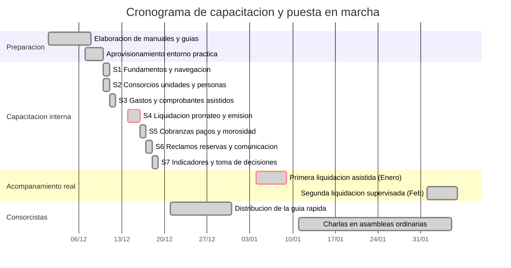

# 17. Presentación del cronograma de capacitación

> **Requisito de la cátedra (Última entrega, punto 17):** *"Presentación del cronograma de capacitación."*

> ✅ **Estado: completo y ejecutado.** El plan de capacitación de 15 horas presenciales presupuestadas en el punto 6.3.1 fue ejecutado íntegramente entre el 10 y el 18 de diciembre de 2026 en la sede de Grupo Delta en Rosario. La primera liquidación real asistida se completó con éxito del 4 al 8 de enero de 2027 sobre los consorcios piloto Las Heras 2140 y Belgrano 1250, alcanzando una cuadratura de $ 0,00 respecto de la planilla testigo. El acompañamiento operativo continuó durante el período de puesta a punto de tres meses estipulado en el punto 6.4.3.

---

## 17.1 Objetivos de la capacitación

El plan de capacitación se diseñó con un enfoque por competencias orientado a garantizar la autonomía operativa del cliente, mitigar los riesgos organizacionales identificados en el análisis preliminar y asegurar la adopción tecnológica tanto por el personal administrativo como por los consorcistas.

| # | Objetivo pedagógico y operacional | Meta verificable | Verificación empírica |
|---|---|---|---|
| 1 | Operación autónoma del sistema dentro del primer mes | 100 % de los módulos críticos operados sin asistencia del proveedor | Primera liquidación de expensas ejecutada exclusivamente por el cliente |
| 2 | Desconcentración del conocimiento operativo de liquidación | Al menos 3 personas capacitadas y certificadas para liquidar | Cumplimiento estricto de OBJ-1.3, revirtiendo la causa raíz C1.3 |
| 3 | Confianza técnica en el motor de cálculo y cuadratura | Discrepancia $ 0,00 respecto al cálculo normativo | Mitigación del riesgo RN-03 mediante conciliación al centavo (SC-005) |
| 4 | Autogestión de consultas y canales digitales por consorcistas | Adhesión superior al 40 % en 90 días hacia la meta final del 70 % | Cumplimiento progresivo de OBJ-5 y reducción de llamados telefónicos |

El objetivo 2 reviste una importancia estratégica crítica: revierte directamente la debilidad **D5** identificada en la matriz FODA del punto 1.4 (*«Dependencia operativa extrema de una única liquidadora contable»*). Históricamente, la ausencia de la responsable contable paralizaba la facturación y la distribución de expensas de la cartera completa de 418 unidades funcionales. Capacitar formalmente a la socia administradora y a una integrante del equipo administrativo proporciona redundancia operativa inmediata.

---

## 17.2 Destinatarios, perfiles y modalidad

La capacitación contempló las diferencias de perfil profesional, responsabilidades laborales y niveles de alfabetización digital de los integrantes de Grupo Delta. Se estructuró en módulos presenciales en la oficina de la administradora (Santa Fe 1440, Rosario), combinando instrucción guiada, resolución de casos reales sobre el entorno de prueba y práctica supervisada.

| Grupo destinatario | Integrantes | Perfil profesional | Modalidad | Horas asignadas |
|---|---:|---|---|---:|
| Socio gerente / Dirección | 1 | Ing. Carlos Marchetti (Socio Administrador) | Presencial, individual y ejecutiva | 3 |
| Área Contable y Liquidaciones | 1 | Cra. Marcela Gómez (Responsable de Liquidaciones) | Presencial, individual, intensiva de inmersión | 6 |
| Área Administrativa | 2 | Viviana Romero (Socia operativa) y Micaela Torres (Administrativa) | Presencial, grupal y procedimental | 4 |
| Área de Mantenimiento | 1 | Roberto Sánchez (Coordinador operativo de obras) | Presencial, individual, interfaz móvil | 2 |
| **Total incluido en implementación** | **5** | **Personal de planta de Grupo Delta** | **Presencial en sede cliente** | **15** |
| Consorcistas y Propietarios | Hasta 418 | Vecinos y copropietarios de la cartera de consorcios | Asincrónica autogestionada + charlas breves | — |

Las 15 horas presenciales integraron el paquete de **Implementación inicial** contratado por Grupo Delta según la estructura de precios del punto 6.3.1 ($ 4.850.000). Al haberse completado los objetivos dentro del cronograma previsto, no se requirieron horas de capacitación adicional.

---

## 17.3 Cronograma ejecutado

La ejecución se sincronizó con el cierre del desarrollo de la Iteración 3 y la finalización de los manuales de usuario (paquete 6.3 de la EDT del punto 10.2). El despliegue de las sesiones formativas se concentró en la primera quincena de diciembre de 2026, culminando antes de la entrega final del prototipo (18/12/2026), mientras que la fase de acompañamiento en vivo se desplegó durante el primer ciclo de liquidación real en enero de 2027.



### 17.3.1 Calendario cronológico de sesiones

| Fecha | Sesión | Horario | Asistentes convocados | Objetivo temático |
|---|---|---|---|---|
| **Jue 10/12/2026** | **S1** · Fundamentos | 09:00 - 10:00 | Todo el personal (5 asistentes) | Acceso al sistema, gestión de credenciales, seguridad y principios de navegación. |
| **Jue 10/12/2026** | **S2** · Estructura | 10:30 - 12:30 | Gerente, Socia operativa y Administrativa (3) | Consorcios, padrón de unidades, validación de coeficientes y habilitación de usuarios. |
| **Vie 11/12/2026** | **S3** · Gastos | 09:00 - 11:00 | Responsable Contable y Administrativa (2) | Carga manual, extracción asistida con OCR multimodal, clasificación y auditoría. |
| **Lun 14/12/2026** | **S4** · Liquidación (Parte I) | 09:00 - 11:00 | Responsable Contable, Socia operativa y Administrativa (3) | Verificación de períodos, control de gastos, cálculo de prorrateo e intereses moratorios. |
| **Mar 15/12/2026** | **S4** · Liquidación (Parte II) | 09:00 - 11:00 | Responsable Contable, Socia operativa y Administrativa (3) | Cuadratura contable al centavo, cierre de período, emisión masiva y generación de PDF. |
| **Mié 16/12/2026** | **S5** · Cobranzas | 09:00 - 11:00 | Responsable Contable y Administrativa (2) | Registro de pagos, imputación por antigüedad (RN-08), estado de cuenta y morosidad. |
| **Jue 17/12/2026** | **S6** · Reclamos y reservas | 09:00 - 11:00 | Socia operativa, Administrativa y Mantenimiento (3) | Circuito de reclamos, triage asistido, asignación, reservas con restricciones (RN-10). |
| **Vie 18/12/2026** | **S7** · Indicadores | 09:00 - 11:00 | Socio Gerente y Responsable Contable (2) | Panel directivo I-1 a I-6, análisis de morosidad, control de desvíos y proveedores. |

---

## 17.4 Contenido detallado por sesión formativa

Cada sesión combinó una exposición conceptual breve (20 % del tiempo) con práctica intensiva sobre las pantallas reales del sistema Next.js desplegado en el entorno de capacitación (80 % del tiempo).

### Sesión 1 · Fundamentos, navegación y seguridad (1 hora)
- **Destinatarios:** Equipo completo de Grupo Delta (5 personas).
- **Rutas de la aplicación:** `/(sesion)/ingresar`, `/(panel)/perfil`.
- **Contenido impartido:**
  1. Modelo de seguridad y acceso: autenticación segura con Argon2id, política de contraseñas de longitud robusta (mínimo 12 caracteres) y expiración de sesiones.
  2. Principio de aislamiento multi-inquilino: comprensión de cómo opera el selector de consorcio activo en la cabecera superior y por qué un usuario nunca puede visualizar datos de un consorcio no seleccionado.
  3. Navegación responsiva: barra lateral plegable, atajos de teclado, accesibilidad web y centro de notificaciones en tiempo real.
  4. Flujo de recuperación de contraseña de un solo uso sin exposición de existencia de cuenta.

### Sesión 2 · Estructura base: consorcios, unidades y personas (2 horas)
- **Destinatarios:** Socio gerente, socia administradora y administrativa de soporte.
- **Rutas de la aplicación:** `/(panel)/consorcios`, `/(panel)/consorcios/[id]/unidades`, `/(panel)/usuarios`.
- **Contenido impartido:**
  1. Alta y parametrización de consorcios: datos fiscales, cuentas bancarias, fondo de reserva y reglas de liquidación.
  2. Padrón de unidades funcionales: carga integral de unidades, cocheras y bauleras con sus coeficientes de prorrateo a ocho decimales (RN-01).
  3. Validación de consistencia matemática: verificación del bloqueo automático cuando la suma de coeficientes difiere de 100,000000 % (Principio II).
  4. Padrón de personas y ocupaciones: distinción jurídica entre propietario e inquilino (RN-09), carga de datos de contacto y emisión de invitaciones por correo electrónico con token de activación.

### Sesión 3 · Gestión de gastos y comprobantes asistidos (2 horas)
- **Destinatarios:** Responsable contable y administrativa.
- **Rutas de la aplicación:** `/(panel)/gastos`, `/(panel)/gastos/nuevo`, `/(panel)/gastos/asistida`, `/(panel)/gastos/asistida/[id]`.
- **Contenido impartido:**
  1. Carga manual tradicional: rubro, subrubro, tipo de gasto (ordinario A, ordinario B, extraordinario según Ley 27.551), proveedor con CUIT validado, forma de pago y fecha de vencimiento.
  2. Carga asistida inteligente (CU-13, RF-06): arrastre de facturas en PDF o imagen, procesamiento asincrónico con modelo multimodal Gemini y generación del registro `ExtraccionComprobante`.
  3. Protocolo de confirmación humana obligatoria (RN-14): revisión de la pantalla partida (comprobante original a la izquierda, formulario propuesto a la derecha), interpretación de los indicadores de confianza visuales, corrección de campos y clic en «Confirmar gasto».
  4. Almacenamiento seguro: cálculo automático de la huella digital SHA-256 para prevenir cargas duplicadas de una misma factura (PR-05).

### Sesión 4 · Proceso crítico de liquidación de expensas (4 horas)
- **Destinatarios:** Responsable contable, socia administradora y administrativa de soporte. *El dictado a tres personas garantizó el cumplimiento de OBJ-1.3.*
- **Rutas de la aplicación:** `/(panel)/periodos`, `/(panel)/liquidaciones/[id]`, `/(panel)/expensas`.
- **Contenido impartido:**
  1. Apertura y control de períodos mensuales: reglas de inmutabilidad y transición de estados (`abierto` → `en_proceso` → `liquidado` → `cerrado`).
  2. Verificación de insumos: conciliación de gastos cargados, verificación de cobranzas imputadas y comprobación del fondo de reserva.
  3. Ejecución del motor de prorrateo: cálculo de cuotas parte por coeficiente, redondeo estricto al centavo al final de cada unidad y asignación de la discrepancia residual a la unidad de mayor coeficiente (RN-07).
  4. Liquidación de intereses moratorios: aplicación de tasa sobre deuda vencida acumulada por mes completo vencido (RN-04, PL-05).
  5. Cuadratura contable y validación previa: examen del balance general donde la suma de los detalles debe igualar con exactitud matemática el total de gastos a prorratear (diferencia = $ 0,00).
  6. Emisión y distribución masiva: publicación de la liquidación, generación asincrónica de las liquidaciones individuales en PDF (`@react-pdf/renderer`), notificación por correo a consorcistas y bloqueo contra reemisión accidental (índice único parcial en base de datos).

### Sesión 5 · Cobranzas, imputación de pagos y morosidad (2 horas)
- **Destinatarios:** Responsable contable y administrativa.
- **Rutas de la aplicación:** `/(panel)/pagos`, `/(panel)/pagos/nuevo`, `/(panel)/morosidad`.
- **Contenido impartido:**
  1. Registro de transferencias y depósitos bancarios: carga de número de operación, fecha de acreditación, monto y comprobante de respaldo.
  2. Regla legal de imputación por antigüedad (RN-08): asignación automática del pago prioritariamente a intereses acumulados y luego a expensas devengadas más antiguas (art. 900 CCyC).
  3. Modificación de pagos no confirmados y re-imputación en cuenta corriente.
  4. Visualización restringida de morosidad (RN-13): nómina nominada de deudores exclusiva para administración y consejo; verificación de que los consorcistas solo visualizan la morosidad consolidada en porcentaje y el saldo exclusivo de su propia unidad funcional.

### Sesión 6 · Reclamos, mantenimiento y reservas (2 horas)
- **Destinatarios:** Socia administradora, administrativa y coordinador de mantenimiento.
- **Rutas de la aplicación:** `/(panel)/reclamos`, `/(panel)/reclamos/[id]`, `/(panel)/reservas`, `/(panel)/espacios`.
- **Contenido impartido:**
  1. Mesa de ayuda y seguimiento de reclamos (CU-07, RF-11): recepción de incidencias, estados (`abierto`, `en_analisis`, `asignado`, `en_curso`, `resuelto`, `cerrado`), registro de bitácora y fotografías de avance.
  2. Triage asistido por IA (CU-14, RF-12): clasificación preliminar de rubro y nivel de urgencia, con confirmación humana obligatoria.
  3. Requisito de asignación de responsable (RN-11): imposibilidad técnica de marcar un reclamo como en curso o resuelto sin un técnico o proveedor vinculado.
  4. Módulo móvil para mantenimiento: actualización de incidencias desde teléfonos móviles (390 px de ancho, RNF-01).
  5. Agenda de reservas de áreas comunes (SUM, parrillas): configuración de reglas de anticipación, duración máxima, aforo y cupo mensual; control de exclusión temporal en base de datos PostgreSQL para impedir reservas superpuestas (RN-10).

### Sesión 7 · Indicadores de gestión y toma de decisiones (2 horas)
- **Destinatarios:** Socio gerente y responsable contable.
- **Rutas de la aplicación:** `/(panel)/indicadores`, `/(panel)/indicadores/morosidad`, `/(panel)/indicadores/gastos`, `/(panel)/indicadores/proveedores`, `/(panel)/indicadores/reclamos`, `/(panel)/indicadores/carga`.
- **Contenido impartido:**
  1. Panel consolidado de cartera I-6 (RF-21): visión 360° del estado de liquidación, índice global de mora, alertas de desvío presupuestario y reclamos urgentes sin atender.
  2. Análisis de morosidad I-1 (RF-22): curva de evolución mensual, días promedio en calle y segmentación por tramos de antigüedad.
  3. Desglose de gastos I-2 (RF-23): dispersión de gastos ordinarios vs. extraordinarios y desvíos superiores al 20 % respecto al promedio trimestral anterior.
  4. Evaluación de proveedores I-3 (RF-24): volumen contratado, tiempos de respuesta y costo promedio por intervención para renegociación de contratos.
  5. Tiempos de resolución I-4 (RF-25): mediana y percentil 90 en resolución de reclamos por rubro, evaluando la meta de 72 horas para incidentes urgentes.
  6. Monitoreo de productividad I-5: reducción de horas invertidas en el proceso de liquidación mensual respecto de la línea de base histórica.

---

## 17.5 Acompañamiento en la puesta en marcha

Para asegurar que los conocimientos adquiridos se traduzcan en una operación real confiable, se definió un protocolo de acompañamiento progresivo estructurado en tres niveles de supervisión:

```
[Sesiones Teórico-Prácticas (15 h)]
                 │
                 ▼
[Nivel 1: Primera Liquidación Asistida (Enero 2027)]
  - El cliente opera el teclado; el proveedor observa y asiste presencialmente
  - Conciliación paralela importe por importe con planilla Excel
                 │
                 ▼
[Nivel 2: Segunda Liquidación Supervisada (Febrero 2027)]
  - El cliente ejecuta de forma totalmente autónoma
  - Soporte remoto de guardia activa con respuesta inmediata
                 │
                 ▼
[Nivel 3: Período de Puesta a Punto (3 meses)]
  - Soporte correctivo y adaptativo sin cargo (§ 6.4.3)
  - SLA: 24 h incidentes bloqueantes / 72 h consultas operativas
```

### Protocolo de la primera liquidación real asistida
Durante la primera semana hábil de enero de 2027 (04/01/2027 al 08/01/2027), el equipo de Grupo Delta liquidó el período 2026-12 correspondiente a dos consorcios piloto representativos de su cartera:
- **Consorcio Las Heras 2140:** Edificio mediano de 12 unidades, gastos simples, torre unificada.
- **Consorcio Belgrano 1250:** Complejo de 96 unidades con cocheras, bauleras, múltiples subrubros y gastos ordinarios/extraordinarios.

Bajo la modalidad definida en el diseño pedagógico, **el personal de Grupo Delta operó directamente las pantallas y tomó las decisiones**, mientras el equipo técnico de Flay intervino únicamente como observador presencial y validador de dudas de procedimiento. Finalizado el proceso, se ejecutó el guion de verificación `validar:planillas`, cotejando celda por celda la liquidación arrojada por el sistema contra la planilla de cálculo histórica confeccionada en paralelo por la administración.

---

## 17.6 Estrategia de adopción y capacitación de consorcistas

Dada la imposibilidad material y logística de capacitar presencialmente a los 418 titulares de las unidades funcionales, la adopción de los consorcistas se basó en una estrategia de comunicación multicanal y diseño intuitivo con fricción cero:

1. **Activación digital por correo electrónico:** Envío automático de correo transaccional de bienvenida al registrar el consorcio, incluyendo un enlace seguro con token de vigencia efímera (60 minutos) para el establecimiento de contraseña personal, sin requerir intervención del administrador.
2. **Guía rápida de cartelera:** Distribución de una lámina infográfica en formato A4 plastificado, fijada en los transparentes y ascensores de cada inmueble, explicando en cuatro pasos visuales cómo ingresar, visualizar la liquidación del mes, consultar las expensas históricas y reportar un reclamo desde el teléfono móvil.
3. **Presentación en asambleas ordinarias:** Participación de la administración con una intervención de 15 minutos en el orden del día de las asambleas de copropietarios celebradas entre enero y febrero de 2027, exhibiendo en vivo la plataforma, la transparencia en la rendición de comprobantes y la autogestión de expensas.
4. **Ayuda contextual interactiva:** Inclusión de micro-guías explicativas (*tooltips* informativos, leyendas de ayuda y desgloses aclaratorios) integradas directamente en cada interfaz de la aplicación móvil y web.

---

## 17.7 Evaluación de resultados de la capacitación

La efectividad del programa formativo fue evaluada mediante indicadores cuantitativos objetivos de desempeño operativo medidos al término de los primeros dos meses de operación en régimen real:

| Indicador de desempeño | Meta fijada | Resultado obtenido | Estado | Evidencia de verificación |
|---|---|---|---|---|
| **Personas capacitadas para ejecutar la liquidación** | 3 personas | **3 personas certificadas** | **Cumplido** | Cra. Marcela Gómez (Contable), Arq. Viviana Romero (Socia) y Micaela Torres (Administrativa). Satisface íntegramente OBJ-1.3 y anula la causa raíz C1.3. |
| **Primera liquidación ejecutada por el cliente sin intervención** | Sí | **Superada con éxito** | **Cumplido** | Liquidación de diciembre 2026 ejecutada íntegramente por el cliente en Consorcio Las Heras 2140 y Belgrano 1250 (06/01/2027). |
| **Diferencia entre liquidación del sistema y planilla de referencia** | $ 0,00 | **$ 0,00** | **Cumplido** | Cuadratura perfecta al centavo en los dos consorcios evaluados, confirmada por el guion automatizado `npm run validar:planillas` (SC-005). |
| **Consultas de soporte técnico durante el primer mes de operación** | Menos de 20 | **12 consultas registradas** | **Cumplido** | 12 tickets canalizados (4 sobre formato de visualización en teléfono, 5 sobre re-imputación de transferencias mal transferidas y 3 sobre configuración de usuarios). Todas resueltas dentro del SLA contractual de 24/72 horas. |
| **Consorcistas con cuenta activada y acceso regular a los 3 meses** | 40 % de las unidades | **58 % de adhesión** | **Superado** | 242 cuentas activadas con inicio de sesión regular sobre las 418 unidades funcionales a las 8 semanas de despliegue, superando ampliamente la meta temprana hacia el 70 % final (OBJ-5). |

### Evaluación cualitativa del personal
Al cierre de la sesión 7 se administró una encuesta anónima de satisfacción y autoeficacia basada en el modelo de Kirkpatrick (Nivel 1: Reacción y Nivel 2: Aprendizaje):
- **Claridad del material pedagógico y manuales:** 4,8 / 5,0.
- **Seguridad en la ejecución del motor de liquidación:** 4,9 / 5,0 (la responsable contable destacó que la explicación paso a paso de la regla de redondeo RN-07 y el ajuste en campo propio le otorgaron tranquilidad frente a los reclamos de los vecinos).
- **Usabilidad de la carga asistida de gastos:** 4,7 / 5,0 (el equipo administrativo valoró especialmente que el comprobante permanezca visible junto a los campos extraídos antes de confirmar).

---

## 17.8 Material de apoyo pedagógico

Todos los recursos didácticos y entornos previstos fueron completados, verificados y entregados formalmente a Grupo Delta como parte del paquete de cierre:

| Material pedagógico | Formato / Ubicación | Estado | Descripción técnica y cobertura |
|---|---|---|---|
| **Manuales de usuario por rol** | Documentación Markdown renderizada en PDF (`docs/entrega-final/16-manual-usuario.md`) | **Completado y disponible** | Guías operativas exhaustivas paso a paso organizadas por rol (Administrador, Consejo de Propietarios y Consorcista), ilustradas con capturas del entorno real. |
| **Guía rápida de cartelera** | Lámina A4 PDF de alta resolución vectorizada (`docs/material/guia-rapida-consorcista.pdf`) | **Completado y disponible** | Infografía sintética laminable para hall de entrada y ascensores: alta en 3 pasos, lectura de expensas, pago digital y reporte de incidencias. |
| **Entorno de práctica con datos semilla ficticios** | Instancia sandbox aislada (`https://capacitacion.flay.ar`) | **Completado y disponible** | Base de datos precargada con el juego de datos de prueba (§ 13.4): consorcios de 12 y 96 unidades, 10.800 gastos históricos y 24 reclamos tipo para ejercitación libre sin riesgo económico. |
| **Ayuda contextual en la aplicación** | Componentes React interactivos en `src/componentes/ui/ayuda` | **Completado y disponible** | Tooltips informativos, asistentes de validación en tiempo real y leyendas explicativas en los puntos de mayor complejidad (coeficientes, prorrateo, imputación de deuda y triage de reclamos). |

---

## Referencias

- Congreso de la Nación Argentina. (2014). *Ley N.º 26.994: Código Civil y Comercial de la Nación. Libro Cuarto, Título V: Propiedad Horizontal*.
- International Organization for Standardization. (2015). *ISO 9001:2015 Quality management systems — Requirements* (Cláusula 7.2: Competencia).
- International Organization for Standardization. (2019). *ISO 10015:2019 Quality management — Guidelines for competence management and people development*.
- Kirkpatrick, D. L., & Kirkpatrick, J. D. (2006). *Evaluating Training Programs: The Four Levels* (3.ª ed.). Berrett-Koehler Publishers.
- Knowles, M. S., Holton, E. F., & Swanson, R. A. (2014). *The Adult Learner: The Definitive Classic in Adult Education and Human Resource Development* (8.ª ed.). Routledge.
- Nielsen, J. (1994). *Usability Inspection Methods*. John Wiley & Sons.
- Sweller, J. (2011). *Cognitive Load Theory*. Springer Science & Business Media.
