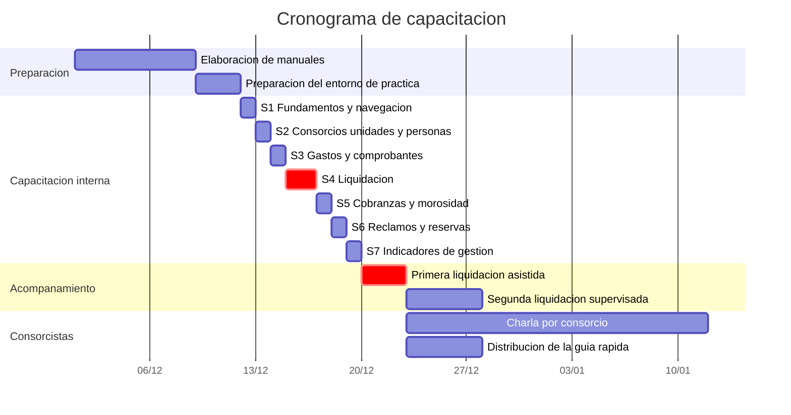

# 17. Presentación del cronograma de capacitación

> **Requisito de la cátedra (Última entrega, punto 17):** *"Presentación del cronograma de
> capacitación."*

> ⚠️ **Estado: esqueleto.** El plan está definido y dimensionado; las fechas y los resultados se
> completan al ejecutarlo, en el paquete 6.4 del punto 10.2.

---

## 17.1 Objetivos de la capacitación

| # | Objetivo | Verificación |
|---|---|---|
| 1 | Que el personal de Grupo Delta opere el sistema sin asistencia dentro del primer mes | Liquidación de un consorcio ejecutada sin intervención del proveedor |
| 2 | Que al menos tres personas puedan ejecutar la liquidación | Cumplimiento de OBJ-1.3, que revierte la causa C1.3 |
| 3 | Que la responsable de liquidaciones confíe en el cálculo del sistema | Mitigación del riesgo RN-03 |
| 4 | Que los consorcistas puedan autogestionar sus consultas | Cumplimiento de OBJ-5, meta del 70 % de las unidades |

El objetivo 2 no es una comodidad: es la contramedida directa a la dependencia de una sola persona,
identificada como debilidad D5 en el FODA del punto 1.4.

## 17.2 Destinatarios y modalidad

| Grupo | Personas | Modalidad | Horas |
|---|---:|---|---:|
| Socio gerente | 1 | Presencial, individual | 3 |
| Área Contable y Liquidaciones | 1 | Presencial, individual e intensiva | 6 |
| Área Administrativa | 2 | Presencial, grupal | 4 |
| Área de Mantenimiento | 1 | Presencial, individual, orientada al uso en teléfono | 2 |
| **Total incluido en la implementación inicial** | **5** | | **15** |
| Consorcistas | Hasta 418 | Autogestionada, más una charla presencial por consorcio | — |

Las 15 horas están incluidas en el precio de implementación del punto 6.3.1. Las adicionales se
facturan según la tarifa allí establecida.

## 17.3 Cronograma

*Las fechas se ajustan al calendario efectivo de puesta en marcha.*

## 17.4 Contenido por sesión

| Sesión | Destinatarios | Contenido | Horas |
|---|---|---|---:|
| 1 · Fundamentos | Todos | Ingreso, navegación, roles, dónde encontrar ayuda | 1 |
| 2 · Estructura | Administrador y administrativas | Consorcios, unidades, coeficientes, personas y accesos | 2 |
| 3 · Gastos | Contable y administrativas | Carga de gastos, comprobantes, carga asistida y qué revisar antes de confirmar | 2 |
| **4 · Liquidación** | **Contable, administrador y una administrativa** | **Verificación previa, ejecución, cuadratura, publicación y resolución de discrepancias** | **4** |
| 5 · Cobranzas | Contable y administrativas | Registro de pagos, imputación, estado de cuenta e intereses | 2 |
| 6 · Reclamos y reservas | Administrativas y mantenimiento | Bandeja de reclamos, estados, asignación, agenda de reservas | 2 |
| 7 · Indicadores | Socio gerente y contable | Lectura de cada indicador y qué decisión soporta | 2 |

La sesión 4 se dicta a tres personas y no solo a la responsable actual: es el mecanismo concreto para
alcanzar OBJ-1.3.

## 17.5 Acompañamiento en la puesta en marcha

| Instancia | Modalidad | Duración |
|---|---|---|
| Primera liquidación real | El proveedor acompaña presencialmente; **la ejecuta el cliente** | Una jornada por consorcio grande |
| Comparación en paralelo con la planilla | Conjunta, importe por importe | Incluida |
| Segunda liquidación | El cliente ejecuta solo; el proveedor disponible a distancia | Una semana de disponibilidad |
| Soporte del período de puesta a punto | Sin cargo, según el punto 6.4.3 | Tres meses |

Que la primera liquidación la ejecute el cliente y no el proveedor es deliberado: es la única forma
de verificar que la capacitación funcionó.

## 17.6 Capacitación de los consorcistas

| Instancia | Modalidad |
|---|---|
| Correo de bienvenida con enlace de activación | Automático, al otorgar el acceso |
| Guía rápida de una carilla | Impresa en cartelera y descargable |
| Charla de 20 minutos en la asamblea de cada consorcio | Presencial, a cargo de la administración |
| Ayuda contextual dentro de la aplicación | Permanente |

La capacitación de los consorcistas es responsabilidad de la administradora y no del proveedor: es
Grupo Delta quien tiene la relación con los vecinos.

## 17.7 Evaluación

*A completar tras la ejecución.*

| Indicador | Meta | Resultado |
|---|---|---|
| Personas capacitadas para ejecutar la liquidación | 3 | |
| Primera liquidación ejecutada por el cliente sin intervención | Sí | |
| Diferencia entre la liquidación del sistema y la planilla | $ 0 | |
| Consultas de soporte durante el primer mes | Menos de 20 | |
| Consorcistas con cuenta activada a los 3 meses | 40 % de las unidades | |

## 17.8 Material de apoyo

| Material | Estado |
|---|---|
| Manuales por rol, punto 16 | A elaborar |
| Guía rápida de una carilla | A elaborar |
| Entorno de práctica con datos ficticios | A preparar |
| Ayuda contextual en la aplicación | A construir |

---

## Referencias

*A completar.*
