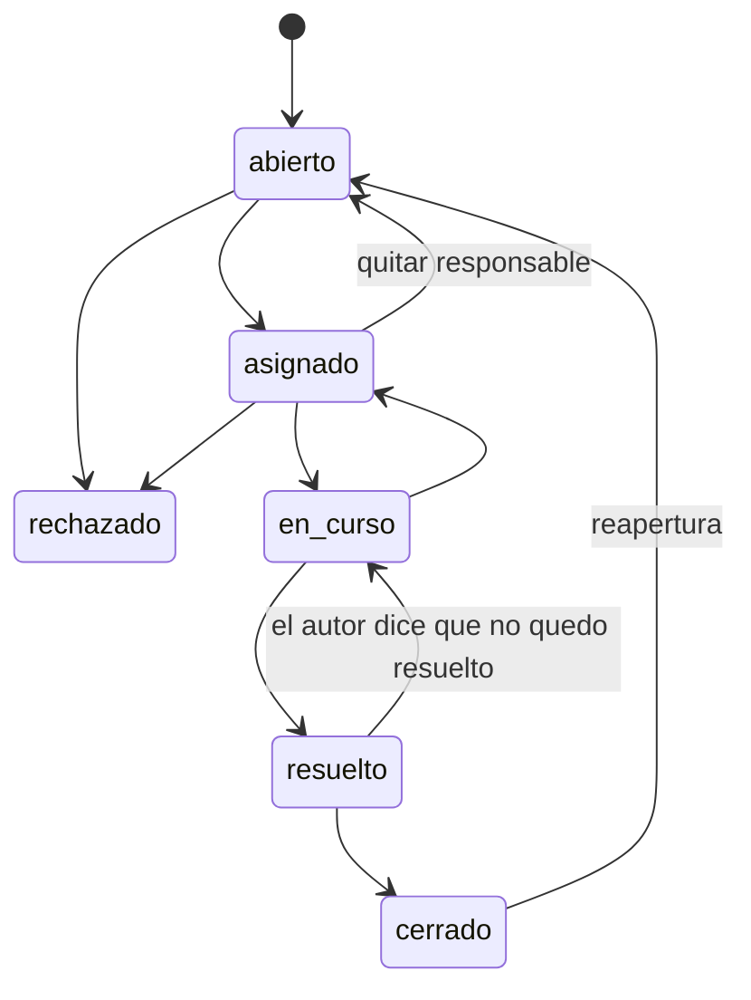

# Guía de recorrido de Flay

Referencia para recorrer el sistema pantalla por pantalla: qué hay en cada sección, qué se puede
hacer, quién puede hacerlo y qué regla lo gobierna. Relevada del código de `src/app/(panel)` y de los
casos de uso de `src/aplicacion` (rama `main`, septiembre de 2026). El manual narrativo por rol es
[`entrega-final/16-manual-usuario.md`](entrega-final/16-manual-usuario.md); este documento es el mapa.

Convención: **quién puede** sale de `rolesPermitidos` del caso de uso, que es la única barrera real
(`src/aplicacion/autorizacion.ts`). Lo que el lateral dibuja (`secciones.ts`) sólo decide qué se ve.

---

## 1. Roles

| Rol | Qué es | Cómo se obtiene | Alcance |
|---|---|---|---|
| **Superadministrador de plataforma** | Quien opera por encima de los consorcios: da de alta administradoras y consorcios. No es un rol *sobre* un consorcio. | `npm run semilla:arranque` (correo y clave por variable de entorno). Es una `HabilitacionPlataforma` con vigencia. | Alta de administradoras y consorcios. Ninguna pantalla de consorcio salvo que además tenga habilitación en él. |
| **Administrador** | La administración del consorcio: carga, liquida, cobra, asigna, publica. | Habilitación `administrador` sobre el consorcio, vigente a la fecha. El alta de un consorcio crea la primera. | Todo lo del consorcio. Es el único rol de carga (`ROLES_DE_CARGA`). |
| **Consejo de administración** | Propietarios que fiscalizan. Ven todo, no escriben datos económicos. | Habilitación `consejo`. **Se suma** a `consorcista`, no lo reemplaza: la persona lleva las dos habilitaciones. | Nómina nominada de deudores (RN-13), liquidaciones completas, todas las expensas, indicadores, unidades, exportación. |
| **Consorcista** | Propietario o inquilino de una o más unidades. | Habilitación `consorcista` **más** una `Ocupacion` vigente sobre una unidad (la carga la semilla o `registrarOcupacion`; no hay pantalla). | Sus unidades: expensas, estado de cuenta, reclamos propios y generales, reservas. Morosidad sólo agregada. |

Reglas transversales:

- Sin habilitación vigente sobre el consorcio, cualquier pedido responde **«no encontrado»**, nunca
  «prohibido»: decir «prohibido» revela que el recurso existe.
- Con habilitación pero rol insuficiente, el caso de uso lanza `RolInsuficiente` con el nombre de la
  acción («no podés *registrar pagos*»).
- Un usuario puede tener varios roles sobre el mismo consorcio y distintos roles en distintos
  consorcios. Alcanza con que **uno** de sus roles esté permitido.

---

## 2. Cómo se entra y cómo se navega

| Ruta | Qué es | Quién |
|---|---|---|
| `/` | Sin sesión: portada con «Ingresar». Con sesión: redirige al resumen del único consorcio, al último usado (galleta `flay_consorcio`) o a la lista. | Todos |
| `/ingresar` | Correo + contraseña. Cinco fallos seguidos bloquean la cuenta 15 minutos; el mensaje no distingue «clave incorrecta» de «bloqueada». | Todos |
| `/invitacion/[credencial]` | El invitado fija su propia contraseña. La credencial vale **72 horas** y no se valida al abrir la pantalla (si estuviera vencida se diría recién al enviar). | Invitados |
| `/consorcios` | Lista de consorcios al alcance, con buscador y señales del que administra (último período, morosidad, reclamos abiertos, desvíos de gasto). Botón «Nuevo consorcio» sólo si hay una administradora al alcance. | Todos con sesión |
| `/consorcios/nuevo` | Alta de consorcio sin JavaScript (el wizard va en modal desde la lista). | Superadministrador |
| `/bandeja` | Lo pendiente de **todos** los consorcios que se administran: períodos sin liquidar, reclamos abiertos, cola de avisos con «Enviar avisos ahora» y «Reintentar los agotados». Sin lateral. | Administrador (a los demás les dice que no hay nada que decidir) |
| `/consorcios/[consorcio]/…` | El panel del consorcio, con lateral. El consorcio vive en la ruta; `conConsorcio` valida el id contra el alcance. | Según sección |
| `/gastos`, `/periodos?consorcio=x` (direcciones viejas) | Redirigen a la misma sección del consorcio pedido, recordado o único. | — |

**Barra superior** (siempre): marca, «Consorcios», «Bandeja», «Salir».
**Lateral** (sólo dentro de un consorcio): cuatro bloques, y cada sección aparece sólo si el rol
puede abrirla. Un bloque sin secciones no se dibuja.

| Bloque | Secciones | Roles que la ven en el lateral |
|---|---|---|
| Dinero | Períodos, Expensas, Gastos, Pagos, Morosidad | Todos |
| Convivencia | Reclamos, Reservas, Espacios, Novedades | Todos (Espacios: la pantalla rechaza a quien no administra) |
| Análisis | Documentación | Todos |
| Análisis | Indicadores | Administrador, consejo |
| Administración | Unidades | Administrador, consejo |
| Administración | Proveedores | Todos |
| Administración | Usuarios | Administrador |

---

## 3. Sección por sección

Cada ficha: qué muestra, qué se puede hacer (con el rol entre paréntesis), reglas que aplican.

### 3.1 Resumen — `/consorcios/[consorcio]`

**Muestra**: nombre y dirección; cuatro KPI (período abierto y su vencimiento, gastos del período,
morosidad «n de m unidades» con deuda vencida, reclamos abiertos y críticos); avisos sólo si aplican
(padrón que no cierra, padrón vacío); tarjetas de últimos gastos, últimos pagos, reclamos sin
resolver y contactos útiles (administración y proveedores).
**Acciones**: «Cargar gasto», «Registrar pago», «Liquidar» / «Abrir período» (*administrador*; los
botones no se dibujan para los demás).
**Reglas**: la morosidad del KPI es agregada para todos; la nómina está en Morosidad (RN-13).

### 3.2 Períodos — `/periodos`

**Muestra**: tabla de períodos (uno por mes, del más nuevo al más viejo) con estado, cantidad de
gastos y total de la liquidación vigente con su vencimiento (enlace al detalle).
**Estados**: `Abierto` (admite gastos) → `Cerrado` (espera liquidación; puede reabrirse) →
`Liquidado` (no vuelve atrás) · `Anulado`.
**Acciones**:

| Acción | Rol | Regla |
|---|---|---|
| Abrir período (modal mes/año) | Administrador | Un período por mes; mes 1–12; no puede repetirse. |
| Cerrar | Administrador | Desde acá no entran más gastos (RN-03). Se puede reabrir mientras no esté liquidado. |
| Liquidar | Administrador | Sólo un período cerrado. Ver § 4.1 para el cálculo. Todo en una transacción: cálculo, detalles, estado, cola de documentos y avisos. |
| Anular liquidación | Administrador | Se anula **la liquidación**, no el período (RN-06). Las imputaciones de pagos se marcan como revertidas —no se borran— y el importe queda como saldo a favor. Una reemisión encuentra el período `liquidado`; el candado contra la emisión doble es un índice único parcial sobre `estado = 'vigente'`. |
| Exportar CSV de liquidaciones | Administrador, consejo | Por páginas, cada una vuelve a pasar por habilitación y aislamiento. |

### 3.3 Liquidación — `/liquidaciones/[id]`

**Muestra**: estado (`Vigente`/`Anulada`), vencimiento, totales ordinario / extraordinario / general,
cantidad de documentos generados sobre el total, y la tabla por unidad: coeficiente aplicado,
ordinario, extraordinario, deuda anterior, interés **con su desglose** (`capital × tasa % × meses`),
ajuste de redondeo y total.
**Quién**: administrador y consejo. El consorcista ve sólo su expensa (§ 3.4).
**Acciones**: «Generar documentos» (*administrador*, sólo si faltan): cada disparo genera unos 60 PDF
en hasta 20 s; el drenaje oportunista de la cola sigue generando mientras alguien navegue.

### 3.4 Expensas — `/expensas` y `/expensas/[detalle]`

**Muestra**: una tabla con las liquidaciones emitidas por unidad: unidad, período, vencimiento, total
y descarga del PDF (o «En generación»). El detalle muestra el total y el botón de descarga.
**Quién ve qué** (lo decide el caso de uso, no la pantalla): el consorcista, las unidades que ocupa;
administrador y consejo, todas. Pedir por URL la expensa de otra unidad responde «no encontrado».
**Acciones**: descargar el PDF (todos); «Registrar pago» desde el detalle (*administrador*).

### 3.5 Gastos — `/gastos` y `/gastos/[id]`

**Muestra**: tabla paginada (fecha, rubro, proveedor, detalle, importe, cantidad de comprobantes) con
filtros por período y rubro y fila de total del filtro. El detalle muestra el gasto, su clasificación
y los comprobantes (visor de PDF/imagen; HEIC y TIFF sólo descarga).
**Quién ve**: todos los roles del consorcio (el consorcista audita los gastos, CU-05).
**Acciones**:

| Acción | Rol | Regla |
|---|---|---|
| Nuevo gasto (modal: período, rubro, proveedor, importe, fecha, descripción; `/gastos?abrir=1` lo abre de entrada, desde el Resumen) | Administrador | El período tiene que estar **abierto** (RN-03). La clasificación ordinario/extraordinario se **congela** en el gasto al copiarla del rubro (RN-04). Importe como cadena, mayor a cero. Si no hay período abierto, la pantalla manda a Períodos. |
| Adjuntar comprobante al gasto | Administrador | Sólo con el período abierto. PDF, JPEG, PNG, WebP, HEIC o TIFF; hasta 25 MB. La subida va directa al almacén y el estado «no confirmado» se reintenta solo. |
| Exportar CSV de gastos | Administrador, consejo | |

Los parámetros de la URL **precargan** el formulario, lo abren y se marcan como tales: es la
costura por la que entra la carga asistida.

> Observación: los botones «Nuevo gasto», «Carga asistida» y «Adjuntar» se dibujan
> para todos los roles; para consejo y consorcista el caso de uso rechaza con `RolInsuficiente`.

### 3.6 Carga asistida — `/gastos/asistida` y `/gastos/asistida/[id]`

**Muestra**: cargador de comprobante suelto y tabla «Comprobantes cargados» con fecha de carga,
proveedor detectado, importe, estado (`En cola`, `Extrayendo…`, `Para revisar`, `Para revisar (sin
asistencia)`, `No se pudo procesar`) y botón «Revisar». Tras subir, la persona se queda en la lista
y puede subir el siguiente; mientras haya algo en proceso la tabla se refresca sola cada 3 s (y ese
refresco es lo que drena la cola). La revisión muestra el comprobante al lado del formulario de
gasto precargado con la propuesta y su confianza.
**Quién**: administrador (todas las acciones, incluida ver).
**Reglas**: RN-14. El comprobante vive en `ExtraccionComprobante`; el `Gasto` y el `Comprobante`
nacen en una única transacción **al confirmar**, y `campos_corregidos` se calcula por diferencia con
la propuesta. Descartar no deja rastro económico. El proveedor propuesto se ata al padrón por CUIT o
razón social; si no está, queda vacío. Sin servicio de IA, el estado es «Sin asistencia» y el
comprobante queda guardado para cargarlo a mano.

### 3.7 Pagos — `/pagos`

**Muestra**: estado de cuenta por unidad (saldo, saldo a favor, último movimiento) y, al elegir una,
sus movimientos (expensas como deuda, pagos imputados como crédito, saldo corrido). Con una sola
unidad —el consorcista— se abre sola.
**Quién ve qué**: el consorcista, sus unidades; administrador y consejo, todas.
**Acciones**: «Registrar un pago» (modal, *administrador*; `/pagos?abrir=1` lo abre de entrada,
desde el Resumen): unidad, importe, fecha, medio (transferencia, efectivo, depósito, débito automático),
referencia. Exportar CSV de pagos (*administrador, consejo*).
**Reglas**: RN-08 — el pago se imputa de la deuda más vieja a la más nueva, en una sola transacción
con sus imputaciones. Lo que sobra es **saldo a favor**, que la próxima liquidación aplica después del
interés. `suma(imputaciones) + sobrante = importe`, tolerancia cero.

### 3.8 Morosidad — `/morosidad`

**Muestra**: KPI de unidades con deuda vencida sobre el total y deuda total; y la nómina (unidad,
períodos vencidos, deuda).
**Quién**: todos ven el agregado. La nómina la ven **administrador y consejo** (RN-13). No es que la
pantalla oculte nombres: son dos consultas distintas y la del consorcista no trae ninguno.

### 3.9 Reclamos — `/reclamos` y `/reclamos/[id]`

**Muestra**: tarjetas con título, unidad o «Área común», rubro, fecha, estado, urgencia, autor
(«Tuyo» si es propio) y responsable; filtro por estado. El detalle agrega descripción, rubro,
proveedor, gasto vinculado, acciones según rol, sugerencia automática de triage e historial completo
(cada transición con quién, cuándo y comentario).
**Quién ve qué**: administrador y consejo, todos; el consorcista, **los propios y los de alcance
general**.
**Alta** (modal: qué pasa, detalle, unidad, urgencia): cualquier rol. Título hasta 140 caracteres,
detalle de al menos 10. El consorcista sólo reclama sobre una unidad que ocupa; sin unidad, el
alcance es «general». Nace `Abierto` sin responsable y encola el triage.
**Estados y transiciones** (RN-11; la base repite la regla con un `CHECK`):

| Quién | Qué puede |
|---|---|
| Administrador | Cualquier transición válida. «Asignar» / «Cambiar asignación» (responsable, rubro, proveedor). Vincular un gasto. Aplicar o descartar la sugerencia de triage. |
| Autor del reclamo (cualquier rol) | Sólo `resuelto → en_curso` y `cerrado → abierto`. |
| Consejo, consorcista no autor | Ver. |

Fuera de `abierto` el reclamo **exige responsable**. Cada cambio de estado deja asiento en el
historial y avisa al autor y al responsable (menos a quien hizo el cambio). La sugerencia de triage
(rubro, urgencia, proveedor) **nunca** toca el estado: el administrador la aplica o descarta.

### 3.10 Reservas — `/reservas`

**Muestra**: reservas de los próximos 60 días (espacio, desde, hasta, **unidad** —nunca nombre—,
estado `Confirmada`/`Cancelada`), filtro por espacio.
**Acciones**: reservar (modal: espacio, unidad, desde, hasta, cantidad de personas, observaciones);
cancelar.
**Quién**: reserva quien ocupa una unidad, para esa unidad; el administrador, para cualquiera.
Cancela el solicitante o el administrador, sólo si está `confirmada`. Un consejo sin unidad ve pero
no reserva («la reserva la hace quien ocupa la unidad»).
**Reglas** (cada una con su mensaje):

1. La unidad **no puede tener deuda vencida** (precondición de CU-09).
2. Fin después de inicio; anticipación mínima en horas y máxima en días del espacio; duración
   máxima; capacidad máxima; tope de reservas por mes y unidad.
3. **Superposición**: la rechaza la base con una restricción de exclusión (RN-10); la aplicación
   sólo traduce el error.
4. Cada confirmación o cancelación avisa por correo al solicitante.

### 3.11 Espacios — `/espacios`

**Muestra**: tarjetas por espacio con capacidad, anticipación (h a días), duración máxima, reservas
por mes y unidad; los dados de baja con etiqueta.
**Acciones**: nuevo, editar, dar de baja (*administrador*; a los demás la pantalla les responde con el
error del caso de uso).
**Reglas**: las reglas son enteros no negativos. La baja es **lógica** y cancela las reservas
futuras avisando a cada solicitante.

### 3.12 Novedades — `/novedades`

**Muestra**: comunicados de la administración, fijados primero, con fecha.
**Acciones**: publicar (modal: título hasta 140, texto, fijada) — *administrador*. Publicar avisa a
todos los habilitados del consorcio.

### 3.13 Documentación — `/documentos`, `/documentos/[id]`, `/documentos/consultar`

**Muestra**: tabla de documentos (título, tipo, fecha, estado de indexación: `Pendiente de indexar`,
`Indexando`, `Listo para consultar`, `No se pudo indexar` con el motivo). Los no visibles para
consorcistas llevan el ojo tachado. El detalle abre el PDF en visor con descarga por enlace firmado.
**Tipos**: reglamento de copropiedad, reglamento interno, acta, contrato, póliza, otro.
**Acciones**: cargar (*administrador*): sólo PDF, hasta 25 MB, con marca «visible para
consorcistas». Se indexa en segundo plano (extracción de texto, fragmentación, vectores, con
reintentos).
**Quién ve qué**: administrador y consejo, todo; consorcista, sólo lo marcado visible. Otro consorcio
o no visible: «no encontrado».
**Consultar** («Preguntarle a la documentación», todos los roles): pregunta en lenguaje natural de al
menos 3 caracteres. Tres salidas posibles: respuesta con citas (documento, página, fragmento);
«no lo encontramos en la documentación cargada» (`sin_respaldo`, lo decide el generador, no un
umbral de similitud); o modo degradado sin servicio de IA, que ofrece los documentos para abrir. La
recuperación filtra por consorcio y visibilidad **en el `WHERE`**, antes de ordenar. Cada consulta
queda registrada y se puede valorar.

### 3.14 Indicadores — `/indicadores` y sus cinco páginas

**Quién**: administrador y consejo. I-3 (proveedores) e I-5 (carga administrativa), sólo
administrador. Sobre vistas materializadas: muestran la «última actualización» y el administrador
puede «Actualizar los indicadores».

| Página | Qué muestra |
|---|---|
| I-6 Panel de la cartera (`/indicadores`) | Morosidad de la cartera y un renglón por consorcio administrado: último período, morosidad, unidades en mora, reclamos abiertos, críticos, desvíos de gasto. |
| I-1 Morosidad | Por período: liquidado, deuda vencida, unidades en mora, morosidad %. Meta 12 %. |
| I-2 Gasto por rubro | Por período y rubro: importe, promedio móvil de los 12 anteriores, desvío. Nunca contra un valor fijo (inflación). |
| I-3 Proveedores | Por proveedor y rubro: contrataciones, costo acumulado, costo promedio, reclamos resueltos, horas medias entre asignación y resolución. |
| I-4 Reclamos | Por rubro y urgencia: cantidad, mediana y percentil 90 de horas hasta resolución. Mediana, no promedio. |
| I-5 Carga administrativa | Por mes: horas de apertura a liquidación contra la línea de base, extracciones confirmadas, sin corrección, sugerencias aceptadas. |

### 3.15 Unidades — `/unidades`

**Muestra**: padrón vigente (designación, tipo, coeficiente) con la suma al pie.
**Quién**: administrador y consejo.
**Acciones**: cargar el padrón (*administrador*), sólo cuando está vacío: se cargan **todas las
unidades de una vez** (o se genera por pisos × unidades por piso y se ajusta). Tipos: departamento,
cochera, local, baulera.
**Reglas**: RN-01 — la suma debe dar exactamente 100,00000000 %; unidad por unidad nunca cerraría.
Un padrón que no cierra bloquea la liquidación (aviso en el resumen). RN-02 — los coeficientes sólo
cambian hacia el futuro con `CoeficienteHistorico`; la vigencia anterior cierra el día **antes** de
que abra la nueva. `agregarUnidades` y `cambiarCoeficientes` existen como casos de uso pero no tienen
pantalla todavía.

### 3.16 Proveedores — `/proveedores`

**Muestra**: razón social, CUIT, rubro habitual.
**Acciones**: nuevo (razón social, CUIT, rubro habitual, teléfono, correo) y editar —
*administrador*. Ver: todos (el consorcista los ve como contactos útiles).

### 3.17 Usuarios — `/usuarios`

**Muestra**: persona, correo, roles, estado (`Invitado`, `Activo`, `Suspendido`, más `Bloqueado`) y
el estado de la invitación en la cola («Correo en cola», «Correo enviado; todavía no la usó», «No se
pudo enviar en n intentos»).
**Quién**: administrador. A los demás la pantalla les muestra el error del caso de uso.
**Acciones**: invitar (modal: nombre, apellido, correo, rol, habilitado desde) y reenviar invitación.
**Reglas**: el correo no puede estar ya registrado. El invitado fija su propia contraseña; el
administrador nunca la conoce. El envío se **encola** siempre: la falla del correo no voltea el alta.
La vinculación de un consorcista a su unidad (ocupación, RN-09) no se hace desde acá.

---

## 4. Matriz de permisos

`✔` puede · `◐` parcial (ver nota) · `—` no.

| Acción | Superadmin | Administrador | Consejo | Consorcista |
|---|---|---|---|---|
| Dar de alta administradora / consorcio | ✔ | — | — | — |
| Ver la bandeja con pendientes | — | ✔ | — | — |
| Abrir, cerrar, reabrir período | — | ✔ | — | — |
| Liquidar, anular, generar documentos | — | ✔ | — | — |
| Ver liquidación completa (detalle por unidad) | — | ✔ | ✔ | — |
| Ver expensas | — | todas | todas | las propias |
| Ver gastos y comprobantes | — | ✔ | ✔ | ✔ |
| Registrar gasto, adjuntar comprobante | — | ✔ | — | — |
| Carga asistida (subir, revisar, confirmar, descartar) | — | ✔ | — | — |
| Ver estado de cuenta | — | todas | todas | las propias |
| Registrar pago | — | ✔ | — | — |
| Morosidad agregada | — | ✔ | ✔ | ✔ |
| Nómina nominada de deudores (RN-13) | — | ✔ | ✔ | — |
| Exportar CSV (gastos, liquidaciones, pagos) | — | ✔ | ✔ | — |
| Ver reclamos | — | todos | todos | propios + generales |
| Registrar reclamo | — | cualquier unidad | cualquier unidad | unidad que ocupa o general |
| Asignar, rechazar, poner en curso, resolver, cerrar | — | ✔ | — | — |
| «No quedó resuelto» / reabrir | — | ✔ | ◐ si es autor | ◐ si es autor |
| Vincular gasto, aplicar/descartar sugerencia de triage | — | ✔ | — | — |
| Ver reservas (por unidad, sin nombres) | — | ✔ | ✔ | ✔ |
| Reservar | — | cualquier unidad | ◐ sólo si ocupa una unidad | ◐ unidad que ocupa |
| Cancelar reserva | — | cualquiera confirmada | las propias | las propias |
| Administrar espacios | — | ✔ | — | — |
| Ver novedades | — | ✔ | ✔ | ✔ |
| Publicar novedad | — | ✔ | — | — |
| Ver documentos | — | todos | todos | sólo visibles |
| Cargar documento | — | ✔ | — | — |
| Consultar la documentación (IA) | — | ✔ | ✔ | ✔ sobre lo visible |
| Indicadores I-1, I-2, I-4, I-6 | — | ✔ | ✔ | — |
| Indicadores I-3, I-5; actualizar indicadores | — | ✔ | — | — |
| Ver unidades (padrón) | — | ✔ | ✔ | — |
| Cargar el padrón | — | ✔ | — | — |
| Ver proveedores | — | ✔ | ✔ | ✔ |
| Alta y edición de proveedores | — | ✔ | — | — |
| Ver usuarios, invitar, reenviar invitación | — | ✔ | — | — |
| Despachar / reintentar avisos por correo | — | ✔ | — | — |

---

## 5. Reglas de negocio

### 5.1 Las quince del punto 7.2

| Código | Regla | Dónde se hace cumplir |
|---|---|---|
| RN-01 | Los coeficientes de un consorcio suman exactamente 100,000000 %. | Carga del padrón entera; verificación antes de liquidar; aviso en el resumen. |
| RN-02 | Un coeficiente sólo cambia hacia el futuro; las liquidaciones emitidas conservan el aplicado. | `CoeficienteHistorico` con vigencia; `DetalleLiquidacion.coeficienteAplicado`. |
| RN-03 | Un gasto pertenece a un consorcio y un período, y no se modifica una vez liquidado. | Sólo se carga en período `abierto`; cerrar es el candado. |
| RN-04 | Todo gasto es ordinario o extraordinario. | Se copia del rubro al registrar y se congela. |
| RN-05 | Ordinarias a cargo del ocupante, extraordinarias del propietario (Ley 27.551). | Dos subtotales por unidad en la liquidación. |
| RN-06 | Un período se liquida una vez; corregir es anular y reemitir, con ambas registradas. | Se anula la `Liquidacion`, no el período; índice único parcial sobre la vigente. |
| RN-07 | La suma de los detalles iguala el total con tolerancia cero. | Redondeo sólo al final; la diferencia va a la unidad de mayor coeficiente en `ajusteRedondeo`; más de un centavo por unidad **aborta**. |
| RN-08 | Un pago se imputa por antigüedad a liquidaciones de la misma unidad. | `imputar` en el dominio; sobrante a saldo a favor. |
| RN-09 | Una unidad no tiene dos ocupaciones vigentes del mismo tipo el mismo día. | Restricción de exclusión sobre el rango. |
| RN-10 | Una reserva no se superpone con otra confirmada del mismo espacio. | Restricción de exclusión sobre el rango horario. |
| RN-11 | Un reclamo siempre tiene estado y, salvo `abierto`, responsable. | `transicionar` + `CHECK` en la base. |
| RN-12 | Un usuario sólo accede a consorcios con habilitación vigente. | `conAutorizacion` abre el contexto de aislamiento; la extensión de Prisma inyecta `consorcio_id`. |
| RN-13 | La nómina nominada de deudores es para administrador y consejo. | Dos consultas distintas en `verMorosidad`. |
| RN-14 | Ninguna salida automática toca un dato económico sin confirmación humana. | `ExtraccionComprobante` separada de `Gasto`; `SugerenciaReclamo` separada del estado. |
| RN-15 | Toda modificación económica queda en la bitácora. | Disparadores de base; `flay_app` no tiene `UPDATE`/`DELETE` sobre `BitacoraAuditoria`. |

### 5.2 Reglas operativas que se ven al recorrer

**Liquidación (§ 4.1)**. Por unidad: `ordinario × coeficiente` + `extraordinario × coeficiente`
+ deuda anterior + interés − saldo a favor (aplicado **después** del interés) ± ajuste de redondeo.
Vencimiento: el día de vencimiento del consorcio sobre el mes siguiente al período. Interés simple
por **mes vencido completo**: `capital × tasa mensual × meses`, por cada liquidación impaga desde su
propio vencimiento, sin prorrateo de días ni capitalización (29 días de atraso no cuestan nada; 31,
un mes entero — decisión del 2026-09-10). El desglose se guarda en `InteresLiquidado` y se muestra en
el detalle.

**Períodos**: `abierto → cerrado → liquidado`; `cerrado → abierto` permitido; `liquidado` no vuelve.

**Sesión**: 5 intentos fallidos consecutivos bloquean 15 minutos. Invitación vigente 72 horas.

**Archivos**: comprobantes en PDF, JPEG, PNG, WebP, HEIC o TIFF; documentos del consorcio sólo PDF;
25 MB máximo. La verificación de tipo y tamaño ocurre antes de transferir un byte.

**Avisos por correo**: liquidación emitida, cambio de estado de reclamo, reserva confirmada o
cancelada, novedad publicada, invitación. Todo sale por la cola `Pendiente`, que se drena después de
cada pedido; el administrador puede empujarla desde la bandeja.

**Dinero**: nunca `number`. Importes como cadena en la interfaz, `Decimal` en dominio y aplicación.

---

## 6. Recorrido sugerido

Con `DEMO_CLAVE` definida, `npm run semilla` deja siete usuarios activos con esa clave sobre dos
consorcios: **Mitre 456** (C-A, 12 unidades) y **San Martin 7890** (C-B, 96 unidades).

| Correo | Rol | Unidad |
|---|---|---|
| `admin1@flay.demo` | Administrador de C-A y C-B | — |
| `consejo1@flay.demo` | Consejo + consorcista en C-A | 2A |
| `vecino1a@flay.demo` | Consorcista en C-A | 1A |
| `moroso3b@flay.demo` | Consorcista en C-A, con deuda vencida | 3B |
| `inquilino1c@flay.demo` | Consorcista (inquilina) en C-A | 1C |
| `operador1@flay.demo` | Administrador sólo de C-B | — |
| `vecinob010@flay.demo` | Consorcista en C-B | 2B |

1. **Como `admin1`**: `/consorcios` muestra las dos tarjetas con señales. Entrar a Mitre 456.
   Resumen → Períodos: abrir el mes, cargar dos gastos (uno manual, uno por carga asistida), cerrar,
   liquidar. Abrir la liquidación y leer el desglose de interés de 3B. Pagos: registrar un pago
   parcial a 3B y ver la imputación por antigüedad. Reclamos: asignar uno, aplicar la sugerencia.
   Bandeja: «Enviar avisos ahora».
2. **Como `consejo1`**: mismo consorcio. Ve Morosidad con nómina, Indicadores I-1/I-2/I-4 (no I-3
   ni I-5), Unidades, todas las expensas; el lateral no muestra Usuarios. Intentar registrar un
   gasto: `RolInsuficiente`.
3. **Como `vecino1a`**: Expensas trae sólo 1A; Pagos abre directo su cuenta; Morosidad sin nómina;
   Reclamos muestra los propios y los generales; puede reservar el SUM. Pegar en la URL el id de la
   expensa de 3B: «no encontrado».
4. **Como `moroso3b`**: intentar reservar: «La unidad 3B tiene deuda vencida (n períodos)».
5. **Como `operador1`**: `/consorcios` sólo muestra San Martin 7890; `/consorcios/<id de Mitre>`
   responde «no encontrado». Documentación → «Preguntarle a la documentación».

---

## 7. Observaciones del relevamiento

- En Gastos, los botones de alta, carga asistida y adjuntar se muestran a consejo y consorcista aunque
  el caso de uso los rechace. En Unidades, el cargador de padrón se muestra al consejo con el mismo
  efecto. Coherente con la regla de que la barrera es el caso de uso, pero es una asimetría con el
  resto de las pantallas, que ocultan el botón.
- No hay pantalla para registrar ocupaciones ni para `agregarUnidades` / `cambiarCoeficientes`: hoy
  salen de la semilla o de los casos de uso directamente.
- Espacios aparece en el lateral para todos los roles aunque sólo el administrador pueda usarla; la
  pantalla muestra el error del caso de uso a los demás. Usuarios sí se oculta del lateral, pero por
  URL responde igual: con el error, no con «no encontrado».
