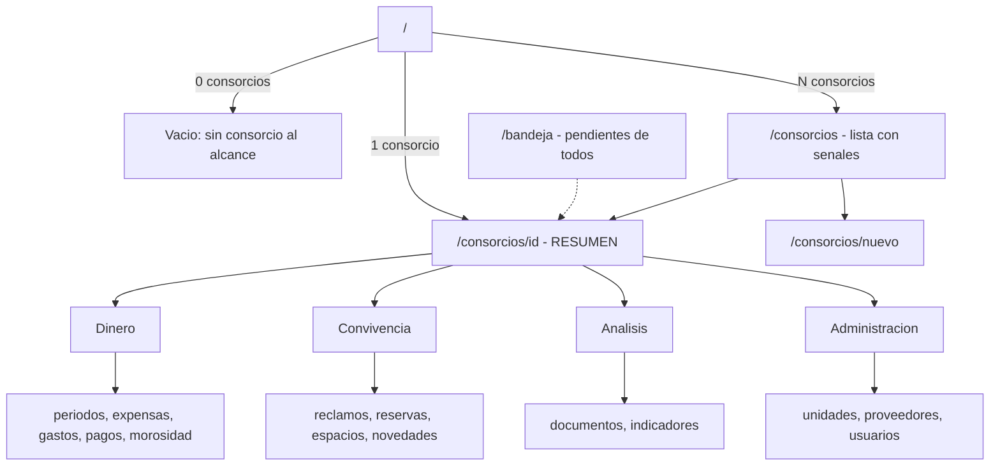

# Navegación por consorcio — diseño

> Estado: aprobado en brainstorming, pendiente de plan de implementación.
> Fecha: 2026-09-13. Autores: Lautaro Marchetti, Franco Ferrero.

## 1. El problema

El panel tiene hoy un lateral plano de trece secciones, idéntico en toda la
aplicación. El consorcio sobre el que se trabaja es un **contexto implícito**:
vive en la galleta `flay_consorcio`, se elige en un `select` de la barra
superior y `src/middleware.ts` lo espeja desde `?consorcio=`.

Medido sobre el código: **doce de las trece secciones ya son por consorcio**.
La única que no lo es es `/consorcios`. El lateral ofrece permanentemente
secciones que no significan nada hasta que hay un consorcio elegido, y la
dirección del navegador no dice en cuál estás parado.

La ficha de consorcio (`/consorcios/[id]`) muestra solo el padrón: cantidad de
unidades, suma de coeficientes y un enlace a unidades. No hay ninguna pantalla
que responda «qué está pasando en este edificio». Lo más cercano es
`/indicadores`, que cruza consorcios y exige rol `administrador`: es el tablero
de la cartera, no el del edificio.

## 2. La decisión

El consorcio pasa a ser la **raíz de la navegación** y vive en la ruta. Todo lo
que depende de un consorcio cuelga de `/consorcios/[id]/`.

Se evaluaron tres caminos:

| Camino | Qué hace | Por qué no |
|---|---|---|
| A. Consorcio en la ruta | `/consorcios/[id]/gastos` | **Elegido** |
| B. Solo agregar el resumen | Lateral plano, `?consorcio=` propagado | No arregla el fondo: la estructura sigue sin decir dónde estás |
| C. Prefijo corto `/c/[id]` | Igual que A, URL más corta | Rompe la relación entre `/consorcios` y sus hijos, segmento sin significado |

Costo medido de A: 34 páginas en el panel, 16 archivos que usan
`conConsorcio`, 71 lugares que arman `?consorcio=`, 49 referencias en pruebas.
Grande pero mecánico, y `conConsorcio` ya es el único punto donde se resuelve
el consorcio: pasa de leer `searchParams` a leer `params`.

**Lo que esta decisión NO toca**: el aislamiento por consorcio (RN-12, RT-04)
sigue en la extensión de Prisma y la autorización sigue en cada caso de uso
contra la base (FR-002). La ruta solo decide qué se dibuja.

## 3. El mapa



### 3.1 Fuera de consorcio

Sin lateral de secciones. La barra lleva marca, `/consorcios`, `/bandeja` y
Salir.

| Ruta | Qué es |
|---|---|
| `/` | Redirige: 0 consorcios → pantalla vacía; 1 → `/consorcios/<id>`; N → `/consorcios` |
| `/consorcios` | Lista de edificios con señales |
| `/consorcios/nuevo` | Alta (queda como está) |
| `/bandeja` | Pendientes de todos los consorcios al alcance |

### 3.2 Dentro de un consorcio

Todas las rutas actuales se mueven bajo `/consorcios/[id]/` conservando su
nombre: `unidades`, `periodos`, `expensas`, `expensas/[detalle]`,
`liquidaciones/[id]`, `gastos` (con `nuevo`, `[id]`, `asistida`,
`asistida/[id]`), `pagos` (con `nuevo`), `morosidad`, `reclamos` (con `[id]`),
`reservas`, `espacios`, `novedades`, `documentos` (con `consultar`, `[id]`),
`indicadores` (con sus cinco hijos), `proveedores`, `usuarios` (con `invitar`).

**`/pendientes` desaparece** como sección del consorcio: se funde en
`/bandeja`, que es global y filtrable por consorcio. Una pantalla menos.

### 3.3 El lateral, agrupado

Doce secciones planas es una lista larga. Se agrupan en cuatro bloques con
encabezado, sin desplegables ni estado que recordar:

| Bloque | Secciones |
|---|---|
| Dinero | Períodos, Expensas, Gastos, Pagos, Morosidad |
| Convivencia | Reclamos, Reservas, Espacios, Novedades |
| Análisis | Documentación, Indicadores |
| Administración | Unidades, Proveedores, Usuarios |

El resumen (`/consorcios/[id]`) no es un ítem del lateral: es el encabezado del
lateral, siempre visible arriba con el nombre del consorcio.

La barra inferior del teléfono (variante C, cinco ítems) se mantiene y apunta a
las cinco de Dinero, ahora con el `[id]` en la ruta.

### 3.4 El selector de la barra

Deja de ser el mecanismo y pasa a ser un atajo: cambiar de consorcio conserva
la sección (`/consorcios/A/gastos` → `/consorcios/B/gastos`). La galleta
`flay_consorcio` queda solo como memoria del último usado, para decidir a dónde
manda `/`. El middleware que espeja `?consorcio=` se borra.

## 4. Las pantallas nuevas

### 4.1 `/consorcios` — la lista

Tarjeta por edificio con nombre, dirección y una fila de señales: último
período, morosidad por ciento, unidades en mora, reclamos abiertos y críticos,
alertas de desvío de gasto.

**No requiere SQL nuevo.** `verPanel`
(`src/aplicacion/indicadores/indicadores.ts:283`) ya devuelve exactamente esos
campos por consorcio; hoy solo lo consume `/indicadores`.

Límite honesto: `verPanel` cubre solo los consorcios donde el usuario es
`administrador` y lanza `RolInsuficiente` si no lo es en ninguno. Para consejo
y consorcista las tarjetas van sin señales. No se inventa un dato que ese rol
no tiene derecho a ver.

El semáforo usa solo umbrales ya documentados: `META_MOROSIDAD` y
`ALERTA_DESVIO`.

### 4.2 `/consorcios/[id]` — el resumen

Caso de uso nuevo `verResumenConsorcio`: un `Promise.all` sobre lecturas que ya
existen. No agrega consultas crudas ni toca el aislamiento.

**KPI** (hero + secundarias en fila, guía de estilos § 3.4):

1. Período abierto, con el próximo vencimiento derivado de
   `Consorcio.diaVencimiento`; si ya hay liquidación emitida, la fecha real de
   `Liquidacion.vencimiento`.
2. Morosidad por ciento (`v_morosidad_consorcio`).
3. Gastos acumulados del período abierto.
4. Reclamos abiertos, con los críticos aparte.

**Avisos, solo si aplican** (RNF-10, nunca ruido):

- Padrón que no cuadra — ya lo calcula `verConsorcio`.
- Período listo para liquidar.
- Avisos pendientes fallidos de este consorcio.

**Tres listas de cinco filas** con enlace «Ver todo»: últimos gastos, últimos
pagos, reclamos sin responder.

Las «últimas cosas» salen de las entidades, **no** de `BitacoraAuditoria`: la
bitácora guarda los `NUMERIC` como número JSON (CLAUDE.md, punto 3 de lo que no
se adivina leyendo el código). Sirve para auditar, no para dibujar dinero.

**Contactos útiles**: administrador y consejo del consorcio, con nombre, correo
y teléfono desde `Habilitacion → Usuario → Persona`; y los proveedores con su
rubro habitual. Va en una tarjeta al pie del resumen.

**Acciones rápidas**: Cargar gasto, Registrar pago, Abrir período, Liquidar.
Cada una respeta la autorización de su caso de uso; el botón no aparece si el
rol no puede.

### 4.3 `/bandeja` — pendientes de todos los consorcios

Reclamos sin responder, períodos sin cerrar y avisos fallidos, de todo el
alcance del usuario, agrupados por consorcio y filtrables.

Es la **segunda consulta que sale de la extensión de aislamiento**, junto con
las vistas materializadas de indicadores (CLAUDE.md, invariante 16). La regla
es explícita y no se negocia:

> El `WHERE consorcio_id IN (...)` se arma desde `misConsorcios(usuarioId)`,
> jamás desde un parámetro del cliente. El filtro por consorcio de la interfaz
> solo **reduce** ese conjunto, nunca lo amplía.

## 5. Cambio de datos

`Proveedor` tiene razón social, CUIT y rubro habitual, pero **ni teléfono ni
correo**. Un proveedor sin teléfono no es un contacto útil, así que la tarjeta
de contactos necesita una migración chica:

```sql
ALTER TABLE proveedor ADD COLUMN telefono TEXT, ADD COLUMN correo TEXT;
```

Ambas nulas: los proveedores ya cargados quedan válidos y la tarjeta los
muestra sin contacto. Se agregan al formulario de alta y edición de proveedor,
opcionales.

Es el único cambio de esquema del rediseño.

## 6. Mecánica de la migración de rutas

1. **`conConsorcio` cambia de fuente.** Pasa de resolver `?consorcio=` contra
   galleta y alcance, a recibir el `id` de `params` y validarlo contra
   `misConsorcios`. Un id no alcanzable devuelve el aviso «no está al alcance»
   que ya existe. Es el único punto donde esto se decide, y sigue siéndolo.
2. **Layout anidado en `consorcios/[id]/layout.tsx`**: resuelve el consorcio
   una vez, dibuja el encabezado y el lateral agrupado. Para que no se resuelva
   dos veces por pedido (layout y página), `misConsorcios` se envuelve en
   `cache()` de React.
3. **`src/middleware.ts` se borra**, con su `matcher`. Ya no hay parámetro que
   espejar.
4. **Los 71 armados de `?consorcio=`** se reemplazan por el prefijo de ruta.
5. **`EncabezadoDeConsorcio`** deja de repetirse página por página: sube al
   layout. El botón Volver apunta a la sección madre dentro del mismo
   consorcio.
6. **Redirecciones permanentes** de las rutas viejas a las nuevas, para no
   romper enlaces guardados: `/gastos` y compañeras redirigen a
   `/consorcios/<último recordado>/gastos`, o a `/consorcios` si no hay galleta
   válida.

## 7. Pruebas

- **Integración**: dos consorcios en paralelo contra `/bandeja` y contra la
  lista con señales, afirmando que ninguno ve filas del otro. Es como se cazó
  RT-04 la vez anterior y es la prueba que más importa de todo el rediseño.
- **Integración**: `verResumenConsorcio` con consorcio sin períodos, sin gastos
  y sin reclamos — que no reviente el caso vacío.
- **Extremo a extremo**: entrar con un solo consorcio saltea la lista; entrar
  con dos la muestra; cambiar de consorcio desde la barra conserva la sección;
  una ruta vieja redirige a la nueva.
- **Accesibilidad**: el lateral agrupado con `axe` A/AA, y los encabezados de
  grupo como estructura real, no como texto suelto.
- **Teléfono 390×844**: la barra inferior con el `[id]` en la ruta, sin scroll
  horizontal.

## 8. Documentación a actualizar

- `docs/guia-estilos.md` § 3.4, bloque «Navegación»: hoy describe el lateral
  plano, la galleta como contexto y el espejo del middleware. Todo eso cambia.
  `EncabezadoDeConsorcio` pasa a describirse como parte del layout.
- `docs/entrega-final/13-prototipo.md`: el mapa de pantallas.
- `docs/entrega-final/14-codificacion.md`: la mecánica de resolución del
  consorcio.
- `docs/guia-estilos-ejemplo.html`: el patrón de navegación.

## 9. Riesgos

| Riesgo | Mitigación |
|---|---|
| `/bandeja` filtra datos entre consorcios (RT-04) | El `IN` se arma desde `misConsorcios`, con prueba de dos consorcios en paralelo |
| La migración de 71 enlaces deja alguno roto | `typecheck` más las rutas tipadas de Next; las redirecciones cubren lo que se escape |
| El resumen se vuelve lento por hacer muchas lecturas | `Promise.all` sobre consultas ya indexadas; si hace falta, medir con `npm run medir:p95 /consorcios/<id>` (RNF-06) |
| Doble resolución del consorcio (layout y página) | `cache()` de React sobre `misConsorcios` |

## 10. Fuera de alcance

- Bandejas globales por sección (un «todos los gastos» de la cartera). Solo
  `/bandeja`.
- Cambiar la autorización o el aislamiento. Nada de esto se toca.
- Rediseño visual. Se reusan los componentes y las clases que ya existen.
