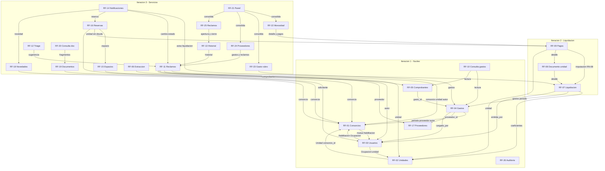

# Análisis de insumos para el plan de construcción

**Etapa 1 de 4 del plan de construcción por etapas — Tarea T1.**
Cubre: inventario decidido vs. abierto sobre los 18 documentos de `docs/`, grafo de
dependencias entre los 26 RF, contraste con § 8.3.1 y huecos que bloquean la iteración 1.
No propone cambios de stack (14.1) ni toca las entregas 1 a 3, que están cerradas.

Fuentes primarias: `docs/entrega-1/04-alternativas-solucion.md` (RF),
`docs/entrega-3/07-analisis-de-datos.md` (entidades, RN-01 a RN-15),
`docs/entrega-3/08-metodologia-desarrollo.md` § 8.3 (iteraciones),
`docs/entrega-3/12-diseno.md` (arquitectura, casos de uso, matriz § 10),
`docs/entrega-final/14-codificacion.md` (stack y puntos abiertos).

---

## 1. Inventario: decidido vs. abierto

Leyenda de la columna «Efecto»: **Bloquea** = impide escribir la primera línea útil de la
iteración 1; **Temprano** = debe resolverse dentro de las primeras semanas aunque no bloquee
el día uno; **Tardío** = puede esperar a su iteración o al cierre; **No bloquea** = académico
o de cierre.

### 1.1 Entregas 1 y 2 (puntos 1 a 6) — completas

| Doc | Decidido | Abierto | Efecto |
|---|---|---|---|
| `00-caratula-resumen.md` | Título, resumen, palabras clave, índice | Tutor, director, fecha de defensa, identificadores | No bloquea |
| `01-analisis-organizacion.md` | Cliente (Grupo Delta), cartera (11 consorcios, 418 unidades), FODA, procesos | Nada | — |
| `02-analisis-problemas.md` | Problema central, árbol causal | Nada | — |
| `03-analisis-objetivos.md` | Objetivo general, OBJ-1 a OBJ-5 con submetas | Nada | — |
| `04-alternativas-solucion.md` | 26 RF, 15 RNF, alternativa A elegida, funciones excluidas (pasarela de pagos, app nativa, contabilidad, sueldos, asambleas, predicción, i18n, conciliación) | Nada funcional | — |
| `05-analisis-factibilidad.md` | Alternativa A con 5 fundamentos; 3 condiciones de verificación (5.5.4): degradación ante terceros, exportación abierta, prueba de concepto de RF-20 | Las 3 condiciones se verifican construyendo | Tardío (puntos 12 y 15) |
| `06-precio-y-forma-de-pago.md` | Modelo SaaS, precios, 4 cuotas contra entregables que calzan 1:1 con las 3 iteraciones (cuota 3 atada a la validación en paralelo de la liquidación) | Nada | — |

### 1.2 Entrega 3 (puntos 7 a 12) — completa

| Doc | Decidido | Abierto | Efecto |
|---|---|---|---|
| `07-analisis-de-datos.md` | Modelo de ~30 entidades, RN-01 a RN-15, índices, vistas `v_*`, volumetría (< 600.000 registros a 5 años) | Nada de diseño. **Colisión de códigos**: el prefijo `RN-` nombra a la vez las 15 reglas de negocio (RN-01 a RN-15) y los 6 riesgos de negocio del punto 11 (RN-01 a RN-06). Como ambas series ya están publicadas en entregas cerradas, el plan debe adoptar una convención de cita inequívoca (p. ej. «regla RN-07 (§ 7.2)» vs. «riesgo RN-01 (§ 11.2)») | Temprano (convención, etapa 2 del plan) |
| `08-metodologia-desarrollo.md` | 3 iteraciones con asignación de RF, definición de terminado (8 condiciones), GC (rama por RF, revisión cruzada, semver), TDD obligatorio en liquidación/prorrateo/intereses/imputación, PoC con criterios 80 % / 85 % | Nada metodológico. **El cronograma no tiene etapa de andamiaje**: los cimientos viven dentro de la iteración 1 como paquete 3.1 (34 h) | Temprano (detallar 3.1, ver § 4) |
| `09-tamano-del-sistema.md` | 481 PFA comprometidos, 770 h, reserva de 214 h, 23 funcionalidades **diferidas** a fase post-académica (§ 9.11), política de recortes 10.8 | Nada por estimar | Temprano (las 23 diferidas recortan ABM: altas/bajas de rubro, bajas de consorcio/unidad/usuario/proveedor/documento, anular liquidación/pago, etc. — operarlas será por soporte; el plan debe decirlo) |
| `10-diagrama-gantt.md` | WBS con horas por paquete, camino crítico, hitos, asignación por integrante, pares solo en 3.2 y 4.2 | Fechas por verificar al arrancar: demo iteración 1 (04/09/2026), PoC 5.1 (semana del 24/08/2026), prototipo de interfaz 2.5 (24/07/2026, § 13.2 vacío) | Temprano (verificar estado real en el arranque) |
| `11-analisis-de-riesgos.md` | Registro RT/RG/RN, respuestas, reservas (40 h a RT-01, 80 h a RG-01), detonantes, orden de recorte | Ejecución de las PoC y medición de detonantes | Tardío |
| `12-diseno.md` | Capas y regla de dependencia, 15 CU, flujo CU-03 con 6 alternativas, módulo IA (4 interfaces × 3 implementaciones), 6 indicadores con vistas, matriz RF↔entidad↔CU↔iteración, seguridad de diseño | Nada de diseño | — |

### 1.3 Última entrega (puntos 13 a 18) — esqueletos

| Doc | Decidido | Abierto | Efecto |
|---|---|---|---|
| `13-prototipo.md` | Naturaleza evolutiva, guion de demostración (8 pasos), datos ficticios obligatorios | 13.2 validación con cliente, 13.3 estado por módulo, 13.4 datos de demostración, 13.5 accesos, 13.7 limitaciones | Temprano (13.4 conviene definirlo al inicio: sirve como fixtures de pruebas) |
| `14-codificacion.md` | 14.1 stack completo; criterios 14.3 (6, no negociables) | **14.1: versiones «A fijar»** en las 10 filas de la tabla | **Bloquea** (fijar al abrir 3.1) |
| | | 14.2 formalmente abierta («a completar con la herramienta finalmente utilizada»), aunque la tabla ya anticipa Recharts | Temprano (ratificar o rectificar al iniciar 5.5) |
| | | 14.3 proveedor de IA, diferido a iteración 3 a propósito | Tardío (no bloquea iteraciones 1–2 por las interfaces del § 12.8) |
| | | 14.4 estándares, «a completar al cerrar la iteración 1» | **Temprano**: cerrarlos al final llega tarde; el mínimo (nomenclatura, carpetas por capa, dinero, errores, registro) debe existir antes del primer RF |
| | | 14.5 métricas, al cierre | Tardío |
| `15-pruebas.md` | Estrategia por nivel y 40+ casos con criterios (PL-01 a PL-10, PA-01 a PA-07, PI-01 a PI-09, PR-01 a PR-09, PN-01 a PN-06) | Resultados, defectos, auditoría externa, informe | Temprano (infraestructura de pruebas dentro de 3.1) |
| `16-manual-usuario.md` | Estructura por rol, criterio editorial | Contenido (paquete 6.3) | No bloquea |
| `17-cronograma-capacitacion.md` | Objetivos, sesiones, acompañamiento con 2 liquidaciones reales | Fechas y evaluación | No bloquea |
| `18-seguridad.md` | Activos, 12 amenazas, controles con referencia, auditoría externa como puerta de producción | «A definir»: gestión de secretos (18.7), revisión de dependencias (18.7), procedimiento de supresión (18.4). Resto «A verificar» | **Bloquea** (secretos) / Temprano (dependencias) / Tardío (supresión, solo producción) |

### 1.4 Otras decisiones pendientes que bloquean la construcción

Más allá de 14.3/14.4/14.5, la búsqueda sistemática deja estos pendientes con efecto
**Bloquea** o **Temprano** (el detalle operativo va en § 4):

1. Plataforma concreta de despliegue, región, proveedor de base administrada, de correo y de
   objetos (el punto 14 fija categorías, no marcas; 5.5.4 exige región próxima y cláusulas).
2. Versiones de las 10 filas de la tabla 14.1.
3. Estándares mínimos 14.4 antes del primer RF.
4. Gestión de secretos y entornos (18.7).
5. Propiedad de la entidad `Periodo` entre iteraciones (§ 3, hallazgo 1).
6. Lista semilla de `RubroGasto` (su alta/modificación quedó diferida en § 9.11, pero RF-04,
   RF-11 y RF-12 la necesitan cargada).
7. Datos de partida: 3 liquidaciones reales para los casos PL (RT-01 exige obtenerlas «antes
   de escribir el código» del motor) y juego ficticio 13.4.
8. Estado real de los hitos con fecha ya pasada (prototipo 2.5, PoC 5.1, demo iteración 1).

---

## 2. Grafo de dependencias entre los 26 RF

Regla de lectura: «A depende de B» significa que A necesita una entidad, una validación o un
servicio que B crea. El motivo cita la FK o la regla concreta del punto 7. «Semilla
RubroGasto» = lista precargada dentro del alcance de RF-04 (el alta/modificación de rubros
quedó diferida en § 9.11, ítems 9–10).

| RF | Depende de | Motivo |
|---|---|---|
| RF-01 Consorcios | RF-03 (parcial, mutua) | `Habilitacion` vincula usuario↔consorcio (RN-12); sin usuarios no hay quien administre el consorcio. Construir juntos en iteración 1 |
| RF-02 Unidades y coeficientes | RF-01 | `Unidad.consorcio_id` FK; RN-01 valida que los coeficientes sumen 100,000000 % por consorcio |
| RF-03 Usuarios, roles, personas | RF-01, RF-02 (parcial) | `Habilitacion` FK a consorcio; `Ocupacion` FK a unidad y persona (RN-09). `Persona`/`Usuario` son raíces |
| RF-04 Gastos, rubros | RF-01, RF-17, RF-03, semilla RubroGasto | `Gasto.periodo_id` NN (RN-03), `proveedor_id` FK, `cargado_por` FK; `rubro_id` NN. Opcional: RF-11 si el gasto cita `reclamo_id` |
| RF-05 Comprobantes | RF-04 | `Comprobante.gasto_id` FK; más almacenamiento de objetos |
| RF-06 Extracción automática | RF-05 | `ExtraccionComprobante.comprobante_id` FK; RN-14 (no crea el gasto) |
| RF-07 Liquidación | RF-02, RF-04, RF-03, entidad `Periodo` | Coeficientes vigentes RN-01/RN-02, gastos del período RN-03/RN-04, `emitida_por` y habilitación de administrador; `Periodo`, `Liquidacion`, `DetalleLiquidacion`. Ver § 3 hallazgo 1 |
| RF-08 Documento por unidad | RF-07 | Lee `DetalleLiquidacion`; generación diferida por RNF-07 |
| RF-09 Pagos e imputación | RF-07, RF-08, RF-02 | `PagoImputacion` FK a `DetalleLiquidacion` (RN-08); `Pago.unidad_id` FK; intereses sobre saldos de detalles |
| RF-10 Consulta de gastos | RF-04, RF-05, RF-03 | Solo lectura sobre gastos/comprobantes con filtro por consorcio (RN-12) |
| RF-11 Reclamos | RF-01, RF-02, RF-03, semilla RubroGasto, RF-17 | `consorcio_id` NN, `unidad_id` opcional, `creado_por` NN, `rubro_id`, `proveedor_id`; RN-11 |
| RF-12 Triage automático | RF-11 | `SugerenciaReclamo.reclamo_id` FK; sugerencia, no decisión |
| RF-13 Historial de reclamo | RF-11 | `ReclamoHistorial.reclamo_id` FK |
| RF-14 Notificaciones | RF-07, RF-08, RF-11, RF-13, RF-16, RF-18 | Consume eventos de liquidación, reclamos, reservas y novedades; infra de correo y tareas. Ver § 3 hallazgo 2 |
| RF-15 Espacios comunes | RF-01 | `EspacioComun.consorcio_id` FK |
| RF-16 Reservas | RF-15, RF-02, RF-03, RF-09 | `espacio_id`, `unidad_id`, `solicitada_por` FK; RN-10 (exclusión); precondición CU-09: sin deuda vencida |
| RF-17 Proveedores | — (raíz) | Sin FK obligatorias (`rubro_principal_id` opcional a la semilla) |
| RF-18 Novedades | RF-01, RF-03 | `consorcio_id`, `publicada_por` FK |
| RF-19 Documentación | RF-01, RF-03 | `consorcio_id` FK; más almacenamiento; `visible_consorcistas` |
| RF-20 Consulta documental | RF-19, RF-01, RF-03 | `FragmentoDocumento.documento_id` FK; filtro por consorcio y visibilidad antes de responder; pgvector |
| RF-21 Panel consolidado | RF-07, RF-09, RF-11, RF-04 | Agrega I-1 a I-4 más estado de liquidación del mes |
| RF-22 Morosidad | RF-07, RF-08, RF-09 | `v_morosidad_consorcio` sobre `DetalleLiquidacion` y `PagoImputacion`; RN-13 |
| RF-23 Gasto por rubro | RF-04 | `v_gasto_rubro_periodo` con promedio móvil de 12 períodos |
| RF-24 Proveedores | RF-04, RF-17, RF-11 | `v_desempeno_proveedor`: costos, contrataciones, tiempos de resolución |
| RF-25 Reclamos (tiempos) | RF-11, RF-13 | `v_resolucion_reclamos`: apertura vs. resolución por rubro y urgencia |
| RF-26 Auditoría | Transversal (todas las tablas económicas) | Disparadores RN-15/RNF-12; la mecánica se construye en iteración 1 y cada iteración agrega sus tablas |

Cadenas críticas del grafo (caminos más largos, mandan el orden):

- `RF-17 → RF-04 → RF-07 → RF-08 → RF-09 → RF-16` (6 eslabones, cruza las 3 iteraciones).
- `RF-01 → RF-02 → RF-07 → RF-09 → RF-22 → RF-21` (núcleo → liquidación → indicador → panel).
- `RF-05 → RF-06`, `RF-19 → RF-20`, `RF-11 → RF-12 / RF-13 → RF-25` (ramas asistidas y de reclamos).
- RF-26 no tiene predecesores funcionales pero cada iteración debe extender sus disparadores.

---

## 3. Contraste con la sección 8.3.1

Asignación de § 8.3.1: iteración 1 = RF-01 a RF-05, RF-10, RF-17, RF-26; iteración 2 =
RF-07, RF-08, RF-09; iteración 3 = RF-11 a RF-16, RF-18 a RF-25, RF-06, RF-12, RF-20.
Cobertura verificada: 8 + 3 + 15 = 26/26, ningún RF sin iteración.

### Hallazgo 1 — RF-04 (iteración 1) exige `Periodo`, que se construye en iteración 2

- **RF afectado**: RF-04, asignado a iteración 1.
- **Dependencia**: entidad `Periodo` (`Gasto.periodo_id` NN, § 7.4; RN-03 «un gasto pertenece a
  un único período»; CU-02: precondición «el período está abierto»).
- **Ubicación de la dependencia**: la matriz del punto 12 (§ 10) asigna `Periodo` a RF-07, y el
  paquete 4.1 «Períodos y control de estado» (22 h, RN-03/RN-06) está en iteración 2. El alcance
  de iteración 1 en § 8.3.1 no menciona períodos.
- **Efecto**: tal como está escrito el plan, la carga de gastos de iteración 1 no tiene período
  abierto contra el cual imputarse.
- **Resolución propuesta**: adelantar a iteración 1 el mínimo de períodos (apertura y listado,
  EI n.º 29) y dejar en iteración 2 la máquina de estados (cierre, liquidación, anular). Es un
  movimiento chico (parte de las 22 h de 4.1) que desbloquea RF-04 sin anticipar la liquidación.

### Hallazgo 2 — RF-14 (iteración 3) recibe el aviso de liquidación de iteración 2

- **RF afectado**: RF-14, asignado a iteración 3 (paquete 5.4).
- **Dependencia**: CU-03 paso 10 «se encolan los documentos y los avisos por correo» y § 12.7
  («Liquidación publicada» → RF-14).
- **Efecto**: la liquidación de iteración 2 no puede emitir avisos porque la tabla
  `Notificacion` y el despachador aún no existen. No invalida el criterio de aceptación de la
  iteración 2 (coincidencia al centavo con la planilla), pero deja un cabo suelto entre
  iteraciones.
- **Resolución propuesta**: crear en iteración 2 la tabla `Notificacion` y el encolado (outbox),
  y dejar para iteración 3 el despachador, los avisos de reclamos/reservas/novedades y la
  interfaz. Así ningún aviso de liquidación se pierde aunque el correo se conecte después.

### Observación 3 — Redacción redundante en la fila de iteración 3 (sin efecto)

La fila dice «RF-11 a RF-16, RF-18 a RF-25, RF-06, RF-12, RF-20»: RF-12 y RF-20 ya están
incluidos en los rangos. Es énfasis en las funciones asistidas, no un error de cobertura.

### Verificación del resto (conforme al grafo, sin cambios)

- RF-10 tras RF-04/RF-05 dentro de iteración 1: respeta.
- RF-17 raíz en iteración 1, antes de sus consumidores RF-04 (iteración 1) y RF-11/RF-24
  (iteración 3): respeta.
- RF-07 tras RF-02/RF-04, RF-08 tras RF-07, RF-09 tras RF-07/RF-08; el Gantt ordena
  4.2 → 4.3 → 4.4: respeta.
- RF-16 (iteración 3) tras RF-09 (iteración 2) para la precondición de deuda: respeta.
- RF-11 tras semilla de rubros y RF-17 (iteración 1): respeta. RF-12/RF-13 tras RF-11 dentro de
  iteración 3, y el Gantt ordena 5.2 antes de 5.7: respeta.
- RF-06 tras RF-05 cruzando de iteración 1 a 3: respeta; exige que la pantalla de confirmación
  de iteración 1 deje la costura para enchufar la extracción en 5.6.
- RF-20 tras RF-19 dentro de iteración 3 (5.4 antes de 5.8): respeta.
- RF-22 a RF-25 tras sus fuentes (RF-04 iteración 1, RF-09 iteración 2, RF-11/RF-13 iteración 3)
  y el Gantt ubica el panel 5.5 después de reclamos 5.2: respeta.
- RF-26 transversal desde iteración 1 (paquete 3.7): respeta, con la obligación de extender
  disparadores en cada iteración posterior.
- Pagos del punto 6 (cuotas contra entregables 1/2/3) calzan con las iteraciones 1/2/3: respeta.

---

## 4. Huecos que bloquean la construcción

El cronograma académico no tiene etapa de andamiaje: los cimientos son el paquete 3.1 (34 h)
dentro de iteración 1. Nada de lo siguiente puede descubrirse a mitad de iteración 1; todo va
antes de la primera línea de código de RF o dentro de 3.1 como trabajo explícito.

| # | Hueco | Por qué bloquea | Resolución mínima |
|---|---|---|---|
| H-01 | Plataforma, región, base administrada, correo y objetos sin proveedor concreto | 3.1 no puede crear proyecto, CI ni entornos sin saber dónde despliega; 5.5.4 exige región próxima y cláusulas | Elegir y registrar las 5 piezas con región y capa antes de 3.1 |
| H-02 | Versiones «A fijar» en las 10 filas de 14.1 | Sin versiones fijadas no hay reproducibilidad ni cierre de inventario de licencias (5.3.4) | Fijarlas al abrir 3.1 |
| H-03 | 14.4 previsto «al cerrar la iteración 1» | Los estándares escritos al final no gobiernan el código ya escrito | Borrador mínimo antes del primer RF: nomenclatura, carpetas por capa, dinero (Decimal/cadena, Constitución II), errores RNF-10, registro |
| H-04 | Secretos «A definir» (18.7) | Sin política de secretos el primer commit ya puede filtrarlos | Variables por ambiente, ningún secreto en el repo, antes del primer commit de código |
| H-05 | Propiedad de `Periodo` (hallazgo 1) | RF-04 queda sin período imputable | Decidir el corte (propuesta en § 3) y mover la apertura a iteración 1 |
| H-06 | Correo necesario ya en iteración 1 | El alta de usuario e invitación (EI n.º 13, paquete 3.2) envía correo, pero el proveedor de correo parecía materia de RF-14/iteración 3 | Contratar/configurar el correo en iteración 1 aunque el despachador general llegue en iteración 3 |
| H-07 | Semilla de `RubroGasto` | Alta/modificación de rubros diferida (§ 9.11), pero RF-04, RF-11 y RF-12 necesitan rubros existentes | Lista semilla acordada con el cliente como entregable de datos de iteración 1 |
| H-08 | Bootstrap de acceso | Ningún documento dice quién crea al primer administrador ni cómo se otorga la primera `Habilitacion` (RN-12 lo exige todo, incluso para empezar) | Semilla de arranque + flujo de invitación, dentro de 3.2 |
| H-09 | Datos de partida | RT-01 exige 3 liquidaciones reales «antes de escribir el código»; 13.4 exige juego ficticio; 13.2/PoC tienen fechas ya pasadas por verificar | Pedir las 3 liquidaciones y definir el juego ficticio en el arranque; verificar estado de 2.5, 5.1 y demo iteración 1 |
| H-10 | Infraestructura de pruebas y revisión de dependencias (15.1, 18.7) | TDD obligatorio y CI en verde desde el primer RF; dependencias con vulnerabilidades bloquean producción | Vitest + Playwright + ESLint operativos en 3.1; primera revisión de dependencias en iteración 1 |

Nota sobre H-09: las fechas del punto 10 (prototipo 24/07, PoC 24/08, demo iteración 1
04/09) son anteriores o inmediatas a este análisis; la etapa 2 del plan debe abrir con la
verificación de qué hitos están realmente cumplidos, porque varios huecos se dan por
cerrados solo si esos hitos lo están.
