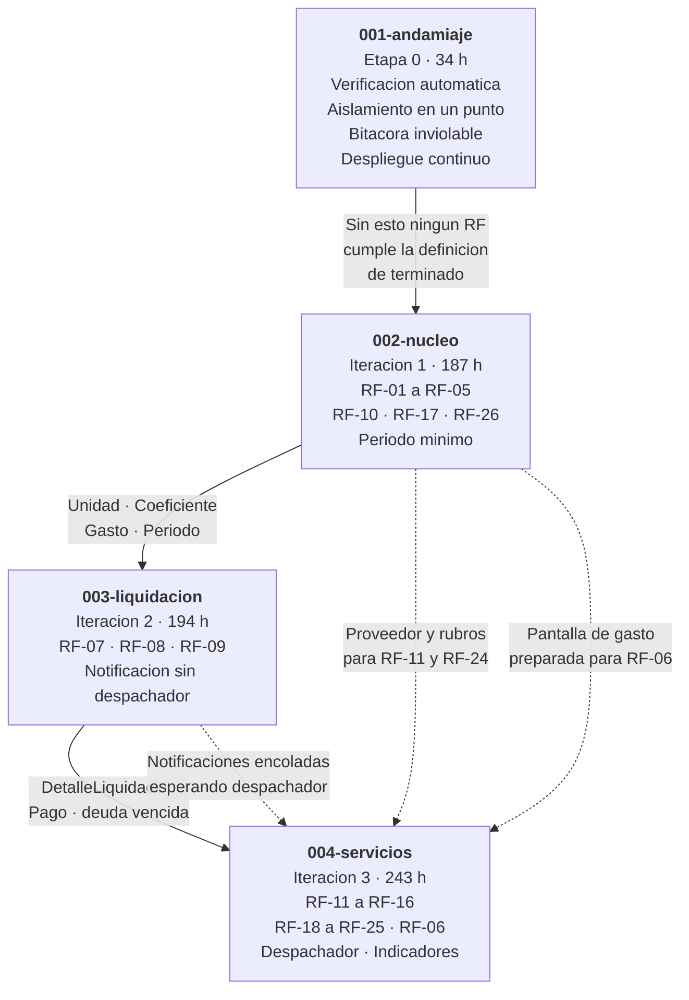

# Plan de construcción por etapas

**Etapa 2 de 4 del plan de construcción — Tarea T2.**
Ata las cuatro etapas de construcción de Flay: orden, dependencias, qué se entrega al cierre de cada
una y cómo se verifica. Se apoya en el grafo de dependencias y los huecos de
[`analisis-insumos.md`](analisis-insumos.md), y se materializa en cuatro especificaciones:

| Etapa | Especificación | Alcance | Duración | Horas |
|---|---|---|---|---:|
| 0 | [`001-andamiaje`](../001-andamiaje/spec.md) | Cimientos ejecutables. Ningún `RF-nn` funcional | — | 34 |
| 1 | [`002-nucleo`](../002-nucleo/spec.md) | `RF-01` a `RF-05`, `RF-10`, `RF-17`, `RF-26` | 6 semanas | 187 |
| 2 | [`003-liquidacion`](../003-liquidacion/spec.md) | `RF-07`, `RF-08`, `RF-09` | 6 semanas | 194 |
| 3 | [`004-servicios`](../004-servicios/spec.md) | `RF-11` a `RF-16`, `RF-18` a `RF-25`, `RF-06` | 8 semanas | 243 |
| | | **26 de 26 `RF-nn`** | **20 semanas** | **658** |

Este plan **no modifica** el alcance de § 8.3.1 ni el presupuesto del punto 10. Extrae la etapa 0 de
las 221 h de la iteración 1 —donde ya vivía como paquete 3.1— y resuelve los dos hallazgos del
análisis de insumos con movimientos mínimos de alcance entre iteraciones.

---

## 1. Convención de cita de códigos

`docs/` usa el prefijo `RN-` para dos series distintas y ambas están publicadas en entregas
cerradas: las **quince reglas de negocio** de `07-analisis-de-datos.md` § 7.2 (RN-01 a RN-15) y los
**seis riesgos de negocio** de `11-analisis-de-riesgos.md` § 11.2 (RN-01 a RN-06). En todo el plan
de construcción, en las cuatro especificaciones, en las ramas y en los mensajes de confirmación se
escribe:

- **«regla RN-nn (§ 7.2)»** para una regla de negocio.
- **«riesgo RN-nn (§ 11.2)»** para un riesgo de negocio.

Nunca `RN-nn` a secas. Los demás prefijos no colisionan y se usan directos: `RF-nn`, `RNF-nn`,
`RT-nn`, `CU-nn`, `I-n`, `OBJ-n`.

---

## 2. Orden y dependencias entre etapas

*Las flechas llenas son dependencias de bloqueo; las punteadas, costuras dejadas a propósito en una
etapa para que la siguiente enchufe sin rediseñar.*

### 2.1 Por qué este orden y no otro

El orden de las iteraciones 1 a 3 es el de § 8.3.1 y responde a tres criterios ya fijados allí:
dependencia de datos, riesgo decreciente y alineación con el pago contra entregables del punto 6.4.1.
Este plan agrega una sola cosa: **la etapa 0 va primero**.

`analisis-insumos.md` § 4 lo justifica: el cronograma académico no tiene etapa de andamiaje, y diez
huecos (H-01 a H-10) quedan sin dueño porque el paquete 3.1 los contiene sin nombrarlos. Cuatro de
las ocho condiciones de la definición de terminado —verificación en verde, teléfono, despliegue y
auditoría— sólo se pueden cumplir en cada `RF-nn` si existe la maquinaria que las verifica. Sin
etapa 0, cada requerimiento paga ese costo de nuevo o miente sobre estar terminado.

### 2.2 Cadenas críticas que manda el grafo

Las cadenas más largas del grafo de `analisis-insumos.md` § 2 son las que fijan el orden interno de
cada etapa:

- `RF-17 → RF-04 → RF-07 → RF-08 → RF-09 → RF-16` — seis eslabones, cruza las tres iteraciones. Es
  la razón por la que `RF-17` (raíz, sin dependencias) va temprano en la etapa 1 y `RF-16` (reservas)
  va tarde en la etapa 3.
- `RF-01 → RF-02 → RF-07 → RF-09 → RF-22 → RF-21` — del núcleo al panel consolidado.
- `RF-05 → RF-06`, `RF-19 → RF-20`, `RF-11 → RF-12 / RF-13 → RF-25` — las ramas asistidas y de
  reclamos, todas dentro de la etapa 3 salvo `RF-05`.
- `RF-26` no tiene predecesores funcionales, pero **cada etapa debe extender sus disparadores** a
  las tablas económicas que crea. Es la única obligación que se repite en las cuatro.

---

## 3. Cobertura: los 26 requerimientos funcionales

| `RF-nn` | Etapa | `CU-nn` | Depende de | Entidades principales |
|---|---|---|---|---|
| `RF-01` Consorcios | 002 | `CU-01` | `RF-03` (mutua) | `Consorcio` |
| `RF-02` Unidades y coeficientes | 002 | `CU-01` | `RF-01` | `Unidad`, `CoeficienteHistorico` |
| `RF-03` Usuarios, roles, personas | 002 | `CU-01` | `RF-01`, `RF-02` | `Persona`, `Usuario`, `Ocupacion`, `Habilitacion` |
| `RF-04` Gastos y rubros | 002 | `CU-02` | `RF-01`, `RF-17`, `RF-03`, `Periodo` | `Gasto`, `RubroGasto` |
| `RF-05` Comprobantes | 002 | `CU-02` | `RF-04` | `Comprobante` |
| `RF-10` Consulta de gastos | 002 | `CU-05` | `RF-04`, `RF-05` | — (sólo lectura) |
| `RF-17` Proveedores | 002 | `CU-01` | — (raíz) | `Proveedor` |
| `RF-26` Auditoría | 002 (mecánica en 001) | — | transversal | `BitacoraAuditoria` |
| `RF-07` Liquidación | 003 | `CU-03` | `RF-02`, `RF-04`, `RF-03` | `Periodo`, `Liquidacion`, `DetalleLiquidacion` |
| `RF-08` Documento por unidad | 003 | `CU-03`, `CU-06` | `RF-07` | `DetalleLiquidacion` |
| `RF-09` Pagos e imputación | 003 | `CU-04` | `RF-07`, `RF-02` | `Pago`, `PagoImputacion` |
| `RF-11` Reclamos | 004 | `CU-07` | `RF-01`, `RF-02`, `RF-03`, `RF-17` | `Reclamo` |
| `RF-12` Triage asistido | 004 | `CU-14` | `RF-11` | `SugerenciaReclamo` |
| `RF-13` Historial de reclamo | 004 | `CU-07`, `CU-08` | `RF-11` | `ReclamoHistorial` |
| `RF-14` Notificaciones | 004 (cola en 003) | `CU-15` | `RF-07`, `RF-08`, `RF-11`, `RF-13`, `RF-16`, `RF-18` | `Notificacion` |
| `RF-15` Espacios comunes | 004 | `CU-01` | `RF-01` | `EspacioComun` |
| `RF-16` Reservas | 004 | `CU-09` | `RF-15`, `RF-02`, `RF-03`, `RF-09` | `Reserva` |
| `RF-18` Novedades | 004 | `CU-12` | `RF-01`, `RF-03` | `Novedad` |
| `RF-19` Documentación | 004 | `CU-12` | `RF-01`, `RF-03` | `DocumentoConsorcio` |
| `RF-20` Consulta documental | 004 | `CU-10` | `RF-19` | `FragmentoDocumento`, `ConsultaDocumental` |
| `RF-06` Extracción asistida | 004 | `CU-13` | `RF-05` | `ExtraccionComprobante` |
| `RF-21` Panel consolidado | 004 | `CU-11` | `RF-22` a `RF-25` | vistas `v_*` |
| `RF-22` Morosidad | 004 | `CU-11` | `RF-09` | `v_morosidad_consorcio` |
| `RF-23` Gasto por rubro | 004 | `CU-11` | `RF-04` | `v_gasto_rubro_periodo` |
| `RF-24` Proveedores | 004 | `CU-11` | `RF-04`, `RF-17`, `RF-11` | `v_desempeno_proveedor` |
| `RF-25` Reclamos (tiempos) | 004 | `CU-11` | `RF-13` | `v_resolucion_reclamos` |

**8 + 3 + 15 = 26.** Ningún requerimiento sin etapa, ninguno en dos.

---

## 4. Los dos ajustes de alcance entre iteraciones

Ambos vienen de `analisis-insumos.md` § 3 y son el único cambio que este plan introduce sobre
§ 8.3.1. Los dos son movimientos chicos que evitan un cabo suelto entre iteraciones.

### 4.1 `Periodo` se parte entre la etapa 1 y la 2 (hallazgo 1)

`RF-04` está en la iteración 1 y exige `Gasto.periodo_id` obligatorio (regla RN-03 § 7.2), pero la
matriz de § 12.10 asigna `Periodo` a `RF-07` y el paquete 4.1 está en la iteración 2. Sin resolverlo,
la carga de gastos de la iteración 1 no tiene período contra el cual imputarse.

| Etapa | Qué construye de `Periodo` |
|---|---|
| `002-nucleo` | Apertura y listado. Un período por consorcio y mes |
| `003-liquidacion` | Máquina de estados completa: cierre, liquidación y anulación (reglas RN-03 y RN-06 § 7.2) |

Es parte de las 22 h del paquete 4.1 adelantada a la etapa 1. Desbloquea `RF-04` sin anticipar nada
de la liquidación.

### 4.2 `Notificacion` nace en la etapa 2 sin despachador (hallazgo 2)

`CU-03` paso 10 y § 12.7 dicen que la liquidación encola avisos, pero `RF-14` está en la iteración 3.
La liquidación de la etapa 2 no podría emitir avisos porque la tabla no existiría.

| Etapa | Qué construye de `RF-14` |
|---|---|
| `003-liquidacion` | Tabla `Notificacion` y encolado. La emisión deja el aviso pendiente |
| `004-servicios` | Despachador con reintentos, avisos de reclamos, reservas y novedades, e interfaz |

Así ningún aviso de liquidación se pierde aunque el correo se conecte una etapa después. No afecta
el criterio de aceptación de la iteración 2, que es la coincidencia al centavo con la planilla del
cliente.

---

## 5. Contabilidad de horas

El punto 10 compromete **770 h**, de las cuales **658 h** son las tres iteraciones de construcción
(paquetes 3, 4 y 5) y **112 h** son análisis, diseño, pruebas y cierre (paquetes 1, 2, 6 y 7). Este
plan **no agrega horas**:

| Concepto | Horas | Origen |
|---|---:|---|
| Iteración 1 del punto 10 | 221 | Paquete 3 completo |
| — de las cuales, paquete 3.1 «Cimientos» | −34 | Se extrae y pasa a ser `001-andamiaje` |
| **`002-nucleo`** | **187** | Paquetes 3.2 a 3.7 |
| **`001-andamiaje`** | **34** | Paquete 3.1, ahora con especificación propia |
| **`003-liquidacion`** | **194** | Paquete 4 completo, sin cambios |
| **`004-servicios`** | **243** | Paquete 5 completo, sin cambios |
| **Total de construcción** | **658** | Igual al punto 10 |

Reservas disponibles, según el punto 11: **40 h** al riesgo RT-01 (motor de liquidación), a gastar en
`003-liquidacion`; **80 h** al riesgo RG-01, más probablemente consumidas en `004-servicios`, que es
la etapa más larga y de mayor incertidumbre. El 10 % de la capacidad de cada iteración se reserva
para refactorización, conforme a la constitución.

---

## 6. Qué se entrega al cierre de cada etapa

### 6.1 `001-andamiaje`

| Entregable | Verificación |
|---|---|
| Aplicación desplegada en el entorno de demostración, con ruta de salud | `GET /api/salud` responde `200` en menos de 10 min tras integrar (SC-007) |
| Verificación automática que rechaza lo que viola la constitución | Las **3** fixtures negativas fallan: capa cruzada, `number` como dinero, aritmética sobre `Decimal` (SC-003) |
| Pruebas del dominio ejecutables sin base de datos | `npm run test:dominio` en verde con `DATABASE_URL` sin definir (SC-002) — **Principio III** |
| Primera migración versionada, con `pgvector`, `btree_gist` y `pgcrypto` | `db:deploy` sobre base vacía + `db:drift` con código 0 (SC-005) |
| Bitácora de auditoría inviolable | `INSERT`, `UPDATE` y `DELETE` del usuario de aplicación fallan los 3 (SC-006) — RNF-12 |
| Aislamiento por consorcio en un solo punto | Mecanismo y prueba (FR-011); se ejercita con datos desde la etapa 1 |
| Huecos cerrados | H-01 plataforma, H-02 versiones de § 14.1, H-03 estándares de § 14.4, H-04 secretos de § 18.7, H-10 pruebas y dependencias |

### 6.2 `002-nucleo` — entregable 1 del punto 6.4.1

| Entregable | Verificación |
|---|---|
| Consorcios, unidades y coeficientes | Suma exactamente `100.00000000` en los 2 consorcios de § 13.4 (SC-001) — regla RN-01 (§ 7.2) |
| Usuarios, roles y habilitaciones por consorcio | **100 %** de las entidades con `consorcio_id` tienen prueba de cero filas sin habilitación (SC-002); el filtro aparece en **1** solo archivo (SC-003) |
| Gastos, rubros, proveedores y comprobantes | 10.800 gastos cargados; listado de `RF-10` bajo 2 s en p95 (SC-006) — RNF-06 |
| Bitácora enganchada a las 5 tablas económicas | Cero operaciones sin asiento (SC-007) |
| `Periodo` mínimo | Período abierto acepta gastos, liquidado los rechaza (SC-012) |
| Datos de partida | 3 liquidaciones reales del cliente en poder del equipo (SC-013), juego ficticio de § 13.4 construido |
| Huecos cerrados | H-05 propiedad de `Periodo`, H-06 correo, H-07 semilla de rubros, H-08 bootstrap de acceso, H-09 (parte de datos) |
| Demostración al cliente | `CU-01`, `CU-02` y `CU-05` de punta a punta, 1 h, sobre el entorno desplegado (SC-014) |

### 6.3 `003-liquidacion` — entregable 2 del punto 6.4.1

| Entregable | Verificación |
|---|---|
| Motor de prorrateo | Suma de `DetalleLiquidacion` = total de `Liquidacion` con **tolerancia cero** sobre padrones de 1, 12, 96 y 100 unidades (SC-001) — regla RN-07 (§ 7.2) |
| Aritmética exacta | Diferencia mayor a un centavo por unidad **aborta** en el 100 % de los casos (SC-003) — Principio II |
| Independencia del dominio | Motor, intereses e imputación probados con `DATABASE_URL` sin definir (SC-002) — Principio III |
| Validación en paralelo (paquete 4.6) | Las **3** liquidaciones reales coinciden **al centavo en cada importe unitario**, cero discrepancias sin explicación (SC-005) — riesgo RT-01 (§ 11.2) |
| Rendimiento | Consorcio de 100 unidades en menos de 30 s sobre 5 ejecuciones (SC-006) — RNF-07 |
| Documento por unidad | 96 documentos sobre 96 unidades, ni uno menos (SC-007); acceso ajeno devuelve «no encontrado» en el 100 % (SC-008) |
| Pagos e imputación | Imputación por antigüedad, suma de imputaciones = pago con tolerancia cero (SC-009) — regla RN-08 (§ 7.2) |
| Transaccionalidad | Fallo inyectado deja la base exactamente como estaba (SC-010) |
| Cola de notificaciones | Emisión con correo caído igual emite y encola (SC-013) — RNF-14 |

### 6.4 `004-servicios` — entregable 3 del punto 6.4.1 y cierre del proyecto

| Entregable | Verificación |
|---|---|
| Pruebas de concepto y § 14.3 | 30 comprobantes contra el 80 %, 20 preguntas contra el 85 % (SC-001); § 14.3 escrito, **0** puntos de § 14 abiertos (SC-002) |
| Reclamos con historial | 100 % de las transiciones con asiento (SC-003) |
| Reservas | Superposición rechazada **por la base** en el 100 % (SC-005) — regla RN-10 (§ 7.2) |
| Despachador de notificaciones | 100 % de los avisos encolados en la etapa 2 se despachan; **cero perdidos** (SC-007) |
| Panel de indicadores `I-1` a `I-6` | Los 6 coinciden con el cálculo manual (SC-009); panel bajo 2 s en p95 sobre el volumen a 5 años (SC-010) — **requisito obligatorio de la cátedra** |
| Funciones asistidas | Cada una de las **4** interfaces con **exactamente 3** implementaciones (SC-012); degradación sin bloquear (SC-013) — RNF-14, RNF-15 |
| Consulta documental | 100 % de respuestas con cita (SC-014); 10 de 10 preguntas sin respuesta contestadas «no encontrado» (SC-015) — Principio IV |
| Confirmación humana | **0** filas de `Gasto` originadas directamente por una extracción (SC-017) — regla RN-14 (§ 7.2) |
| Condiciones de § 5.5.4 | Las 3 verificadas y registradas (SC-018) |
| Cierre documental | §§ 13.3, 13.5, 13.7, 14.5, 15, 16, 17 y 18 completos (FR-034, FR-035) |

---

## 7. Cómo se verifica cada etapa

### 7.1 La puerta es única

Toda etapa se verifica con el mismo comando que `001-andamiaje` construye: `npm run verificar`, y su
equivalente en el flujo automático del repositorio. Formato, análisis estático, tipos, pruebas del
dominio sin base de datos, migraciones, integración, compilación y extremo a extremo, en ese orden.
Lo que no necesita base de datos corre primero, para que el defecto más probable falle en el primer
minuto.

### 7.2 Las ocho condiciones se cierran etapa por etapa

Cada especificación tiene una tabla *«Cierre contra la definición de terminado (§ 8.3.4)»* que dice,
condición por condición, cómo la satisface. Las cuatro que se olvidan más seguido pasan a estar
garantizadas por construcción desde la etapa 0:

| Condición | Garantizada por |
|---|---|
| 2 · Verificación automática en verde | El flujo de `001-andamiaje`, obligatorio para integrar |
| 3 · Autorización por rol y consorcio | El aislamiento en un solo punto (`001` FR-011) más una prueba por entidad (`002` SC-002) |
| 4 · Opera en teléfono (RNF-01) | El proyecto de Playwright a 390 px, existente desde `001` |
| 6 · Desplegado en demostración | El despliegue automático desde la rama principal (`001` FR-019) |
| 7 · Auditoría (regla RN-15 § 7.2) | El disparador y los permisos revocados de `001` FR-010, más el enganche de tablas en cada etapa |

La condición 3 es la que la constitución señala como no negociable: se verifica en **cada**
requerimiento, no en una revisión final.

### 7.3 Los tres principios que una etapa mal planificada violaría

| Principio | Señal de violación | Dónde se verifica |
|---|---|---|
| I · Aislamiento por consorcio | El filtro aparece en más de un archivo | `002` SC-003 |
| II · Exactitud del dinero | Un importe en punto flotante en cualquier capa | `002` SC-009, `003` SC-001 y SC-003 |
| III · El dominio no conoce la infraestructura | El motor de liquidación necesita base de datos para probarse | `001` SC-002, `003` SC-002 |
| IV · La asistencia no decide | Un `Gasto` creado sin confirmación humana | `004` SC-017 |
| V · Auditoría inviolable | Una operación económica sin asiento | `002` SC-007, `003` SC-012 |

**Ninguna de las cuatro etapas viola el Principio III.** La liquidación se puede probar sin base de
datos en `003-liquidacion` porque `001-andamiaje` entrega el proyecto de pruebas del dominio sin
`DATABASE_URL`, y porque `002-nucleo` deja el cálculo de coeficientes en el dominio. Si en algún
momento el motor necesitara base de datos para ejercitarse, la etapa está mal planificada y hay que
volver aquí, no seguir.

---

## 8. Riesgos que este plan atiende y cómo

| Riesgo | Etapa | Respuesta del plan |
|---|---|---|
| RT-01 · Error en el cálculo de liquidación | 003 | Pruebas primero obligatorias, programación en pares en el paquete 4.2, validación en paralelo contra 3 liquidaciones reales, reserva de 40 h. Las liquidaciones se piden en la etapa 1, no en la 2 |
| RT-04 · Fuga entre consorcios | 001, 002 | Filtro en un solo punto, con prueba por entidad. El grep que devuelva el filtro fuera de ese archivo es el defecto |
| RT-05 · Documentos de 96 unidades fuera de presupuesto | 003 | Generación diferida por diseño (decisión 5 de § 12.1.3); si no cierra, se degrada a lotes, nunca a sincrónico |
| RT-02, RT-03 · Funciones asistidas por debajo del umbral | 004 | Pruebas de concepto **antes** de construir, con umbral numérico. Si no alcanza, se reduce o posterga |
| Riesgo RN-01 (§ 11.2) · La capacidad liberada no se materializa | 004 | Indicador `I-5` contra la línea de base de 38 h mensuales del punto 2.7 |
| Compresión de plazo | 004 | Orden de recorte ya tomado: se recortan los paquetes 5.6 a 5.8 (59 h), **nunca** el panel de indicadores (52 h), que es requisito obligatorio de la cátedra |

---

## 9. Lo que este plan deja abierto a propósito

- **Las cinco elecciones de plataforma** de `001-andamiaje` FR-001 son una propuesta y requieren
  ratificación del equipo antes de contratar. No reabren § 14.1, que fija lenguaje, motor, mapeador y
  bibliotecas, y no fija proveedor de plataforma.
- **§ 14.3, proveedor de servicios de procesamiento automático**, se decide en `004-servicios` con el
  resultado de las pruebas de concepto en la mano. El diferimiento es deliberado: las cuatro
  interfaces del dominio (§ 12.8) permiten construir las etapas 0 a 2 sin saber quién será.
- **§ 14.2, herramienta de graficación**, se ratifica o rectifica al abrir el paquete 5.5. La tabla de
  § 14.1 ya anticipa Recharts.
- **Las 23 funcionalidades diferidas** de § 9.11 recortan buena parte de los ABM —altas y bajas de
  rubro, bajas de consorcio, unidad, usuario, proveedor y documento, anulación de pago—. Se operan por
  soporte y así se le comunica al cliente en cada demostración. La interfaz no ofrece lo que no está
  construido.
- **Las fechas del punto 10 con hito ya cumplido** —prototipo 2.5 del 24/07/2026, prueba de concepto
  5.1 de la semana del 24/08/2026 y demo de iteración 1 del 04/09/2026— se verifican al abrir
  `001-andamiaje` (FR-027). Varios huecos se dan por cerrados sólo si esos hitos lo están.
