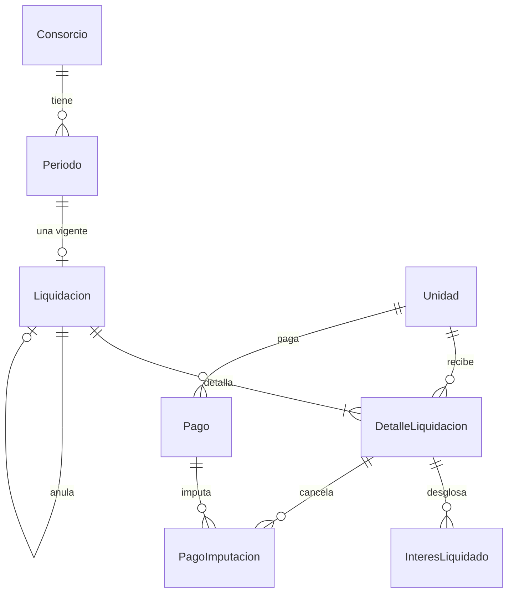

# Fase 1 — Modelo de datos: `003-liquidacion`

Materializa el punto 7 para las entidades económicas de la etapa. Todo importe y toda tasa en
`NUMERIC`; **ningún** tipo de punto flotante. Las cinco tablas económicas quedan enganchadas a
`fn_auditar()` (regla RN-15 § 7.2).

Nomenclatura: los campos van en español y en `snake_case` en la base, como en `002`.

## Lo que cambia en lo ya construido

### `Consorcio` — **económica**

| Campo nuevo | Tipo | Reglas |
|---|---|---|
| `dia_vencimiento` | `SMALLINT` | 1 a 28. La liquidación de un período vence ese día del mes siguiente (`FR-002b`) |
| `tasa_mora_mensual` | `NUMERIC(6,4)` | Tasa mensual vigente, la fija el administrador. `0` es válido: un consorcio puede no cobrar mora |

El tope de 28 no es un capricho: un vencimiento el 30 no existe en febrero, y resolver eso en cada
cálculo es la clase de excepción que aparece una vez al año y rompe en producción.

### `Periodo` — **económica**

Sin campos nuevos. Lo que cambia es que esta etapa **usa** los estados que `002` declaró y no
produjo: `cerrado`, `liquidado`, `anulado`. El contrato de `src/dominio/periodos/estado.ts` **no se
toca** (M-04): `liquidado` sigue sin transiciones de salida (`FR-001`, `FR-003b`).

## Entidades nuevas

### `Liquidacion` — **económica**

| Campo | Tipo | Reglas |
|---|---|---|
| `id` | UUID | Clave |
| `consorcio_id` | UUID | Obligatorio. Alcanzado por el aislamiento |
| `periodo_id` | UUID | Obligatorio |
| `total_ordinario` | `NUMERIC(14,2)` | |
| `total_extraordinario` | `NUMERIC(14,2)` | |
| `total_general` | `NUMERIC(14,2)` | |
| `vencimiento` | `DATE` | Copiado al emitir desde `Consorcio.dia_vencimiento` (`FR-002b`) |
| `emitida_en` | timestamptz | |
| `emitida_por` | UUID | Usuario que la ejecutó |
| `estado` | enum | `vigente`, `anulada` |
| `anula_a_id` | UUID nulo | La liquidación que reemplaza (regla RN-06 § 7.2) |

**Índice único parcial**: `UNIQUE (periodo_id) WHERE estado = 'vigente'`. Es el candado de la
emisión doble, y lo impone la base para que dos transacciones en paralelo no puedan ganar las dos
(SC-011, M-07, research R-03). No es `UNIQUE (periodo_id)` a secas: eso impediría reemitir después
de anular.

### `DetalleLiquidacion` — **económica**

| Campo | Tipo | Reglas |
|---|---|---|
| `id` | UUID | Clave |
| `liquidacion_id` | UUID | Obligatorio |
| `unidad_id` | UUID | Obligatorio |
| `coeficiente_aplicado` | `NUMERIC(11,8)` | Copiado al emitir (regla RN-02 § 7.2, `FR-012`) |
| `importe_ordinario` | `NUMERIC(14,2)` | A cargo del ocupante (regla RN-05 § 7.2) |
| `importe_extraordinario` | `NUMERIC(14,2)` | A cargo del propietario |
| `deuda_anterior` | `NUMERIC(14,2)` | Saldo impago al emitir |
| `interes_mora` | `NUMERIC(14,2)` | Suma de las filas de `InteresLiquidado` |
| `saldo_a_favor_aplicado` | `NUMERIC(14,2)` | Lo que se descontó del crédito de la unidad (`FR-026b`) |
| `ajuste_redondeo` | `NUMERIC(14,2)` | Campo propio, no mezclado con el importe (regla RN-07 § 7.2) |
| `total_unidad` | `NUMERIC(14,2)` | |
| `clave_documento` | texto nulo | Objeto del documento; nulo mientras el trabajo diferido no corrió |

**Restricción**: `UNIQUE (liquidacion_id, unidad_id)`.

No lleva `consorcio_id`: cuelga de `Liquidacion`, que sí lo lleva, igual que `CoeficienteHistorico`
cuelga de `Unidad`.

### `InteresLiquidado` — **económica**

| Campo | Tipo | Reglas |
|---|---|---|
| `id` | UUID | Clave |
| `detalle_id` | UUID | El detalle que lo cobra |
| `liquidacion_origen_id` | UUID | La liquidación impaga que lo devenga |
| `capital` | `NUMERIC(14,2)` | Lo que estaba impago de esa liquidación |
| `tasa_mensual` | `NUMERIC(6,4)` | La vigente al emitir, copiada |
| `meses` | `SMALLINT` | Meses vencidos completos (`FR-024`) |
| `importe` | `NUMERIC(14,2)` | `capital × tasa × meses` |

Existe para que el interés se pueda explicar peso por peso meses después, cuando los pagos
posteriores ya cambiaron qué está impago (research R-07, RNF-10). Sin ella, `interes_mora` es un
número que nadie puede rehacer.

### `Pago` — **económica**

| Campo | Tipo | Reglas |
|---|---|---|
| `id` | UUID | Clave |
| `consorcio_id` | UUID | Obligatorio. Alcanzado por el aislamiento |
| `unidad_id` | UUID | Obligatorio |
| `fecha_pago` | `DATE` | Fecha efectiva, no la de carga |
| `importe` | `NUMERIC(14,2)` | |
| `medio` | enum | `transferencia`, `efectivo`, `deposito`, `debito` (punto 7) |
| `referencia` | texto nulo | Número de operación |
| `saldo_a_favor` | `NUMERIC(14,2)` | Excedente sin imputar (`FR-026`, M-05) |
| `registrado_por` | UUID | |

### `PagoImputacion` — **económica**

| Campo | Tipo | Reglas |
|---|---|---|
| `id` | UUID | Clave |
| `pago_id` | UUID | Obligatorio |
| `detalle_liquidacion_id` | UUID | Obligatorio |
| `importe_imputado` | `NUMERIC(14,2)` | |
| `revertida_en` | timestamptz nulo | Se llena al anular la liquidación (`FR-027`) |

La reversión **no borra la fila**: una imputación borrada es plata que se movió sin rastro. Se marca,
y el pago vuelve a tener saldo disponible.

### `Notificacion` — no económica

Los campos del punto 7, sin cambios: destinatario, tipo, título, cuerpo, entidad referida,
`estado_envio` (`pendiente`, `enviada`, `fallida`) y marcas de envío y lectura. Esta etapa **sólo
crea filas en `pendiente`**; el despachador es de `004-servicios` (`FR-015`, research R-08).

## Diagrama

## Auditoría

`fn_auditar()` se engancha a `Liquidacion`, `DetalleLiquidacion`, `InteresLiquidado`, `Pago` y
`PagoImputacion` (regla RN-15 § 7.2, SC-012). `Notificacion` no es económica y queda afuera, igual
que `TrabajoPendiente` en `002`.

## Orden de construcción

`Consorcio` (dos campos) → `Liquidacion` → `DetalleLiquidacion` → `InteresLiquidado` → `Pago` →
`PagoImputacion` → `Notificacion`. Una migración por bloque, con el índice parcial y los
disparadores escritos a mano donde el mapeador no llega.
